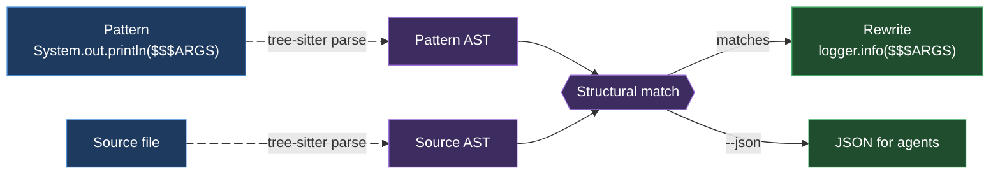

# ast-grep-poc — A Verified Field Study

> A hands-on study of the [`ast-grep`](https://github.com/ast-grep/ast-grep) CLI for
> **LLM-agent development workflows**, focused on **Java (primary), Python, Go**.
> This README is the overview; the full learning material is a progressive book
> under **[`docs/`](docs/INDEX.md)**.

Everything in the book marked _[verified]_ was **run against `ast-grep 0.42.3`** on
this machine (WSL2, x86_64) with the output captured — not recalled. _[sourced]_ =
official docs/repo; _[sourced — unverified]_ = could not be confirmed.

## What ast-grep is, in one diagram

`ast-grep` searches and rewrites code **by its syntax tree, not its text** — fast
(Rust), multi-language (32 built-in grammars, **zero toolchain**), and a strong fit
for agents.



## When to use it (summary)

| You need… | Tool |
| --- | --- |
| Structural search/lint/codemod in one language | **ast-grep** |
| Literal text / identifier, max speed | ripgrep / grep |
| Taint / cross-file dataflow / security | Semgrep Pro / CodeQL |
| Type-aware Java/JVM refactor | OpenRewrite / IDE |

The boundary: **intra-file, AST-structural, no type info, no cross-file dataflow.**
Full comparison → [docs/04-when-to-use](docs/04-when-to-use.md).

## Why it matters for agents (one measured number)

To hand an agent the 5 `println` sites in a 15 KB Java file: reading the whole file
≈ **3858 tokens**; `ast-grep` plain output ≈ **102 tokens (2%)** _[verified]_. The
saving scales with file size. Details + the `--json` tradeoff →
[docs/03-agentic](docs/03-agentic.md).

## 📖 Read the book → [`docs/INDEX.md`](docs/INDEX.md)

**Spine:** [01 Foundations](docs/01-foundations.md) · [02 CLI & Rules](docs/02-cli-and-rules.md) · [03 Agentic](docs/03-agentic.md) · [04 When to use](docs/04-when-to-use.md) · [05 Best practices](docs/05-best-practices.md)

**Languages:** [Java](docs/languages/java.md) · [Python](docs/languages/python.md) · [Go](docs/languages/go.md)
**OS:** [Linux](docs/os/linux.md) · [WSL](docs/os/wsl.md) · [macOS](docs/os/macos.md) · [Windows](docs/os/windows.md)
**Harnesses:** [Decision Policy](docs/harnesses/00-decision-policy.md) · [Claude Code](docs/harnesses/claude-code.md) · [Cursor](docs/harnesses/cursor.md) · [Codex](docs/harnesses/codex.md) · [Pi](docs/harnesses/pi.md) · [Hermes](docs/harnesses/hermes.md)

## Runnable POC

```text
sgconfig.yml              # project config (ruleDirs + testConfigs)
rules/                    # java-no-sysout, python-is-none, go-no-fmt-println
rule-tests/__snapshots__/ # accepted snapshot baselines
examples/{java,python,go} # sample sources the rules fire on
examples/bench/           # token-efficiency benchmark fixtures
```

```bash
pip install ast-grep-cli      # or npm i -g @ast-grep/cli · brew install ast-grep
ast-grep scan                 # run all rules across the project
ast-grep test                 # snapshot-test the rules
```

---

_ast-grep 0.42.3 · verified 2026-06-20 on WSL2 · focus: Java · Python · Go_
