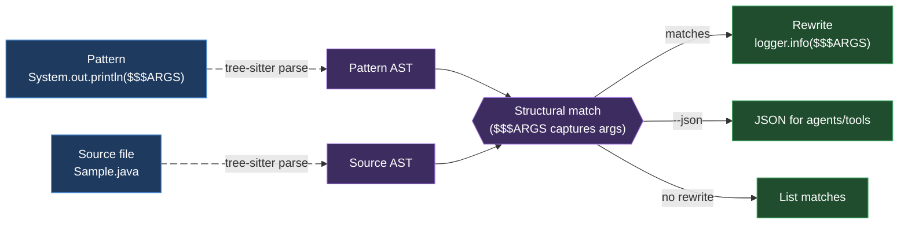

# 01 · Foundations

> Part of the ast-grep learning book — see [INDEX](INDEX.md).

This chapter answers two questions: *what is ast-grep actually doing when it
matches code?* and *what do I need to install for it to work on my language?*

## What ast-grep is

`ast-grep` is a **Rust CLI that searches and rewrites code by its syntax tree,
not its text.** You write a *pattern* that looks like the code you want —
`System.out.println($$$ARGS)` — and ast-grep parses both your pattern and the
target file with [Tree-sitter](https://tree-sitter.github.io/), compares the two
trees, and reports (or rewrites) the matches.

The everyday payoff: ast-grep is immune to the things that break `grep`.
Reformatting, line breaks inside a call, extra spaces, and comments don't affect a
structural match, because they don't change the syntax tree.

## The parse → match → rewrite model



A *meta-variable* (`$X`, `$$$`) is a wildcard in your pattern. When a match is
found, ast-grep captures what each meta-variable stood for, and a rewrite template
can substitute those captures back in.

### See the tree your pattern compiles to

The single most useful diagnostic is `--debug-query`. It shows the exact
Tree-sitter AST your pattern parsed into — which is how you catch a pattern that
*looks* right but parsed wrong _[verified]_:

```text
$ ast-grep run -p 'System.out.println($$$A)' -l java --debug-query=ast Sample.java
Debug AST:
program
  expression_statement
    method_invocation
      object: field_access
        object: identifier        # System
        field: identifier         # out
      name: identifier            # println
      arguments: argument_list
        identifier                # $$$A
```

> **Beginner note.** "AST" = Abstract Syntax Tree: the structured, nested form a
> parser turns source text into. `method_invocation`, `argument_list`, etc. are
> *node kinds* from the language's Tree-sitter grammar. You'll use these kind names
> directly in rules (Chapter 02).

## The three kinds of matchers

Every rule is built from three categories (full schema in [Chapter 02](02-cli-and-rules.md)):

| Category | Keys | Meaning |
| --- | --- | --- |
| **Atomic** | `pattern`, `kind`, `regex` | match a node directly |
| **Relational** | `inside`, `has`, `follows`, `precedes` | match by a node's neighbours |
| **Composite** | `all`, `any`, `not`, `matches` | boolean logic over sub-rules |

You'll need the relational + composite forms sooner than you'd think — some
constructs (an *empty* `catch`, a *bare* `except:`) can't be expressed as a plain
pattern at all. The language chapters show exactly when.

## The per-language dependency model

This is the part most people get wrong, so be precise:

| Language class | What you need | Java / Python / Go |
| --- | --- | --- |
| **Built-in (32 languages)** | **Nothing** — the Tree-sitter grammar is compiled into the `ast-grep` binary | ✅ all three are built-in _[verified: parsed with zero toolchain]_ |
| **Custom language** | A compiled Tree-sitter grammar + a `customLanguages` entry in `sgconfig.yml` | n/a |

**ast-grep does not run, compile, or import your code.** It parses files
syntactically. The JDK, the Python interpreter, and the Go toolchain are
**irrelevant** to ast-grep working — none of them is ever invoked. (The install is
literally a single self-contained Rust binary; that's *why* there's no toolchain
requirement.)

The 32 built-ins include _[sourced — [languages reference](https://ast-grep.github.io/reference/languages.html)]_:

> Bash, C, C++, C#, CSS, Elixir, Go, Haskell, HCL, HTML, **Java**, JavaScript,
> JSON, Kotlin, Lua, Nix, PHP, **Python**, Ruby, Rust, Scala, Solidity, Swift,
> TypeScript, TSX, YAML, …

Each has aliases for `-l/--lang` (e.g. `py` or `python`).

A **custom language** (only for grammars *not* in the 32) is wired up like this
_[sourced — [custom-language docs](https://ast-grep.github.io/advanced/custom-language.html)]_:

```yaml
# sgconfig.yml
customLanguages:
  mojo:
    libraryPath: ./mojo.so      # REQUIRED: compiled tree-sitter grammar
    extensions: [mojo]          # REQUIRED: file extensions to apply it to
    expandoChar: _              # optional: char that replaces $ so $META parses
```

The compiled-grammar extension is OS-specific (`.so` Linux/WSL, `.dylib` macOS,
`.dll` Windows) — see the [OS shelf](os/linux.md). `languageSymbol` is *not* a
documented field; don't add it.

---

[← Previous: INDEX](INDEX.md) · [Next: 02 · CLI & Rules →](02-cli-and-rules.md)
