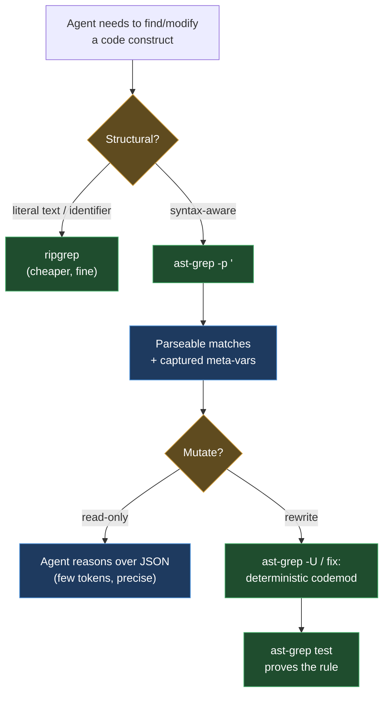

# 03 · Agentic workflows

> Part of the ast-grep learning book — see [INDEX](INDEX.md).

This is the chapter about using ast-grep **with LLM coding agents** (Claude Code,
Cursor, Codex, Pi, Hermes, …). It covers *why* it's a good agent tool, the
**measured token savings**, the official MCP server, and how to make an agent reach
for it at the right time. The per-harness setup lives in the
[harness shelf](harnesses/00-decision-policy.md).

## Why it's a good agent tool

- **Token efficiency.** Returning the few lines that match a pattern (or just their
  JSON ranges) instead of dumping a whole file keeps the context window small and
  the signal high. The numbers are below — and they're bigger than you'd guess.
- **Precision over regex.** Agents are bad at regex on code (false positives in
  comments/strings); they're good at "code that looks like X," which is exactly a
  pattern.
- **Deterministic edits.** A `fix:` rule applied with `-U` changes *exactly* the
  matched nodes — far safer than free-form file edits an agent might botch.
- **Reproducible & reviewable.** A rule file is a diffable artifact a human can
  audit; a one-off LLM edit is not.



## The token-efficiency benchmark _[verified]_

The task: *give an agent the `System.out.println` call sites in a Java file so it
can act on them.* We measured the output size of four approaches against the same
file (`examples/bench/BigService.java`, 211 lines, 4191 bytes, 5 `println` calls).
Tokens are estimated at ≈ bytes/4.

| Approach | Bytes | ~Tokens | % of full read |
| --- | ---: | ---: | ---: |
| **Read the whole file** (no tool) | 4191 | ~1047 | 100% |
| `grep -n` | 354 | ~88 | 8% |
| **`ast-grep` (plain matches)** | 509 | ~127 | **12%** |
| `ast-grep --json=compact` | 2725 | ~681 | 65% |

Then we held the match count fixed (5) and grew the file ~4× to isolate the
file-size effect _[verified]_:

| Fixture | Full read | ast-grep plain | ast-grep as % of full |
| --- | ---: | ---: | ---: |
| `BigService.java` (4191 B) | ~1047 tok | ~127 tok | **12%** |
| `HugeService.java` (15433 B) | ~3858 tok | ~102 tok | **2%** |

### What this actually means (benefits *and* losses)

- **ast-grep crushes the "just read the file" baseline**, and the win **scales with
  file size**: ast-grep's output stays roughly flat per match-count, so the bigger
  the file, the larger the saving (12% → 2% here). On a real multi-thousand-line
  module this is the difference between burning the context window and not.
- **`--json` is *not* a token saver — it's a parseability tradeoff.** It was 5× the
  plain output here (65% vs 12%) because each match carries ranges, byte offsets,
  `metaVariables`, and per-match metadata. Reach for `--json`/`--json=stream` when
  the agent needs structured ranges to do programmatic edits; use plain text when it
  just needs to *see* the matches.
- **ast-grep ≈ grep on raw bytes** for a simple identifier search — its edge over
  grep is not byte count, it's **precision** (no comment/string false positives),
  **structure** (captured meta-variables), and **rewrite** (`fix:`/`-U`). When the
  query is "all println even reformatted across lines" or "rewrite them all," grep
  can't compete; when it's "find this exact literal string," grep is fine and
  cheaper. ([Chapter 04](04-when-to-use.md) draws the full line.)

> **Takeaway for an agent policy:** prefer `ast-grep` plain output for structural
> *search*, add `--json` only when you'll *act on ranges*, and never dump a whole
> file when a pattern would do.

## The official integration surface _[sourced]_

- **MCP server** — experimental, **official org** repo
  [`ast-grep/ast-grep-mcp`](https://github.com/ast-grep/ast-grep-mcp). It exposes
  four tools to the agent:
  - `dump_syntax_tree` — visualise a snippet's AST (the agent's `--debug-query`)
  - `test_match_code_rule` — test a YAML rule against code before applying it
  - `find_code` — search with a simple pattern
  - `find_code_by_rule` — search with a full YAML rule

  The JSON config block is the same across MCP clients; only the **file location
  differs per client/OS** (see the [harness shelf](harnesses/00-decision-policy.md)):

  ```json
  {
    "mcpServers": {
      "ast-grep": {
        "command": "uv",
        "args": ["--directory", "/absolute/path/to/ast-grep-mcp", "run", "main.py"],
        "env": {}
      }
    }
  }
  ```

  Point it at your project rules via `--config /path/to/sgconfig.yml` (CLI arg,
  higher precedence) or `AST_GREP_CONFIG=/path/to/sgconfig.yml` (env var).

- **`--json` / `--json=stream`** for programmatic consumption; JS and Python API
  bindings exist if you'd rather call it in-process.
- **GitHub Action** `ast-grep/action` runs `ast-grep scan` in CI.

## Official prompting guidance _[sourced — [Using ast-grep with AI Tools](https://ast-grep.github.io/advanced/prompting.html)]_

- Put this in the agent's system prompt / rules file:
  > "For any code search that requires understanding of syntax or code structure,
  > you should default to using `ast-grep --lang [language] -p '<pattern>'`."
- **Feed the model `https://ast-grep.github.io/llms.txt`** (the full docs as one
  file) to reduce rule hallucination.
- Have the agent develop rules iteratively: break the query into sub-rules, combine
  with relational/composite rules, and **debug with the AST dump / playground /
  `ast-grep test`** when a match fails.

## The honest cost (and the mitigation)

Agents frequently emit a pattern that doesn't parse as intended and get a **silent
empty result** — exit 1, no error, indistinguishable from "clean code." This is the
single biggest failure mode (the [Go chapter](languages/go.md) has the canonical
example). A good agent harness **always runs `--debug-query` or an `ast-grep test`
case before concluding "no matches."** Encode that in the
[Agent Decision Policy](harnesses/00-decision-policy.md).

---

[← Previous: 02 · CLI & Rules](02-cli-and-rules.md) · [Next: 04 · When to use →](04-when-to-use.md)
