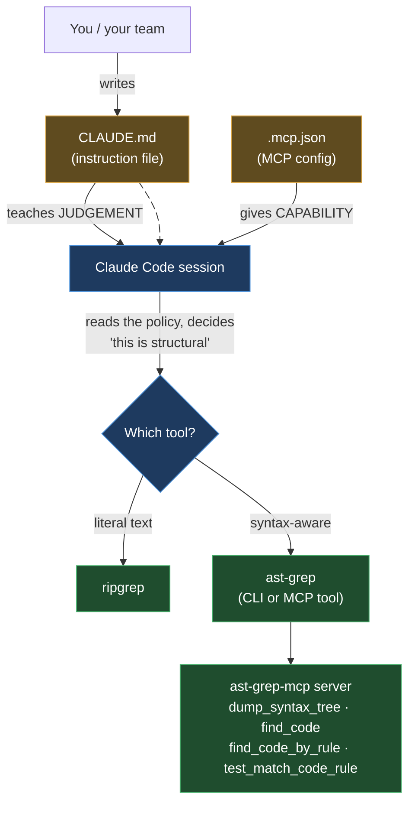

# ast-grep in Claude Code

> Part of the ast-grep learning book — see [INDEX](../INDEX.md). ↑ Up: [Decision Policy](00-decision-policy.md)

This page is a **delta**, not a re-explanation. It tells you exactly two things for
[Claude Code](https://code.claude.com/docs): *where to paste the Agent Decision Policy*
so Claude reaches for ast-grep at the right time, and *how to mount the ast-grep MCP
server* so Claude can call the tools directly. The policy text itself lives once, in
[00-decision-policy.md](00-decision-policy.md) — don't duplicate it here. The *why*
(token savings, the four MCP tools) is in [Chapter 03 · Agentic](../03-agentic.md).

All claims below are labelled. `[verified]` is reserved for ast-grep snippets that
were **run on this machine** (they live in the spine chapters, referenced here).
Claude Code config claims are `[sourced]` with their doc URL and the date checked,
**2026-06-20**. Anything I assembled from two sources but could not run end-to-end is
`[sourced — unverified]`.

## The two surfaces

Claude Code gives ast-grep two independent ways in. They are complementary — use both.



- **The instruction file (`CLAUDE.md`)** carries the [Agent Decision Policy](00-decision-policy.md).
  It shapes *behaviour* — Claude reads it and tries to follow it. The docs are blunt
  that this is guidance, not enforcement: _"Claude treats them as context, not enforced
  configuration."_ `[sourced — https://code.claude.com/docs/en/memory, 2026-06-20]`
- **MCP (`.mcp.json` / `claude mcp add`)** mounts the actual ast-grep tools so Claude
  can call them as functions. This is *capability*. Even without MCP, Claude can shell
  out to the `ast-grep` CLI through its Bash tool — MCP just makes the four tools
  first-class.

## 1. Where the policy lives — `CLAUDE.md`

Claude Code loads `CLAUDE.md` at the start of **every** session. That is where the
decision policy belongs. The file resolves by scope, broadest first; the table below
is the official load order. `[sourced — https://code.claude.com/docs/en/memory, 2026-06-20]`

| Scope | Location | Shared with |
| --- | --- | --- |
| **Managed policy** | Linux/WSL `/etc/claude-code/CLAUDE.md` · macOS `/Library/Application Support/ClaudeCode/CLAUDE.md` · Windows `C:\Program Files\ClaudeCode\CLAUDE.md` | All users on the machine |
| **User** | `~/.claude/CLAUDE.md` | Just you, all projects |
| **Project** | `./CLAUDE.md` or `./.claude/CLAUDE.md` | Team, via source control |
| **Local** | `./CLAUDE.local.md` (gitignore it) | Just you, this project |

> **For a shared team policy, put it in the project `CLAUDE.md`** and commit it. Every
> teammate's Claude then reads the same "ast-grep vs ripgrep vs Semgrep" rule. Files in
> the directory tree *above* the working directory load in full at launch; files in
> subdirectories load on demand when Claude reads files there. `[sourced — memory, 2026-06-20]`

Paste the block from [00-decision-policy.md](00-decision-policy.md) under a clear header.
Keep it short — the docs recommend **targeting under 200 lines per `CLAUDE.md`**, because
the file is loaded into the context window every session and _"longer files consume more
context and reduce adherence."_ `[sourced — memory, 2026-06-20]` A 2000-token policy
defeats its own token-saving purpose.

```markdown
# CLAUDE.md  (project root)

## Code search & refactor tool policy
<!-- paste the canonical block from docs/harnesses/00-decision-policy.md here -->
1. Literal string / identifier → ripgrep.
2. Syntax-aware search in ONE language → ast-grep run -p '<pattern>' -l <lang>.
3. Needs TYPE info / cross-file dataflow / taint → ast-grep CANNOT; use Semgrep/CodeQL/OpenRewrite.
...
```

### The `AGENTS.md` correction (read this — it's a common trap)

A widespread assumption is that Claude Code auto-reads `AGENTS.md`. **It does not.** The
official docs state it plainly: _"Claude Code reads `CLAUDE.md`, not `AGENTS.md`."_
`[sourced — https://code.claude.com/docs/en/memory, 2026-06-20]`

If your repo already keeps the policy in `AGENTS.md` (the portable, cross-tool baseline
that Codex and others read), **bridge it** — don't duplicate it. The docs give two ways:

**Import** — keeps Claude-specific additions possible. This is the exact example from the
docs, verbatim: `[sourced — memory, 2026-06-20]`

```markdown
@AGENTS.md

## Claude Code

Use plan mode for changes under `src/billing/`.
```

`CLAUDE.md` files import other files with `@path/to/import` syntax; the imported file is
expanded into context at launch. (To *mention* a path without importing it, wrap it in
backticks — `` `@AGENTS.md` `` is literal text, `@AGENTS.md` outside backticks is an import.)
`[sourced — memory, 2026-06-20]`

**Symlink** — when you have nothing Claude-specific to add: `[sourced — memory, 2026-06-20]`

```bash
ln -s AGENTS.md CLAUDE.md
```

> On Windows a symlink needs Administrator or Developer Mode, so prefer the `@AGENTS.md`
> import there. `[sourced — memory, 2026-06-20]`

The upshot for this book: the cross-tool policy can live in one `AGENTS.md`, and a
one-line `@AGENTS.md` in `CLAUDE.md` makes Claude Code honour it too. See the harness
matrix in [00-decision-policy.md](00-decision-policy.md).

### Scaling with `.claude/rules/` — scope the policy to Java/Python/Go

For larger repos, a single `CLAUDE.md` gets noisy. Claude Code supports a `.claude/rules/`
directory of topic files, and a rule can be **path-scoped** with YAML frontmatter so it
only enters context when Claude touches matching files. `[sourced — memory, 2026-06-20]`
That fits this book's focus languages perfectly: load the ast-grep policy only when Claude
is in Java, Python, or Go source.

```markdown
---
paths:
  - "**/*.{java,py,go}"
---

# ast-grep-first search policy
- For syntax-aware search in these languages, default to:
  ast-grep run -p '<pattern>' -l <lang>   (plain output unless you must act on ranges)
- A no-match exits 1 with NO error — confirm the pattern parsed with --debug-query=ast
  before trusting "no matches".
```

Rules without a `paths` field load unconditionally, at the same priority as
`.claude/CLAUDE.md`. Path-scoped ones trigger when Claude reads a matching file, which
saves context the rest of the time. `[sourced — memory, 2026-06-20]`

## 2. Mounting the ast-grep MCP server

The server is the official-org repo
[`ast-grep/ast-grep-mcp`](https://github.com/ast-grep/ast-grep-mcp). It exposes four
tools — described in depth in [Chapter 03](../03-agentic.md#the-official-integration-surface-sourced),
so here is just the one-line reminder: `[sourced — https://github.com/ast-grep/ast-grep-mcp]`

| Tool | What it does |
| --- | --- |
| `dump_syntax_tree` | Visualise a snippet's AST — Claude's in-MCP `--debug-query` |
| `test_match_code_rule` | Test a YAML rule against code *before* applying it |
| `find_code` | Search with a simple pattern (`max_results`, `output_format` opts) |
| `find_code_by_rule` | Search with a full YAML rule (relational/composite constraints) |

### Choose a scope, then add the server

Claude Code stores MCP servers at three scopes. The scope decides which projects see the
server and whether it ships in version control. `[sourced — https://code.claude.com/docs/en/mcp, 2026-06-20]`

| Scope | Loads in | Shared with team | Stored in |
| --- | --- | --- | --- |
| **Local** (default) | Current project only | No | `~/.claude.json` |
| **Project** | Current project only | **Yes**, via version control | `.mcp.json` in project root |
| **User** | All your projects | No | `~/.claude.json` |

> For a tool the whole team should have, use **`--scope project`**: it writes a committable
> `.mcp.json`. For your personal everyday setup, **`--scope user`** mounts ast-grep in
> every project on your machine. `[sourced — mcp, 2026-06-20]`

ast-grep-mcp is a **local stdio** server (it runs as a process on your machine). The
official stdio syntax requires the `--` separator before the command, _"Everything after
`--` is passed to the server untouched."_ `[sourced — mcp, 2026-06-20]` The repo's own
no-clone run command is `uvx --from git+...`. `[sourced — https://github.com/ast-grep/ast-grep-mcp]`
Combining the two gives this — the literal ast-grep invocation is not shown in either
source, so treat the assembled command as **`[sourced — unverified]`**:

```bash
# Project scope (committable .mcp.json), no local clone needed — [sourced — unverified]
claude mcp add --transport stdio ast-grep --scope project \
  -- uvx --from git+https://github.com/ast-grep/ast-grep-mcp ast-grep-server
```

The clone-and-run alternative mirrors the repo's published `args` array verbatim
(`["--directory", "...", "run", "main.py"]`) `[sourced — https://github.com/ast-grep/ast-grep-mcp]`,
wrapped in the `claude mcp add` shape — again `[sourced — unverified]` as a combined command:

```bash
# If you cloned the repo locally — [sourced — unverified]
claude mcp add --transport stdio ast-grep --scope project \
  -- uv --directory /absolute/path/to/ast-grep-mcp run main.py
```

### The `.mcp.json` form (project scope)

`--scope project` writes a `.mcp.json` at the repo root in this standardized shape — the
`mcpServers` key with one entry per server. `[sourced — mcp, 2026-06-20]` The block below
mirrors the repo's published config (its `command`/`args`/`env`) inside Claude Code's
`.mcp.json` file. The repo example targets Cursor's `.cursor-mcp/settings.json` path; for
**Claude Code the file is `.mcp.json`**, but the inner object is the same. Marked
`[sourced — unverified]` because it merges the repo block into Claude Code's file without an
end-to-end run:

```json
{
  "mcpServers": {
    "ast-grep": {
      "command": "uv",
      "args": ["--directory", "/absolute/path/to/ast-grep-mcp", "run", "main.py"],
      "env": {}
    }
  }
}
```

> Project-scoped servers from `.mcp.json` are **not** trusted automatically — Claude Code
> prompts for approval before first use (they show as `⏸ Pending approval` in
> `claude mcp list`). `[sourced — mcp, 2026-06-20]`

### Point the server at your project rules

ast-grep-mcp resolves rules from a config file. Aim it at your `sgconfig.yml` either with
the `--config` CLI argument (higher precedence) or the `AST_GREP_CONFIG` environment
variable. `[sourced — https://github.com/ast-grep/ast-grep-mcp]` Claude Code sets
`CLAUDE_PROJECT_DIR` in the spawned stdio server's environment, so a project-relative path
works — but the docs warn that `${VAR}` expansion in a project- or user-scoped `.mcp.json`
needs a default like `${CLAUDE_PROJECT_DIR:-.}`. `[sourced — mcp, 2026-06-20]` The combined
block is therefore **`[sourced — unverified]`**:

```json
{
  "mcpServers": {
    "ast-grep": {
      "command": "uv",
      "args": ["--directory", "/absolute/path/to/ast-grep-mcp", "run", "main.py"],
      "env": {
        "AST_GREP_CONFIG": "${CLAUDE_PROJECT_DIR:-.}/sgconfig.yml"
      }
    }
  }
}
```

### Manage and verify

These are the official management commands. `[sourced — mcp, 2026-06-20]`

```bash
claude mcp list           # list configured servers (shows ⏸ Pending approval too)
claude mcp get ast-grep   # details for one server
claude mcp remove ast-grep
```

Inside a session, run `/mcp` to see connection status and the tool count next to each
server. `[sourced — mcp, 2026-06-20]`

> **MCP output is not free.** Claude Code warns when a tool's output exceeds 10,000 tokens
> (default cap 25,000, raise with `MAX_MCP_OUTPUT_TOKENS`). `[sourced — mcp, 2026-06-20]`
> This is exactly why the [Decision Policy](00-decision-policy.md) tells the agent to prefer
> ast-grep's **plain** output and reach for `--json` only when it must act on ranges. The
> byte/token benchmark in [Chapter 03](../03-agentic.md#the-token-efficiency-benchmark-verified)
> is `[verified]` (run on this machine) — but it measured the **CLI**, and `find_code` has its
> own `output_format` parameter, so the same savings *through MCP* are a reasonable expectation,
> not a measured number `[sourced — unverified]`. Either way, asking for less is the lever.

## Advanced: enforce with hooks, package with skills

`CLAUDE.md` teaches judgement but **cannot enforce** — the docs are explicit: _"To block an
action regardless of what Claude decides, use a PreToolUse hook."_
`[sourced — https://code.claude.com/docs/en/memory, 2026-06-20]` That gives ast-grep a hard
gate the policy alone can't:

- **PreToolUse hook → `ast-grep scan --error`.** Run a scan that fails (exit 1) when a banned
  pattern reappears, and reject the edit before it lands. `scan --error[=ID]` is built for CI
  failure semantics `[verified — flag behaviour run on this machine]`; a hook turns it into a
  per-edit guardrail inside the session. The hook is a shell command at a fixed lifecycle
  event, so it applies no matter what Claude decides. `[sourced — memory, 2026-06-20]`
- **Skill → package an ast-grep codemod.** A [skill](https://code.claude.com/docs/en/skills)
  loads on demand (not every session), so a "migrate `System.out.println` → logger" or
  "rewrite all `$X.equals($Y)`" codemod — a `fix:` rule applied with `-U`, validated by
  `ast-grep test` — can live as a skill Claude invokes only when the task calls for it,
  keeping the base context lean. `[sourced — memory, 2026-06-20]`

Hooks are the enforcement layer; the `CLAUDE.md` policy is the judgement layer; MCP and the
CLI are the capability. Stack all three and Claude both *chooses* ast-grep correctly and is
*blocked* from regressing.

## TL;DR

1. Put the [Agent Decision Policy](00-decision-policy.md) in the **project `CLAUDE.md`** (commit it). Keep it under ~200 lines.
2. Already have `AGENTS.md`? Bridge it with **`@AGENTS.md`** — Claude Code does **not** auto-read `AGENTS.md`.
3. Big repo? Scope the policy to `**/*.{java,py,go}` with a path-scoped `.claude/rules/` file.
4. Mount the tools: `claude mcp add --transport stdio ast-grep --scope project -- uvx --from git+https://github.com/ast-grep/ast-grep-mcp ast-grep-server`.
5. Point it at your rules via `AST_GREP_CONFIG` / `--config`; verify with `claude mcp list` and `/mcp`.
6. Hard-gate banned patterns with a **PreToolUse hook** running `ast-grep scan --error`.

---

[← Previous: Decision Policy](00-decision-policy.md) · [Next: Cursor](cursor.md)
