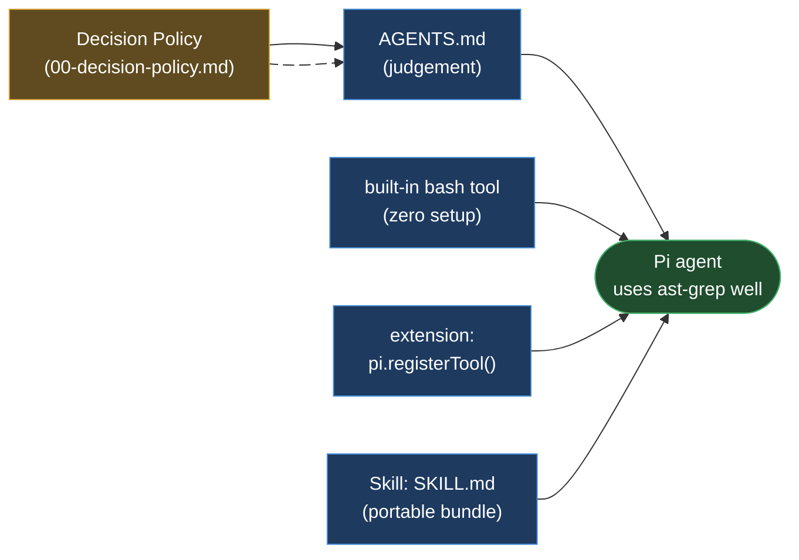
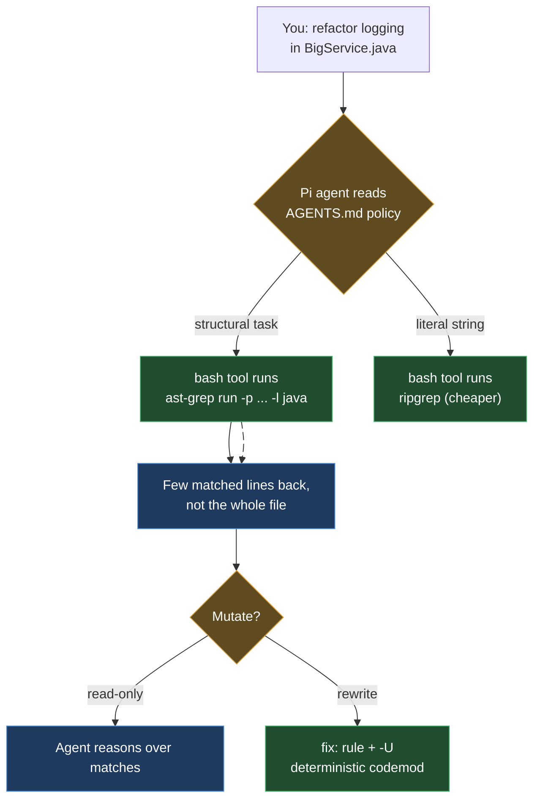

# ast-grep in Pi (Pi Harness)

> Part of the ast-grep learning book — see [INDEX](../INDEX.md). ↑ Up: [Decision Policy](00-decision-policy.md)

[Pi](https://pi.dev) is a **minimalist, provider-agnostic, open-source coding-agent
harness** from earendil-works. It ships as a small family of npm packages —
`@earendil-works/pi-coding-agent` (the interactive CLI),
`@earendil-works/pi-agent-core` (the agent runtime with tool calling and state),
`@earendil-works/pi-ai` (a unified multi-provider LLM API), and
`@earendil-works/pi-tui` (the terminal UI). _[sourced —
[github.com/earendil-works/pi](https://github.com/earendil-works/pi), accessed
2026-06-20]_

Two things about Pi shape this whole chapter, and they are the **delta** from the
[Cursor](cursor.md) and [Codex](codex.md) pages:

1. **Pi is bring-your-own-key / provider-agnostic.** You supply the credentials
   (`pi-ai` speaks OpenAI, Anthropic, Google, etc.). There is no bundled model.
   _[sourced — same source]_
2. **Pi has no built-in MCP.** That is a deliberate design choice, not an
   oversight — so the standard `uv` / `main.py` MCP block used by other harnesses
   **has no config file to live in here**. You expose ast-grep a different way.
   _[sourced — see below]_

So the [two mechanisms](00-decision-policy.md) — *judgement* (a rules/instruction
file) and *capability* (the tool itself) — still apply, but for Pi the capability
side is **not** MCP. It's the built-in `bash` tool, an extension, or a Skill.



## The capability ladder (lead with the simplest)

Unlike Cursor — where MCP is the headline and the CLI is the fallback — in Pi the
**bare CLI through the built-in `bash` tool is the recommended, zero-install path**.
Climb the ladder only if you want something more first-class:

| Tier | Mechanism | Setup cost | When to choose |
| --- | --- | ---: | --- |
| 0 | **Judgement** — policy in `AGENTS.md` | trivial | Always. This is what makes the agent *reach* for ast-grep. |
| 1 | **Built-in `bash` tool** runs `ast-grep …` | none | Default. The agent already has `bash`; nothing to install. |
| 2 | **Extension** wrapping ast-grep via `pi.registerTool()` | small | You want a typed, named tool with structured results. |
| 3 | **Skill** (`SKILL.md`) bundling ast-grep instructions | small | You want a portable, on-demand capability package. |
| 4 | **Extension that adds an MCP client** for `ast-grep-mcp` | larger | You specifically need the official MCP server in Pi. |

Tiers 0 and 1 **compose**: the policy teaches the agent *when*, the `bash` tool
gives it *how*. That pairing alone is a complete, working setup.

## Step 0 — bring your own key (provider-agnostic)

Pi has no built-in model; authenticate with an API key or an interactive login
before anything else. _[sourced —
[github.com/earendil-works/pi/.../docs/providers.md](https://github.com/earendil-works/pi/blob/main/packages/coding-agent/docs/providers.md),
accessed 2026-06-20]_

```bash
export ANTHROPIC_API_KEY=sk-ant-...   # or OPENAI_API_KEY, GEMINI_API_KEY, ...
pi
```

```bash
pi
/login                                 # interactive provider selection
pi --provider openai --model gpt-4o    # or pin provider/model at runtime
pi --api-key sk-...                     # or pass the key inline
```

This BYOK posture is why Pi is "harness, not product": it never assumes a vendor.
Custom providers go in `~/.pi/agent/models.json`. _[sourced — same providers doc,
accessed 2026-06-20]_

## Step 1 — the judgement layer: paste the policy into `AGENTS.md`

Pi loads instruction files at startup and **concatenates** every match, walking the
filesystem so you can layer global → ancestor → project rules. Per Pi's docs, it
loads `AGENTS.md` (or `CLAUDE.md`) from these locations, in this order: _[sourced —
[github.com/earendil-works/pi/.../docs](https://github.com/earendil-works/pi/blob/main/packages/coding-agent/README.md),
accessed 2026-06-20]_

| Location | Scope |
| --- | --- |
| `~/.pi/agent/AGENTS.md` | global (all projects) |
| Parent directories (walking up from cwd) | ancestor layers |
| Current directory `AGENTS.md` | the project you're in |

> You can turn this discovery off with the `--no-context-files` / `-nc` flag.
> _[sourced — same source, accessed 2026-06-20]_

This is exactly why `AGENTS.md` is the [portable baseline](00-decision-policy.md):
Pi reads it natively (so does Codex), no bridge needed. Drop the policy into the
project root and Pi picks it up.

`./AGENTS.md` _[sourced — unverified; ast-grep policy assembled for Pi]_:

```markdown
<!--
  Paste the "Code search & refactor tool policy" block VERBATIM from
  docs/harnesses/00-decision-policy.md here. The policy is maintained in ONE
  place; this file is just where Pi reads it. Pi concatenates AGENTS.md from
  ~/.pi/agent/, parent dirs, and cwd — so a global copy in ~/.pi/agent/AGENTS.md
  applies to every project, a per-repo copy here applies to this one. Do not
  edit the policy text here — edit it in 00-decision-policy.md.
-->
```

Keep it short. The [token rationale](../03-agentic.md) is the whole point of the
policy — a 2000-token rules file pasted into a concatenated `AGENTS.md` chain
defeats its own purpose.

> **System-prompt alternative.** If you'd rather attach the guidance to the system
> message than to context files, Pi also reads `.pi/SYSTEM.md` /
> `~/.pi/agent/SYSTEM.md` (replace the default prompt) and `.pi/APPEND_SYSTEM.md` /
> `~/.pi/agent/APPEND_SYSTEM.md` (append without replacing). For a short tool-choice
> policy, an `APPEND_SYSTEM.md` is a clean, non-destructive spot. _[sourced — Pi
> docs, accessed 2026-06-20]_

## Step 2 — capability, the easy way: the built-in `bash` tool

Pi ships built-in tools — `read`, `bash`, `edit`, `write`, `grep`, `find`, `ls` —
and you control which are active with `--tools`, `--exclude-tools`,
`--no-builtin-tools`, or `--no-tools`. _[sourced —
[github.com/earendil-works/pi/.../README.md](https://github.com/earendil-works/pi/blob/main/packages/coding-agent/README.md),
accessed 2026-06-20]_

Because `bash` is built in, **once the policy is in `AGENTS.md` the agent can just
run ast-grep directly** — no extension, no Skill, no MCP:

```bash
ast-grep run -p 'System.out.println($$$)' -l java
```

Recall from the [foundations](../01-foundations.md): the Tree-sitter grammars for
all 32 languages are **bundled in the `ast-grep` binary**, so analysing Java,
Python, or Go needs **no JDK, no Python, no Go toolchain** — only the single binary
on `PATH`. _[verified]_ That makes the `bash`-tool path effectively free to set up.

> **Guardrails (already in the [policy](00-decision-policy.md), repeated here so you
> don't forget them in Pi):** invoke `ast-grep`, never the `sg` alias — on
> Linux/WSL `sg` collides with the `setgroups` command. _[verified]_ A no-match
> exits 1 with no error message, so an empty result is **not** proof the code is
> clean; have the agent confirm a pattern parsed with `--debug-query=ast` before it
> trusts "no matches." _[verified]_



## Step 3 — capability, first-class: an extension that wraps ast-grep

If you want ast-grep as a **named, typed tool** (structured results, validated
parameters, a label in the UI) rather than free-form `bash`, write a Pi extension.
Extensions are TypeScript modules auto-discovered from trusted locations and they
register tools through `pi.registerTool()`. _[sourced —
[github.com/earendil-works/pi/.../docs/extensions.md](https://github.com/earendil-works/pi/blob/main/packages/coding-agent/docs/extensions.md),
accessed 2026-06-20]_

Where extensions live, and how to load them _[sourced — same extensions doc,
accessed 2026-06-20]_:

| Location | Scope |
| --- | --- |
| `~/.pi/agent/extensions/*.ts` or `~/.pi/agent/extensions/*/index.ts` | global |
| `.pi/extensions/*.ts` or `.pi/extensions/*/index.ts` | project-local |

```bash
pi -e ./ast-grep-extension.ts   # quick test (auto-discovered ones hot-reload via /reload)
```

```json
{
  "extensions": [
    "/path/to/local/extension.ts",
    "/path/to/local/extension/dir"
  ]
}
```

The registration shape, **as documented by Pi** _[sourced — same extensions doc,
accessed 2026-06-20]_:

```typescript
pi.registerTool({
  name: "my_tool",
  label: "My Tool",
  description: "What this tool does",
  parameters: Type.Object({
    action: StringEnum(["list", "add"] as const),
    text: Type.Optional(Type.String()),
  }),
  async execute(toolCallId, params, signal, onUpdate, ctx) {
    return {
      content: [{ type: "text", text: "Done" }],
      details: { result: "..." },
    };
  },
});
```

Filled in for ast-grep, an extension wraps the CLI and hands back only the matched
lines. The following is **assembled by this book** against the documented API — it
illustrates the shape; it has not been run against Pi:

```typescript
// .pi/extensions/ast-grep.ts
import { execFile } from "node:child_process";
import { promisify } from "node:util";
const run = promisify(execFile);

export default function (pi: any) {
  pi.registerTool({
    name: "ast_grep",
    label: "ast-grep",
    description:
      "Syntax-aware structural code search in ONE language. " +
      "Prefer over reading whole files. Use ripgrep for literal strings.",
    parameters: Type.Object({
      pattern: Type.String(),                 // e.g. 'System.out.println($$$)'
      lang: Type.String(),                    // e.g. 'java'
      json: Type.Optional(Type.Boolean()),    // only when ranges/captures are needed
    }),
    async execute(_id, params, signal) {
      const args = ["run", "-p", params.pattern, "-l", params.lang];
      if (params.json) args.push("--json");
      // ast-grep exits 1 on NO MATCH with no error — treat that as "0 matches",
      // not failure. See the Decision Policy guardrails.
      const { stdout } = await run("ast-grep", args, { signal }).catch((e) =>
        e.code === 1 ? { stdout: "" } : Promise.reject(e),
      );
      return {
        content: [{ type: "text", text: stdout || "(no matches)" }],
        details: { matched: Boolean(stdout) },
      };
    },
  });
}
```

_[sourced — unverified; ast-grep wrapper assembled against the documented
`pi.registerTool` API, not executed]_

Then activate it by name (custom tools join the active set the same way built-ins
do): _[sourced —
[github.com/earendil-works/pi/.../README.md](https://github.com/earendil-works/pi/blob/main/packages/coding-agent/README.md),
accessed 2026-06-20]_

```bash
pi --tools read,bash,edit,ast_grep
```

> Point the wrapper at your project rules so it resolves your `sgconfig.yml`: add
> `--config /path/to/sgconfig.yml` to the `args` array (CLI arg, higher precedence)
> or set `AST_GREP_CONFIG=/path/to/sgconfig.yml` in the spawn environment.
> _[sourced]_

## Step 4 — capability, portable bundle: a Skill

Pi also implements the **Agent Skills** standard: self-contained capability
packages loaded **on-demand**, with progressive disclosure — only the skill's
*description* sits in context until a task matches, then the agent `read`s the full
`SKILL.md`. _[sourced —
[github.com/earendil-works/pi/.../docs/skills.md](https://github.com/earendil-works/pi/blob/main/packages/coding-agent/docs/skills.md),
accessed 2026-06-20]_

Skills are discovered from `~/.pi/agent/skills/`, `~/.agents/skills/`,
`.pi/skills/`, `.agents/skills/` (and package `skills/` dirs), and invoked with
`/skill:name` or auto-loaded by the model. The documented layout: _[sourced — same
skills doc, accessed 2026-06-20]_

```
my-skill/
├── SKILL.md              # Required: frontmatter + instructions
├── scripts/              # Helper scripts
├── references/           # Detailed docs loaded on-demand
└── assets/
```

An ast-grep Skill bundles the policy guidance with concrete invocations. The
`SKILL.md` below follows the documented frontmatter format, but the ast-grep body
is **this book's assembly**, not a tested artifact:

````markdown
---
name: ast-grep
description: >
  Syntax-aware structural code search and codemods for ONE language. Use when the
  task is "find/replace code that looks like X" rather than a literal string.
---

# ast-grep

## When to use (not)
- Literal string / identifier / log line → ripgrep (`rg`). Cheaper.
- Syntax-aware, single language → ast-grep (below).
- Type info / cross-file dataflow / taint → ast-grep CANNOT. Use Semgrep Pro /
  CodeQL / the IDE. (Full policy: docs/harnesses/00-decision-policy.md.)

## Search
```bash
ast-grep run -p 'System.out.println($$$)' -l java
# add --json ONLY to act on exact ranges/captures (it is ~5x larger)
```

## Rewrite (deterministic)
```bash
# preview first (no -U), then apply with -U
ast-grep scan -r rule.yml
ast-grep scan -r rule.yml -U
```

## Guardrails
- Invoke `ast-grep`, never `sg` (collides with setgroups on Linux/WSL).
- A no-match exits 1 with NO message — confirm the pattern parsed with
  `ast-grep run -p '<pattern>' -l <lang> --debug-query=ast` before trusting
  "no matches".
````

_[sourced — unverified; ast-grep `SKILL.md` assembled against the documented Skill
format, not executed]_

This is the most portable option: a Skill is a directory you can drop into any
Agent-Skills-aware harness, and it pairs naturally with Pi's
[token-efficiency](../03-agentic.md) goal because the full instructions load only
when a code-search task actually fires.

## And MCP? (the honest answer)

Pi's own documentation is explicit: **it has no built-in MCP support** — that is
listed among the things Pi *intentionally does not include* (alongside sub-agents,
permission popups, plan mode, to-dos, and background bash). The guidance is to
build CLI tools with READMEs (i.e. Skills) or to **build an extension that adds MCP
support**. _[sourced —
[github.com/earendil-works/pi](https://github.com/earendil-works/pi) and
[.../docs/extensions.md](https://github.com/earendil-works/pi/blob/main/packages/coding-agent/docs/extensions.md),
accessed 2026-06-20]_

Concretely, the [`ast-grep/ast-grep-mcp`](https://github.com/ast-grep/ast-grep-mcp)
server and its standard config block —

```json
{
  "mcpServers": {
    "ast-grep": {
      "command": "uv",
      "args": ["--directory", "/absolute/path/to/ast-grep-mcp", "run", "main.py"],
      "env": {}
    }
  }
}
```

— **do not drop into Pi the way they drop into Cursor or Codex.** Pi has no
`mcpServers` config slot to read this. _[sourced — invocation from
[ast-grep/ast-grep-mcp](https://github.com/ast-grep/ast-grep-mcp); Pi MCP absence
per Pi docs, accessed 2026-06-20]_ To actually run that server inside Pi you would
write a **Tier-4 extension that implements an MCP client**, connects to
`ast-grep-mcp`, and re-exposes its tools (`dump_syntax_tree`,
`test_match_code_rule`, `find_code`, `find_code_by_rule`) through `pi.registerTool`.
That is real work — and for ast-grep specifically it buys little over the Tier-1
`bash` path, because the CLI is already self-contained. Reach for it only if you're
standardising on `ast-grep-mcp` across a fleet of harnesses and want Pi to match.

> The canonical MCP block, its four tools, and the `--config` / `AST_GREP_CONFIG`
> options live once in [03-agentic.md](../03-agentic.md) and the
> [Decision Policy](00-decision-policy.md) — this page does not re-document them.

## Setup checklist

| Step | Where | Done when |
| --- | --- | --- |
| 0. Install ast-grep | — | `ast-grep --version` prints `0.42.3` (or your version) |
| 1. Authenticate (BYOK) | env var / `/login` | `pi` starts against your provider |
| 2. Add the policy | `AGENTS.md` (cwd or `~/.pi/agent/`) | Pi concatenates it at startup (`-nc` would disable) |
| 3. Capability (pick one) | `bash` tool / extension / Skill | Agent runs `ast-grep`, returns matches not full files |
| 4. (Optional) point at config | `--config` or `AST_GREP_CONFIG` | rule-based search resolves your `sgconfig.yml` |
| 5. Sanity-test | — | Ask Pi to find `System.out.println` in a Java file; it uses ast-grep, not a full read |

## Why this matters in Pi specifically

Pi is deliberately small — no MCP, no sub-agents, no plan mode. That minimalism is
the reason the [token argument](../03-agentic.md) lands hard here: there is no
heavyweight tool layer to lean on, so the agent's instinct is to `read` files. The
`AGENTS.md` policy is what redirects that instinct toward `ast-grep`. From the
book's [benchmark](../03-agentic.md) _[verified]_: on a 4191-byte Java file with 5
`System.out.println` calls, reading the whole file costs ≈ 1047 tokens; the same
information via `ast-grep` plain output is ≈ 127 tokens — **12%** of the full read.
Grow the file ~4× (15433 bytes, same 5 matches) and ast-grep's output stays roughly
flat, dropping to **2%** of a full read. _[verified]_ In a lean harness that hands
the model a built-in `bash` tool and trusts it to choose well, that policy is
doing real work on every code task.

## Cross-links

- The policy text you paste into `AGENTS.md`: [00-decision-policy.md](00-decision-policy.md)
- The four MCP tools, the canonical config block, and the token benchmark: [03-agentic.md](../03-agentic.md)
- Same setup for other harnesses: [Claude Code](claude-code.md) · [Cursor](cursor.md) · [Codex](codex.md)
- Where ast-grep stops (type info, dataflow, taint): [04-when-to-use.md](../04-when-to-use.md)

---

[← Previous: Codex](codex.md) · [Next: Hermes →](hermes.md)
