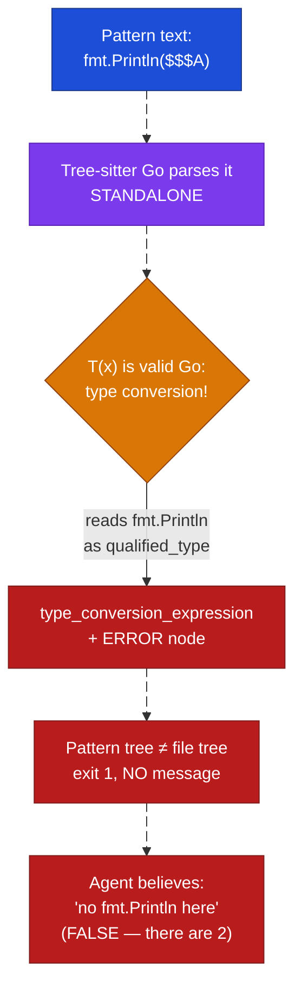
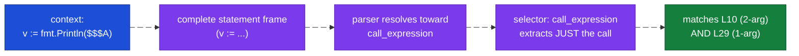
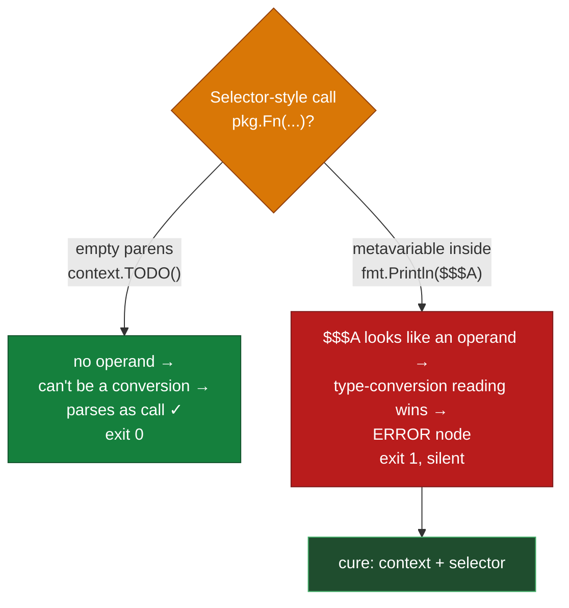

# ast-grep for Go

> Part of the ast-grep learning book — see [INDEX](../INDEX.md). ↑ Up: [03 · Agentic](../03-agentic.md)

Go has the simplest grammar of the three languages in this book — short keywords,
no generics ceremony in everyday code, calls that *look* like calls. You would expect
it to be the easiest target for ast-grep. For most patterns, it is. But Go also hides
the single most **dangerous** pattern failure in the entire book: a pattern that parses
cleanly, produces no error, exits "successfully" — and matches the **wrong node**
entirely. The sibling chapters ([Java](java.md), [Python](python.md)) both point *here*
for it. This is where we pay it off.

The headline lesson: **`fmt.Println($$$A)` matches nothing in Go, and Go won't tell you
why.** No crash, no exit-8, no "Multiple AST nodes" warning. Just an empty result that
an agent will happily read as "there are no `fmt.Println` calls here" — which is false.
By the end of this chapter you will know exactly why that happens, how to prove it with
one flag, and the `context`/`selector` cure that fixes it.

Everything marked **[verified]** below was run against the fixture
`examples/go/sample.go` using **ast-grep 0.42.3** on WSL2. The exact commands and their
outcomes (match / no match / exit code) were handed to me pre-run. Where I describe the
*internal* shape of a parse tree I could not capture verbatim, I say so and label it
**[sourced — unverified]** — I will not print a fabricated terminal dump and call it
verified.

---

## The fixture

Every example targets this one small Go file. It is deliberately flawed — each line
maps to a pattern lesson.

```go
// examples/go/sample.go
package main

import (
	"context"
	"errors"
	"fmt"
)

func process(input string) (string, error) {
	fmt.Println("debug:", input) // debug print left in
	result, err := doWork(input)
	if err != nil { // err-check boilerplate
		return "", err
	}
	return result, nil
}

func doWork(s string) (string, error) {
	if s == "" {
		return "", errors.New("empty")
	}
	return s, nil
}

func main() {
	out, _ := process("hello") // ignored error
	ctx := context.TODO()      // placeholder context left in
	_ = ctx
	fmt.Println(out)
}
```

Four smells live here, and each teaches one thing:

| Line | Smell | Pattern lesson |
| --- | --- | --- |
| `fmt.Println("debug:", input)` (L10) | debug print left in | **the gotcha** — bare call parses to the wrong node |
| `if err != nil { ... }` (L12) | err-check boilerplate | the easy, plain pattern |
| `out, _ := process("hello")` (L26) | ignored error | the easy, plain pattern |
| `ctx := context.TODO()` (L27) | placeholder context | the **counter-example** — empty parens parse fine |

Note line 10 (`fmt.Println("debug:", input)`, two args) and line 29 (`fmt.Println(out)`,
one arg) are *both* `fmt.Println` calls. Keep them in mind — they are the heroes of the
gotcha section.

---

## The easy wins (plain patterns)

Start with what just works, so you trust the tool before we break it. These two need
nothing more than `run -p`.

### The err-check boilerplate

The `if err != nil { ... }` idiom is everywhere in Go. A plain pattern reads exactly
like the code, using `$$$` for "any block body" [verified]:

```bash
ast-grep run -p 'if err != nil { $$$ }' -l go
```

This matches the `if err != nil { ... }` block on line 12. The `$$$` (anonymous
zero-or-more) swallows whatever statements the body holds — here, the
`return "", err`. The pattern matched by **structure**: an `if_statement` whose
condition is the binary expression `err != nil`. A regex hunting the text `err != nil`
would also hit it inside comments and strings; ast-grep matches only the real
syntax node.

### The ignored error

Go's `result, _ := call()` pattern silently throws away an error — a real reliability
smell. A plain pattern captures the shape with meta-variables [verified]:

```bash
ast-grep run -p '$V, _ := $CALL' -l go
```

This matches `out, _ := process("hello")` on line 26. Read the meta-variables:

- `$V` binds one named node on the left (`out`).
- `_` in the pattern is the **literal Go blank identifier** — it matches the literal
  `_` in the code, the discarded second return value.
- `$CALL` binds the right-hand call (`process("hello")`).

This is the textbook ast-grep win: a structural shape (`X, _ := someCall`) that text
search cannot express precisely, captured in one short pattern. (Note `$V, _ := $CALL`
demands *exactly two* left-hand names. A three-value assignment like
`a, b, _ := f()` would need a different pattern — positional rigidity, the same trap
Python's chapter dwells on.)

So far Go behaves. Now the trap.

---

## The Go bare-call gotcha (the headline)

Here is the most natural pattern a beginner could write — "find every `fmt.Println`
call, with any arguments":

```bash
# DOES NOT WORK — matches nothing, and stays silent about it
ast-grep run -p 'fmt.Println($$$A)' -l go
```

This matches **nothing** and exits with code **1** [verified]. There is **no error
message.** No "Multiple AST nodes." No exit-8. Just zero matches and a clean-looking
exit. An LLM agent reading that output concludes *"this file has no `fmt.Println`
calls"* — and that is flat wrong: the fixture has **two** of them (lines 10 and 29).

This is the dangerous failure mode the whole book circles around. Compare it to the loud
failures in the sibling chapters:

| | Go `fmt.Println($$$A)` | Java `catch (Exception $E) {}` | Python `except: $$$B` |
| --- | --- | --- | --- |
| **Outcome** | matches nothing | refuses to run | refuses to run |
| **Exit code** | **1 (silent)** | 8 (loud) | 8 (loud) |
| **Parser** | parses to a **plausible wrong node** | won't parse (multiple nodes) | won't parse (multiple nodes) |
| **The danger** | you believe a false "no matches" | you *can't* miss the error | you *can't* miss the error |

The Java and Python failures are *friendly*: ast-grep shouts at you. The Go failure is
*treacherous* because it looks exactly like success.

### Why it fails — proving it with `--debug-query`

Never trust the empty result. The cure is one flag: `--debug-query=ast` prints what
your pattern *actually parsed to*.

```bash
ast-grep run -p 'fmt.Println($$$A)' -l go --debug-query=ast
```

The debug output reveals the pattern did **not** parse as a function call at all. Go's
grammar is ambiguous here: standing alone, `fmt.Println(...)` can be read as a
**type conversion** — Go syntax `T(x)` converts `x` to type `T`. So the parser reads
`fmt.Println` as a **`qualified_type`** (the package-qualified type `fmt.Println`) and
the `($$$A)` as the conversion's parenthesized operand. Because `$$$A` (a metavariable)
cannot be a valid operand in that reading, the parse produces a
**`type_conversion_expression` containing an `ERROR` node** [verified — this is the
parse outcome I was handed].

Your *file* contains a real `call_expression` (`fmt.Println(...)`), but your *pattern*
is a broken `type_conversion_expression`. The two trees don't match, so: zero results,
exit 1, silence.

> **I was handed the *fact* of this parse, not a verbatim terminal dump.** The claim
> "`fmt.Println($$$A)` parses as a `type_conversion_expression` with an `ERROR` node,
> reading `fmt.Println` as a `qualified_type`" is **[verified]**. The exact pixels of
> the `--debug-query=ast` printout are not reproduced here — run the command yourself
> to see them. (This is the same discipline the [Python chapter](python.md) follows for
> its AST dumps.)



### The working fix — `context` + `selector`

The problem is that the parser, given the *bare fragment*, has no well-formed statement
to anchor on and slides into the type-conversion reading. The fix is to give the pattern
a complete, unambiguous **statement frame** so the parser resolves the ambiguity toward
a function call — then point ast-grep at just the call node inside that frame.

That is exactly what the `context` + `selector` pair does in a YAML rule [verified]:

```yaml
# rules/go-fmt-println.yml
id: go-fmt-println
language: go
severity: warning
message: Debug `fmt.Println` left in — remove it or route through a logger.
rule:
  pattern:
    context: "v := fmt.Println($$$A)"
    selector: call_expression
```

Two moves, one mechanism:

1. **`context: "v := fmt.Println($$$A)"`** — wrap the call inside a complete
   short-variable-declaration (`v := ...`). The `$$$A` token is *identical* to the bare
   case — what changed is that ast-grep now parses a whole, well-formed statement instead
   of a dangling expression fragment. Inside that statement frame the parser resolves the
   ambiguity toward a **`call_expression`** rather than committing to the
   type-conversion-with-`ERROR` path. (Why a *statement* frame specifically, rather than
   "an assignment forbids conversions": it does not — `v := int(x)` is a valid conversion
   assigned with `:=`. The differentiator is the well-formed statement, not the `:=`.
   This is the defensible mechanism; the exact tree-sitter resolution is best confirmed
   with `--debug-query=ast` yourself **[sourced — unverified]**.)
2. **`selector: call_expression`** — the `context` is scaffolding, not what you want to
   *match*. The selector says "match only the `call_expression` node inside this
   context, not the whole `v := ...` assignment." So matches report the bare call, not
   the fake assignment you wrapped it in.

This **matches both** `fmt.Println` calls in the fixture [verified]:

- `fmt.Println("debug:", input)` on line 10 (two args), and
- `fmt.Println(out)` on line 29 (one arg).

The `$$$A` (zero-or-more) now does its job correctly, flexing across both the 1-arg and
2-arg calls — because it is finally being parsed inside a real `call_expression`.



> **The general lesson.** When a Go pattern is a *bare expression* that the grammar
> could also read as something else (a type conversion, a composite literal), wrap it in
> a **`context`** that pins it to one syntactic position, then **`selector`** the inner
> node you actually want. This is ast-grep's official escape hatch for ambiguous
> fragments, and Go's `fmt.Println` is its poster child.

### The rigid alternative — explicit args

There *is* a plain-pattern way to match a `fmt.Println` call without a rule: spell out
the exact argument count. Naming each argument with a single `$VAR` removes the
ambiguity (the parser can't read `fmt.Println($A, $B)` as a one-operand conversion):

```bash
ast-grep run -p 'fmt.Println($A, $B)' -l go
```

This **works** [verified] — but it is *rigid*. It demands **exactly two** arguments. It
matches `fmt.Println("debug:", input)` on line 10 (two args) and **misses**
`fmt.Println(out)` on line 29 (one arg). To cover both you'd write two patterns, or three
for three args, and so on. The `context`/`selector` rule with `$$$A` covers them all in
one shot — which is why it is the right tool for "any `fmt.Println`."

| Approach | Form | 2-arg (L10) | 1-arg (L29) | Verdict |
| --- | --- | --- | --- | --- |
| Bare call | `-p 'fmt.Println($$$A)'` | ✗ | ✗ | **broken** (parses wrong) [verified] |
| Explicit args | `-p 'fmt.Println($A, $B)'` | ✓ | ✗ | works but **rigid** [verified] |
| context + selector | rule with `selector: call_expression` | ✓ | ✓ | **correct** [verified] |

---

## The crucial nuance: not *every* call breaks

Here is the subtlety that separates "Go calls are broken" (wrong) from the real rule.
Look at the fixture's `context.TODO()` on line 27. The naive pattern for it **works**:

```bash
ast-grep run -p 'context.TODO()' -l go
```

This matches `context.TODO()` on line 27 and exits **0** [verified]. No gotcha, no
`context`/`selector` needed. Why does *this* qualified call parse fine when
`fmt.Println($$$A)` does not?

**Because the parentheses are empty.** The ambiguity that wrecks `fmt.Println($$$A)` is
triggered by the **metavariable inside the argument list**. A type conversion `T(x)`
needs an operand `x`; when the parser sees `fmt.Println($$$A)`, the `$$$A` *looks like*
that operand, and the type-conversion reading wins. But `context.TODO()` has **nothing
between the parens** — there is no operand, so the type-conversion reading is impossible
(a conversion with no operand isn't valid Go). The only reading left is a function
call, and it parses correctly.

State the rule precisely:

> **The Go bare-call ambiguity is triggered by a metavariable inside non-empty
> parentheses of a selector-style call (`pkg.Fn($X)` / `pkg.Fn($$$A)`) — *not* by every
> call.** Empty parens (`pkg.Fn()`) parse fine because there is no operand to mistake
> for a type conversion. Explicit literal/identifier arguments parse fine too. It is the
> *metavariable-as-operand* that creates the fork.



This nuance is why the chapter's one unbreakable rule is **not** "Go calls are broken."
It is: **always verify a Go pattern with `--debug-query` before trusting an empty
result** — because some calls work, some don't, and the output looks identical until you
inspect the parse.

---

## The three ways a pattern fails (Go's seat at the table)

The book's spine is that a pattern fails in exactly three ways. The
[Python chapter](python.md) draws the full diagram and owns two of the three. Go owns
the third — and it is the one that should scare you, because it is *silent* **and**
parses to a real-looking node:

| | Go `fmt.Println($$$A)` | Python `except: $$$B` | Python `def $F($P=[])` |
| --- | --- | --- | --- |
| **Symptom** | matches nothing | refuses to run | matches nothing |
| **Exit code** | 1 (silent) | **8 (loud)** | 1 (silent) |
| **Root cause** | parses to **wrong node** (type conversion) | **doesn't parse** (not standalone) | parses right but **too rigid** (positional) |
| **The tell** | `--debug-query` shows `ERROR` / wrong kind | "Multiple AST nodes" message | clean exit, zero matches |
| **The fix** | `context` + `selector` | `kind` + `not: has` | target inner node by `kind` |

Two of these three are silent. Go's is the most insidious of the silent pair, because
the wrong node it parses to (`type_conversion_expression`) is *itself a valid Go
construct* — there's nothing obviously broken until you look. Hence the takeaway:
**never trust an empty Go result; confirm the parse with `--debug-query` first.**

---

## Go cheat-sheet

| Goal | Approach | Form |
| --- | --- | --- |
| Find `if err != nil { ... }` | plain pattern | `-p 'if err != nil { $$$ }'` [verified] |
| Find ignored errors `x, _ := f()` | plain pattern | `-p '$V, _ := $CALL'` [verified] |
| Find *any* `fmt.Println(...)` | rule: `context` + `selector` | `selector: call_expression` [verified] |
| Find 2-arg `fmt.Println(a, b)` only | plain pattern (rigid) | `-p 'fmt.Println($A, $B)'` [verified] |
| Find `context.TODO()` | plain pattern (empty parens — works) | `-p 'context.TODO()'` [verified] |
| ✗ Bare `fmt.Println($$$A)` | **does not work** — parses to wrong node | exit 1, silent [verified] |

**Rules of thumb for Go**

- Statements (`if err != nil`, `x, _ := f()`) → plain `-p` patterns work; lean on `$$$`
  for bodies and arg lists.
- A **bare qualified call with a metavariable inside the parens** (`pkg.Fn($X)`) →
  suspect the type-conversion misparse. Don't trust an empty result.
- The cure is `context` (pin the call to an unambiguous position, e.g. an assignment
  RHS) + `selector: call_expression` (extract just the call).
- Empty-paren calls (`pkg.Fn()`) and explicit-arg calls (`pkg.Fn($A, $B)`) parse fine —
  the ambiguity needs a *metavariable operand*.
- **Always** run `--debug-query=ast` when a Go pattern matches nothing. It's one flag,
  and it turns the silent failure into an obvious one.

---

## Where Go's type-blindness bites

Like every language here, ast-grep has **no type information** in Go. It matches the
syntax tree, not resolved types (the same boundary called out for [Java](java.md) and
[Python](python.md)). In Go this means:

- `fmt.Println(...)` matches the *text* `fmt.Println`. It cannot confirm `fmt` is the
  standard library package versus a local variable or shadowed import you named `fmt`.
- `$V, _ := $CALL` matches the *shape* of an ignored error. It cannot confirm the
  discarded second value is actually of type `error` versus some other two-value return.
- ast-grep cannot follow a value across functions or files (no dataflow, no taint
  analysis). "This error is ignored *and* it could be non-nil here" is beyond a
  syntactic matcher.

When correctness depends on resolved types or cross-function flow, reach for a
type-aware Go tool (`go vet`, `staticcheck`, `golangci-lint`, or a custom
`golang.org/x/tools/go/analysis` pass). ast-grep's job is fast, precise, **syntactic**
search and rewrite — zero toolchain, no Go compiler invoked (the Tree-sitter Go grammar
is bundled in the binary, see [INDEX](../INDEX.md)) — and for the four smells in our
fixture, that is exactly the right tool, *once you clear the bare-call gotcha*.

---

## See also

- **[Java](java.md)** — the primary language; the empty-`catch` gotcha (a *loud* exit-8
  failure) and the type-aware OpenRewrite tradeoff.
- **[Python](python.md)** — owns the other two failure modes: the loud unparseable
  `except:` (exit 8) and the silent, too-rigid mutable-default pattern.
- **[README — Languages](../../README.md)** — the per-language entry points and the
  field-guide basics (meta-variables, `run` vs `scan`, exit codes).

---
[← Previous: Python](python.md) · [Next: Linux](../os/linux.md)
