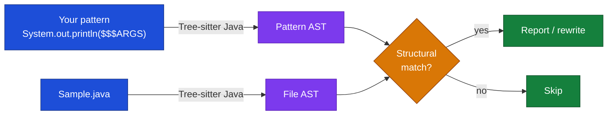
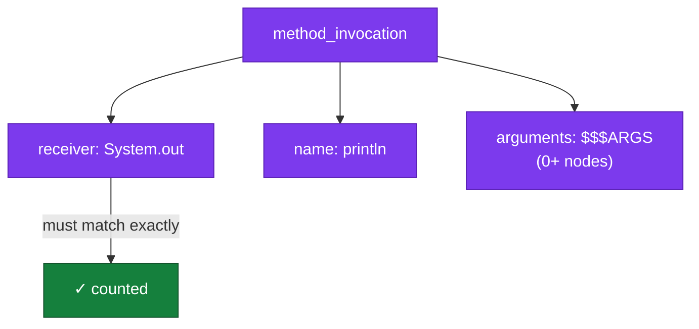
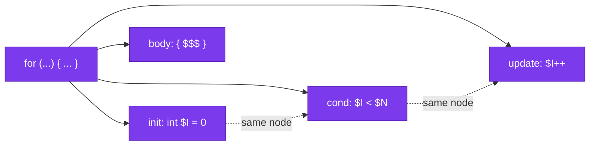
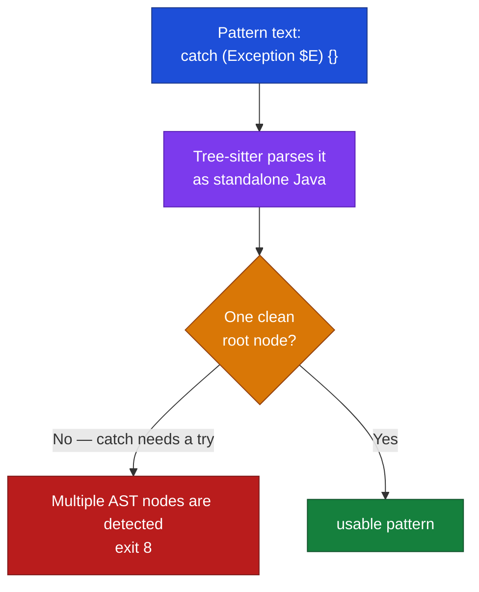
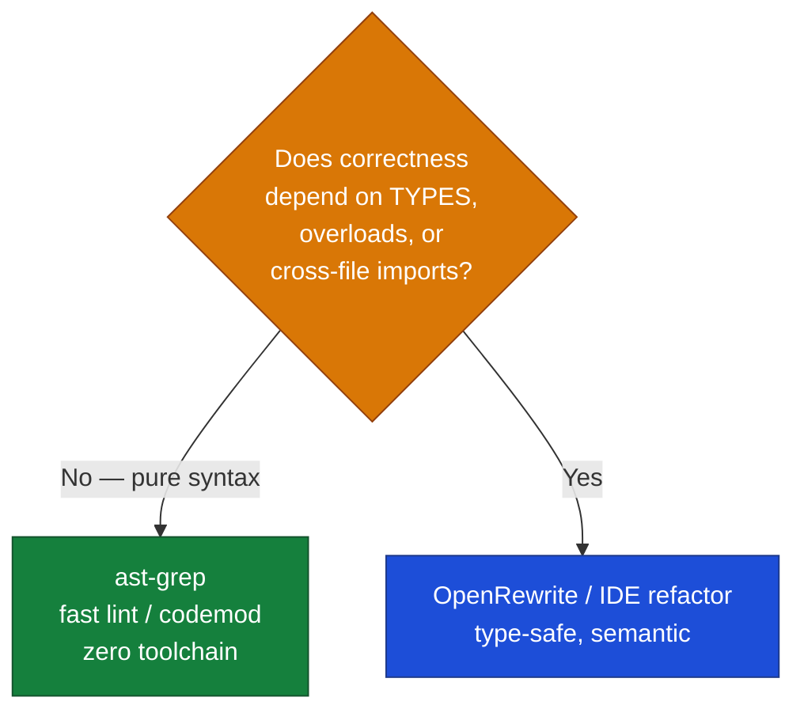

# ast-grep for Java

> Part of the ast-grep learning book — see [INDEX](../INDEX.md). ↑ Up: [03 · Agentic](../03-agentic.md)

Java is the **primary language** of this book. It is also the language where ast-grep's strengths *and* its hardest limitation show up most sharply — because Java is statically typed, and ast-grep is not. This chapter goes deeper than its siblings ([Python](python.md), [Go](go.md)): we work through five real patterns against a real fixture, hit a genuine parser error and fix it the right way, and then draw the line that tells you when to reach for a heavier tool ([OpenRewrite](#the-key-java-tradeoff-ast-grep-vs-openrewrite)).

By the end you will be able to read a Java pattern, predict whether it parses, and know — for any given lint or codemod — whether ast-grep is the right tool or the wrong one.

---

## The mental model in one breath

ast-grep parses your *pattern* and your *target file* with the same Tree-sitter Java grammar (bundled in the binary — no JDK is ever invoked _[verified]_, see [INDEX](../INDEX.md)), then matches the two **syntax trees** structurally. Whitespace, comments, and formatting are invisible. What it *cannot* see is just as important: **types**. ast-grep performs "syntactic and AST-based matching only … not runtime type information" _[sourced — https://ast-grep.github.io/guide/rule-config.html]_. Hold that thought; it is the spine of this entire chapter.



---

## The fixture

Every `[verified]` command in this chapter ran against `examples/java/Sample.java`. It is small on purpose — each line is a deliberate trap that one of our patterns will catch.

```java
package com.example;

import java.util.ArrayList;
import java.util.List;

public class Sample {
    public void process(String input) {
        System.out.println("debug: " + input);
        if (input == "admin") {                 // String identity bug (needs type info to be sure)
            System.out.println("welcome");
        }
        try {
            doWork(input);
        } catch (Exception e) {                  // empty catch block
        }
        List<String> items = new ArrayList<String>();   // could use diamond <>
        for (int i = 0; i < items.size(); i++) {         // old-style indexed loop
            System.out.println(items.get(i));
        }
    }

    private void doWork(String s) throws Exception {
        if (s == null) {
            throw new Exception("null");
        }
    }
}
```

> **A naming note.** The short alias `sg` collides with the Linux/WSL `setgroups` utility, so in this repo we always type the full `ast-grep` _[verified]_. On macOS/Windows the alias is usually free _[sourced, not reproduced here]_.

---

## Pattern 1 — `System.out.println`: the "hello world" of structural search

This is the simplest possible useful pattern. `$$$ARGS` is a **multi meta-variable** — it captures *zero or more* nodes, so the one pattern matches `println()`, `println("x")`, and `println("a", b, c)` alike.

```bash
ast-grep run -p 'System.out.println($$$ARGS)' -l java examples/java/Sample.java
```

This reports **3 matches** in the fixture _[verified]_ — the three `System.out.println(...)` calls on lines 8, 10, and 18.

Why three and not "all the printlns"? Because ast-grep matched *call expressions whose receiver is exactly `System.out` and whose method is `println`*. A `System.err.println` would **not** match — different receiver. That is the whole pitch: structure over text. A regex like `println` would also hit `System.err.println`, comments, and string literals containing the word.



> **Meta-variable cheat-sheet.** `$VAR` = one named node · `$$$VAR` = zero-or-more nodes · `$_` = one node, not captured · `$$VAR` = one *unnamed* node. JSON output exposes captures under `metaVariables.single` and `metaVariables.multi` _[sourced, see INDEX]_.

This pattern is the body of a real rule in this repo (`rules/java-no-sysout.yml`), which adds a `fix: logger.info($$$ARGS)` so `ast-grep scan -U` can rewrite all three at once.

---

## Pattern 2 — `$X == "admin"`: where type-blindness becomes visible

In Java, comparing strings with `==` compares *references*, not contents — almost always a bug. (`"admin".equals(input)` is the correct form.) So let's hunt for it.

```bash
ast-grep run -p '$X == "admin"' -l java examples/java/Sample.java
```

This matches `input == "admin"` on line 9 _[verified]_.

The match is correct here — but read carefully **why** it is only *probably* a bug, and what ast-grep actually proved:

- ast-grep proved: *"there is a `==` binary expression whose right operand is the string literal `"admin"`."* That is a purely **syntactic** fact.
- ast-grep did **not** prove: *"the left operand `$X` is a `String`."* It cannot. It has no type information. `$X` is just "some expression node."

This is the **type-blind heuristic** in action. The pattern works as a *lint* because the right-hand side is a string literal, which strongly implies a string comparison. But flip it around:

```text
status == ADMIN      // $X == enum constant — `==` is CORRECT for enums, not a bug
flags == MASK        // could be int bit-flags — `==` is fine
```

A pattern like `$X == $Y` would flag all of those as suspicious, even the legitimate enum and `int` comparisons. ast-grep has no way to tell a `String` operand from an `enum` operand from an `int` operand — they are syntactically identical (`identifier == identifier`). **This single fact is the reason the OpenRewrite section exists.** Park it; we return to it.

| What you wrote | What ast-grep checks | What it *cannot* check |
| --- | --- | --- |
| `$X == "admin"` | RHS is the literal `"admin"`, operator is `==` | that `$X` is a `String` |
| `$X == $Y` | both sides are expressions | whether either side is a `String`, `enum`, or `int` |

---

## Pattern 3 — raw `new ArrayList<String>()` (a diamond-operator candidate)

Since Java 7, the right-hand side of an assignment can use the *diamond* `<>` and let the compiler infer the type argument. Spelling it out (`new ArrayList<String>()`) when the left side already says `List<String>` is redundant. Let's find the literal occurrence.

```bash
ast-grep run -p 'new ArrayList<String>()' -l java examples/java/Sample.java
```

This matches the `new ArrayList<String>()` on line 16 _[verified]_.

Note this pattern is **fully literal** — it only finds `ArrayList<String>`. To generalize across element types you would parameterize the type argument, e.g. `new ArrayList<$T>()` (illustrative — not run here), which would also catch `new ArrayList<Integer>()`. And here type-blindness bites *gently*: ast-grep can suggest the diamond syntactically, but it cannot verify the surrounding context actually permits inference (the left-hand declared type). For a quick repo-wide nudge that a human reviews, the syntactic match is plenty.

---

## Pattern 4 — old-style indexed `for` loop

The classic `for (int i = 0; i < n; i++)` index loop is often a candidate for an enhanced for-each. The pattern mirrors the loop's three clauses, with meta-variables standing in for the parts that vary:

```bash
ast-grep run -p 'for (int $I = 0; $I < $N; $I++) { $$$ }' -l java examples/java/Sample.java
```

This matches the loop on lines 17–19 _[verified]_.

Three things make this pattern robust:

1. **`$I` is reused** — the same meta-variable appears in all three clauses. ast-grep enforces that they bind to the *same* node, so a malformed loop using `i` in init but `j` in the condition would not match. Meta-variable reuse is a constraint, not just a placeholder.
2. **`$N`** captures whatever the bound is — `items.size()`, `10`, `arr.length` — because the bound varies and we don't care what it is.
3. **`{ $$$ }`** is "any loop body, including an empty one." `$$$` (anonymous multi) swallows zero or more statements.



---

## Pattern 5 — the empty-catch GOTCHA (and the correct fix)

Empty `catch` blocks swallow exceptions silently — a classic code smell. The *obvious* pattern is to write the catch literally:

```bash
ast-grep run -p 'catch (Exception $E) {}' -l java examples/java/Sample.java
```

This **does not work**. It fails with a parser error and **exit code 8** _[verified]_:

```text
Multiple AST nodes are detected
```

### Why it fails — the beginner explanation

ast-grep parses your *pattern* as if it were a standalone snippet of Java. But `catch (Exception e) {}` is **not a complete, standalone piece of Java**. A `catch` clause cannot exist on its own — it is only legal *attached to a `try`*. When Tree-sitter tries to parse the fragment in isolation, it cannot produce a single clean `catch_clause` node; it produces a broken, multi-node parse. ast-grep refuses to guess which node you meant and bails out with *"Multiple AST nodes are detected."*

Exit code 8 is ast-grep's signal for **"unparseable pattern."** It is distinct from "no match" (exit 1) — a useful thing to test for in CI, because it means *your rule is broken*, not *your code is clean*.



### The correct form — a relational rule on `kind`

When a pattern can't express what you mean, drop down to a **YAML rule** that talks about the AST directly. ast-grep rules come in three flavors _[sourced — https://ast-grep.github.io/guide/rule-config.html]_:

- **Atomic** — match a node by `pattern` or by `kind` (its Tree-sitter node type, e.g. `catch_clause`).
- **Relational** — `has` (contains a matching descendant), `inside`, `follows`, `precedes`.
- **Composite** — `all` (every sub-rule), `any` (at least one), `not` (must *not* match).

The empty-catch rule that **works** combines all three ideas — *"a `catch_clause` that does **not** **have** any real statement inside it"_ _[verified]_:

```yaml
rule:
  kind: catch_clause
  not:
    has:
      any:
        - { kind: expression_statement }
        - { kind: local_variable_declaration }
        - { kind: return_statement }
        - { kind: throw_statement }
```

Against the fixture this **matches the empty catch** on lines 14–15 _[verified]_.

### Why *this* matches the fixture's catch

Look again at the fixture:

```java
} catch (Exception e) {                  // empty catch block
}
```

The catch body is not truly empty — it holds a **comment**. But in the Java grammar a comment is **not a statement**. So when the rule asks *"does this `catch_clause` `has` any `expression_statement` / `local_variable_declaration` / `return_statement` / `throw_statement`?"*, the answer is **no** — there are zero statements of any kind. The `not:` flips that "no" into a match. The comment is invisible to the statement check, which is exactly what we want: a catch with *only* a comment is still a swallowed exception.

| Rule piece | Plain-English meaning |
| --- | --- |
| `kind: catch_clause` | start from each `catch (...) { ... }` node |
| `has:` | does it contain a descendant matching… |
| `any: [ ... ]` | …**any** of these statement kinds? |
| `not:` | negate it — keep catches with **no** such statement |

This is the general escape hatch for Java: **when a fragment isn't standalone-parseable (a `catch`, an `else`, a lone `case`, a bare annotation), describe it with `kind` + relational rules instead of a literal pattern.**

---

## The key Java tradeoff: ast-grep vs OpenRewrite

Everything above pivots on one fact we kept flagging: **ast-grep is type-blind.** It is a syntactic tool. For a huge class of Java lint-and-codemod work that is exactly right and gloriously fast. For another class it is *unsafe*, and you want a tool that understands types. That tool, in the Java world, is **[OpenRewrite](https://docs.openrewrite.org/)**.

The difference is in the tree each tool builds:

- ast-grep matches a **Tree-sitter syntax tree** — nodes know their *shape*, not their *type* _[sourced — https://ast-grep.github.io/guide/rule-config.html]_.
- OpenRewrite builds a **type-attributed Lossless Semantic Tree (LST)**: *"Each LST is imbued with type information. … the OpenRewrite LST for `myField` … would contain additional information about what the type of `myField` is, even if it isn't defined in the same source file or even the same project."* _[sourced — https://docs.openrewrite.org/concepts-and-explanations/lossless-semantic-trees]_


### Concrete example 1 — the `==` comparison, revisited

Remember Pattern 2. `$X == "admin"` matched, but ast-grep could not confirm `$X` is a `String`. Run the same idea against a codebase that mixes strings, enums, and ints:

```text
input  == "admin"   // String  → real bug, should use .equals()
status == ADMIN      // enum    → CORRECT, == is idiomatic for enums
flags  == BIT_MASK   // int     → CORRECT
```

- **ast-grep** sees three structurally similar `==` expressions and cannot rank them. A pattern broad enough to catch the bug also flags the two correct lines (false positives). A pattern narrow enough to be safe (`$X == "literal"`) misses the bug when the constant lives in a variable.
- **OpenRewrite** resolves each operand's type from the LST, fires *only* on the `String` operand, and can rewrite it to `"admin".equals(input)` — type-safely, with no false positives.

### Concrete example 2 — JUnit 4 → JUnit 5 migration

Migrating tests is the canonical "you need types and cross-file awareness" job. It requires rewriting **imports** (`org.junit.Test` → `org.junit.jupiter.api.Test`), annotations (`@Before` → `@BeforeEach`), and assertion calls (`Assert.assertEquals` → `Assertions.assertEquals`) — coherently, across many files.

- **ast-grep** can rewrite individual lines that *look* like JUnit 4. But it does not track imports across files, cannot tell an `org.junit.Test` from a same-named class in another package, and won't reconcile the import statements with the call sites. You get a partial, possibly-wrong migration.
- **OpenRewrite** ships a single recipe, `org.openrewrite.java.testing.junit5.JUnit4to5Migration`, described as *"Migrates JUnit 4.x tests to JUnit Jupiter"* — composed of 40+ sub-recipes that update annotations, assertions, `@RunWith`→`@ExtendWith`, and the Maven/Gradle dependencies together _[sourced — https://docs.openrewrite.org/recipes/java/testing/junit5/junit4to5migration]_. It does this *because* it has the types and the whole-project view.

### The decision rule



| Use **ast-grep** when… | Use **OpenRewrite / IDE** when… |
| --- | --- |
| The match is purely syntactic (`System.out.println`, indexed `for`) | Correctness needs the resolved type of an operand |
| You want a fast, dependency-free lint in CI | You must distinguish overloaded methods |
| The codemod is line-local and a human reviews it | You must rewrite imports coherently across files |
| You run agents over many languages with one tool | You migrate a framework (JUnit 4→5, Spring versions) |

They are **complements, not rivals.** A common workflow: ast-grep finds candidates fast and cheap across the whole repo; OpenRewrite (or a human in the IDE) performs the changes that need type safety.

---

## Takeaways

- ast-grep matches **structure, not text** — `System.out.println($$$ARGS)` finds exactly the three calls, ignoring `System.err` and comments _[verified]_.
- It is **type-blind**: `$X == "admin"` matches syntactically but cannot prove `$X` is a `String` _[verified]_. This is a heuristic, not a guarantee.
- Some Java constructs **aren't standalone-parseable**. The naive `catch (Exception $E) {}` fails with *"Multiple AST nodes are detected"* and exit 8 _[verified]_. The fix is a **`kind` + relational rule** (`kind: catch_clause` / `not: has: any: [...statements]`) _[verified]_ — and it matches the fixture's catch *because a comment is not a statement*.
- For type-safe, cross-file, framework-scale refactors, reach for **OpenRewrite's type-attributed LST** _[sourced — https://docs.openrewrite.org/concepts-and-explanations/lossless-semantic-trees]_; keep ast-grep for fast syntactic lint and codemod.
- On token economics (why agents prefer matches over full-file reads), see the benchmark in best practices — ast-grep plain output stays roughly flat per match while whole-file reads blow up with file size.

**Next:** the same ideas in a dynamically typed language — see [Python](python.md) — and in Go's simpler grammar — see [Go](go.md).

---
[← Previous: 05 · Best Practices](../05-best-practices.md) · [Next: Python](python.md)
