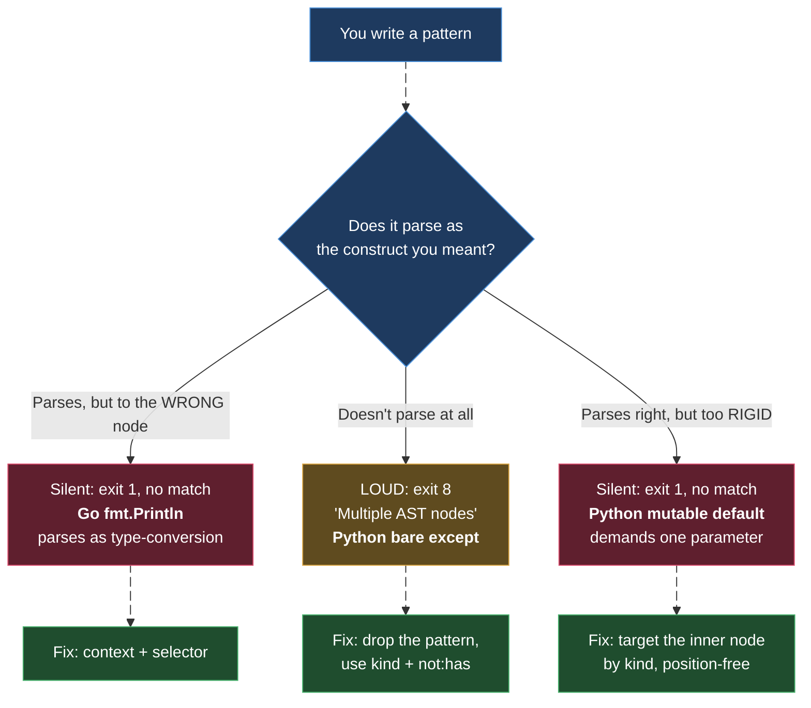

# ast-grep for Python

> Part of the ast-grep learning book — see [INDEX](../INDEX.md). ↑ Up: [03 · Agentic](../03-agentic.md)

Python is, on the surface, the friendliest language for ast-grep. The grammar is
clean, calls look like calls, and most of your everyday patterns just work. But
Python also hides the two most *instructive* pattern failures in this whole book —
one that screams at you, and one that fails in total silence. Master both and you
understand how Tree-sitter patterns really behave.

This chapter assumes you've met the basics in the [field guide README](../../README.md)
(meta-variables, `run` vs `scan`, exit codes). Everything here was exercised against
the fixture `examples/python/sample.py` using **ast-grep 0.42.3** on WSL2.

> **A note on `[verified]` labels in this chapter.** For Python I was handed the exact
> *commands* and their *outcomes* (matches / fails to parse / which exit code), and
> those are marked **[verified]**. I was **not** handed captured `stdout` for Python
> the way the README has it for Java and Go, so this chapter does **not** print a
> fabricated `Debug AST:` or match block and call it verified. Where I show an
> illustrative AST or a refinement I could not run, it is marked
> **[sourced — unverified]** and you should confirm it with `--debug-query` yourself.

---

## The fixture

Every example targets this one small, deliberately-flawed file. Read it once; we'll
come back to each line.

```python
# examples/python/sample.py
import requests


def fetch(url, headers=[]):          # mutable default argument
    print("fetching", url)            # debug print left in
    try:
        r = requests.get(url)         # no timeout
    except:                           # bare except swallows everything
        return None
    if r.status_code == None:         # should be `is None`
        return None
    return r.text
```

Five separate smells live here, and each maps to a pattern lesson:

| Line | Smell | Pattern lesson |
| --- | --- | --- |
| `headers=[]` | mutable default argument | params are **positional** — the rigidity trap |
| `print("fetching", url)` | debug print left in | the easy, plain pattern |
| `requests.get(url)` | no `timeout=` | matching presence is easy, **absence** needs a rule |
| `except:` | bare except | the pattern that **won't parse** (exit 8) |
| `r.status_code == None` | identity-vs-equality bug | the easy, *fixable* pattern |

---

## The easy wins (plain patterns)

These two need nothing more than `run -p`. Python's surface syntax for calls and
comparisons maps almost one-to-one onto a pattern.

### Debug prints

`print(...)` is unambiguous standalone Python, so a plain pattern with a
zero-or-more capture (`$$$A`) catches every call regardless of how many arguments
it has [verified]:

```bash
ast-grep run -p 'print($$$A)' -l python
```

This matches `print("fetching", url)` on line 5. The `$$$A` is the key — it captures
**zero or more** argument nodes, so the same pattern matches `print()`,
`print(x)`, and `print(a, b, c)` alike. (Contrast with `print($A)`, which demands
*exactly one* argument — a rigidity we'll see bite hard below.)

### `== None` — the identity bug

In Python, comparing to `None` with `==` instead of `is` is a classic bug: `==`
invokes `__eq__`, which a class can override, while `is None` is an unambiguous
identity check. The pattern reads exactly like the buggy code [verified]:

```bash
ast-grep run -p '$X == None' -l python
```

`$X` captures one named node on the left-hand side, so this matches
`r.status_code == None` on line 10, with `$X` bound to `r.status_code`. Because the
capture is preserved, this becomes a one-line **fixable** rule — substitute the
captured `$X` straight into the fix template:

```yaml
# rules/python-is-none.yml
id: python-is-none
language: python
severity: warning
message: Use `is None` for identity comparison, not `==`.
rule:
  pattern: $X == None
fix: $X is None
```

Run it with `scan` and preview with `-r`/`-U` like any other rule. The captured
`$X` (`r.status_code`) flows into the fix, yielding `r.status_code is None`. This
is the canonical example of ast-grep's superpower: a structural match that carries
its captures into a deterministic rewrite.

> **Indentation is the grammar's job, not yours.** Python is whitespace-significant,
> and beginners worry their pattern needs the "right" indentation. It does not.
> ast-grep matches the **syntax tree**, and Tree-sitter has already turned
> indentation into real block structure (`block` nodes, `if_statement` bodies, etc.).
> A pattern matches by *structure*, never by literal whitespace — a one-liner pattern
> matches a deeply-indented match and vice-versa.

---

## Matching *presence* is easy; *absence* needs a rule

The `requests.get(url)` on line 7 has no `timeout=`, which is a real reliability bug
(the call can hang forever). A naive instinct is to write a pattern for "a get call
with no timeout." Start with what actually works — matching the call at all [verified]:

```bash
ast-grep run -p 'requests.get($URL)' -l python
```

This matches `requests.get(url)`. But read carefully: it matches **every**
single-argument `requests.get` call, with or without a timeout. The pattern says
nothing about *absence*. A plain pattern can describe what a node **looks like**; it
cannot, on its own, assert that something is **missing**.

To require the timeout to be *absent*, you climb up to a YAML rule and use the
**relational** matcher `has` under a `not` — "match the call that does **not** have a
`timeout` keyword argument" [sourced — unverified]:

```yaml
# illustrative — confirm with --debug-query before trusting
id: requests-get-no-timeout
language: python
severity: warning
message: requests.get without a timeout can hang forever.
rule:
  pattern: requests.get($$$ARGS)
  not:
    has:
      kind: keyword_argument
      has:
        field: name
        regex: '^timeout$'
```

The shape is the lesson, not the exact field names: **presence → plain pattern;
absence → `not: { has: {...} }`**. The same move powers "function with no docstring,"
"call with no error check," and dozens of other "X is missing" lint rules. Verify the
exact node kinds with `--debug-query=ast` on a real example before you commit it —
keyword-argument internals vary, and this rule was **not** run on this machine.

---

## The three ways a pattern fails

Here is the spine of the whole book. A pattern can fail in exactly three ways, and
Python hands us two of the three in one tiny file. Understanding *which* failure you
hit tells you *how* to fix it.



The first failure (parses to the *wrong* node) is the Go `fmt.Println` gotcha — it's
covered in [go.md](go.md) and README §10. Python owns the other two. Crucially, **one
of them is loud** — the rare case where ast-grep *tells* you it failed instead of
silently matching nothing.

### Failure 2 (LOUD): the bare `except:` that won't parse

The fixture's bare `except:` on line 8 is a genuine code smell — it swallows
*everything*, including `KeyboardInterrupt` and `SystemExit`. The obvious pattern is
to write the except clause and capture its body:

```bash
# DOES NOT WORK — fails to parse
ast-grep run -p 'except: $$$B' -l python
```

This **fails to parse** and exits with code **8** ("Multiple AST nodes") [verified].
This is unusual and worth savoring: almost every bad pattern in this book fails
*silently* (exit 1, no match). This one is **loud** — ast-grep refuses the pattern up
front. Exit 8 means "your pattern is not parseable as a single construct," and it's a
gift: a loud failure you can't miss, versus the silent ones you can.

**Why it fails.** An `except` clause is **not a standalone statement** in Python's
grammar — it only exists *attached to* a `try`. When you hand ast-grep `except: $$$B`
on its own, Tree-sitter can't fit it into one coherent node, so it produces *multiple*
top-level AST nodes. ast-grep needs your pattern to be **one** node it can match
against; "multiple AST nodes" is it telling you the pattern is fragmentary. On top of
that, a *bare* except has no exception-type child at all (no `except ValueError:`,
no `except (A, B):`) — there's literally nothing for a positional pattern to anchor to.

**The working approach.** Stop trying to write a pattern that *looks like* the code.
Instead, describe the node **structurally** with a YAML rule: select the
`except_clause` kind, and assert that it does **not** contain any exception-type child
[verified]:

```yaml
# rules/python-bare-except.yml
id: python-bare-except
language: python
severity: warning
message: Bare `except:` swallows every exception, including KeyboardInterrupt.
rule:
  kind: except_clause
  not:
    has:
      any:
        - kind: identifier      # except ValueError:
        - kind: attribute       # except mod.Error:
        - kind: tuple           # except (A, B):
        - kind: as_pattern      # except E as e:
```

This matches the bare `except:` on line 8 [verified]. Read the logic: "an
`except_clause` that has **none** of the four ways an exception type can appear." If
any of those children exist, the except is *not* bare, and the rule correctly skips
it. This is `kind` (atomic) + `not`/`any` (composite) + `has` (relational) working
together — exactly the rule-composition the README previews in §1.

> **Lesson:** when a construct isn't valid *standalone* code, a `-p` pattern can't
> express it. Reach for `kind:` and describe the node directly. The bare-except case
> is the textbook trigger.

### Failure 3 (SILENT): the mutable default that's too rigid

The fixture's `def fetch(url, headers=[])` on line 4 has a mutable default argument —
a notorious Python footgun (the `[]` is created **once** at definition time and shared
across every call). The obvious pattern writes the function with a defaulted param:

```bash
# parses fine, but MISSES the real code
ast-grep run -p 'def $F($P=[]): $$$BODY' -l python
```

This **parses perfectly** and exits cleanly — but it matches **nothing** in the
fixture [verified]. No error, no warning, exit 1: the silent killer the README warns
about. An agent that trusts this empty result concludes "no mutable defaults here,"
which is *wrong*.

**Why it misses.** Look at the pattern's parameter list: `($P=[])`. That is **exactly
one** parameter. But the real signature is `def fetch(url, headers=[])` — **two**
parameters. Pattern parameters are **positional and exact**: `$P` matches one
parameter node, and there's no room in `($P=[])` for the `url` that comes before
`headers`. Meta-variables do **not** float across sibling nodes; `$P` will not skip
over `url` to land on `headers`. (To allow extra params you'd need `$$$` siblings —
but threading that around a defaulted param correctly is fiddly and easy to get
wrong.)

This is the single most common Python pattern mistake: **writing a signature with
fewer parameters than the real code has.**

**The working approach.** Don't match the whole `def`. Match the **inner node** that
actually carries the smell — the defaulted parameter itself — by its `kind`, free of
any position [verified]:

```yaml
# rules/python-mutable-default.yml
id: python-mutable-default
language: python
severity: warning
message: Mutable default argument is shared across all calls — use None + sentinel.
rule:
  kind: default_parameter
  has:
    field: value
    kind: list
```

This matches `headers=[]` regardless of where it sits in the parameter list
[verified]. The logic: "a `default_parameter` whose `value` field is a `list`
literal." It doesn't care that `url` comes first, doesn't care how many params there
are, doesn't care about the function name. It zeroes in on the *one node* that is the
problem.

> **Lesson:** when a plain `-p` pattern silently matches nothing, suspect
> **positional rigidity**. Stop matching the big enclosing construct; find the small
> inner node that carries the smell and match it by `kind`. (For a `dict` default,
> swap `kind: list` for `kind: dictionary`; for a `set`, `kind: set`.)

### The three failures side by side

| | Go `fmt.Println($$$A)` | Python `except: $$$B` | Python `def $F($P=[])` |
| --- | --- | --- | --- |
| **Symptom** | matches nothing | refuses to run | matches nothing |
| **Exit code** | 1 (silent) | **8 (loud)** | 1 (silent) |
| **Root cause** | parses to **wrong node** (type conversion) | **doesn't parse** (not standalone) | parses right but **too rigid** (positional) |
| **The tell** | `--debug-query` shows `ERROR` / wrong kind | "Multiple AST nodes" message | clean exit, zero matches |
| **The fix** | `context` + `selector` | `kind` + `not: has` | target inner node by `kind` |

Two of these three are *silent*. That is why the README's #1 rule for agents is:
**never trust an empty result — verify the parse with `--debug-query` or a `test`
case first.** The loud exit-8 case is the friendly exception; the silent ones are the
trap.

---

## Seeing the tree (and why you should)

The cure for every silent failure is to look at the actual syntax tree. ast-grep's
`--debug-query` prints what your pattern parsed to, and `kind`-based debugging on a
real snippet shows you the node names you need for `kind:` rules.

The README §1 shows a real, captured `Debug AST:` block — for **Java**
(`System.out.println(...)` → `method_invocation`). The exact same flag works for
Python:

```bash
# inspect how YOUR pattern parses (run this yourself to see Python node kinds)
ast-grep run -p 'def $F($P=[]): $$$BODY' -l python --debug-query=ast examples/python/sample.py
```

This is how you'd *discover* node names like `default_parameter`, `except_clause`,
`keyword_argument`, and `list` rather than guessing them. I was not handed a captured
Python AST dump for this chapter, so I won't print one and pretend it's verified — but
the workflow is identical to the Java dump in README §1, and it is the move that turns
a silent failure into an obvious one. For an even quicker visual, the official
**playground** (<https://ast-grep.github.io/playground>) renders the tree for any
snippet [sourced — playground exists per official docs].

---

## Python cheat-sheet

| Goal | Approach | Form |
| --- | --- | --- |
| Find all `print(...)` | plain pattern | `-p 'print($$$A)'` [verified] |
| Flag `== None` | plain pattern + fix | `-p '$X == None'`, `fix: $X is None` [verified] |
| Find `requests.get(...)` calls | plain pattern | `-p 'requests.get($URL)'` [verified] |
| `requests.get` **without** `timeout=` | rule: `not: has` | absence needs a rule [sourced — unverified] |
| Bare `except:` | rule: `kind: except_clause` + `not: has: any` | pattern won't parse (exit 8) [verified] |
| Mutable default `=[]` | rule: `kind: default_parameter` + `has: {field: value, kind: list}` | plain pattern too rigid [verified] |

**Rules of thumb for Python**

- Calls and comparisons → plain `-p` patterns work; lean on `$$$` for arg lists.
- "Something is **missing**" → you need `not: { has: {...} }` in a rule, not a pattern.
- A construct that isn't valid standalone (an `except` clause, an `elif`, a lone
  decorator) → describe it with `kind:`, not a `-p` pattern.
- A plain pattern matching **nothing** → suspect positional rigidity; match the inner
  node by `kind` instead of the whole enclosing statement.
- Never trust an empty result. `--debug-query=ast` is one flag away.

---

## Where Python's type-blindness bites

ast-grep has **no type information** — the same boundary called out for Java. In
Python, dynamically typed and duck-typed, this bites *harder*:

- `$X == None` is reliable because `None` is a literal — there's no type ambiguity.
- `requests.get(...)` matches the *name* `requests.get`; it cannot confirm `requests`
  is the HTTP library versus a local variable you happened to call `requests`.
- A pattern like `$X.append($Y)` matches `.append` on *any* object — a `list`, a
  custom class, anything with that method name. ast-grep can't tell which.

When correctness depends on knowing a value's **type** or following it **across
functions/files** (taint, dataflow), reach for a type-aware tool (Semgrep Pro,
type-checked linters). ast-grep's job is fast, precise, **syntactic** search and
rewrite — and for the five smells in our fixture, that's exactly the right tool.

---

## See also

- **[Java](java.md)** — the primary language; plain patterns mostly Just Work, and
  the OpenRewrite type-aware tradeoff.
- **[Go](go.md)** — the third failure mode (a pattern that parses to the *wrong*
  node) and the `context`/`selector` cure.
- **[INDEX](../INDEX.md)** — the book's table of contents and language shelf.

---
[← Previous: Java](java.md) · [Next: Go](go.md)
