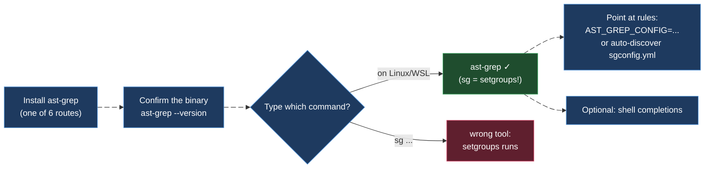
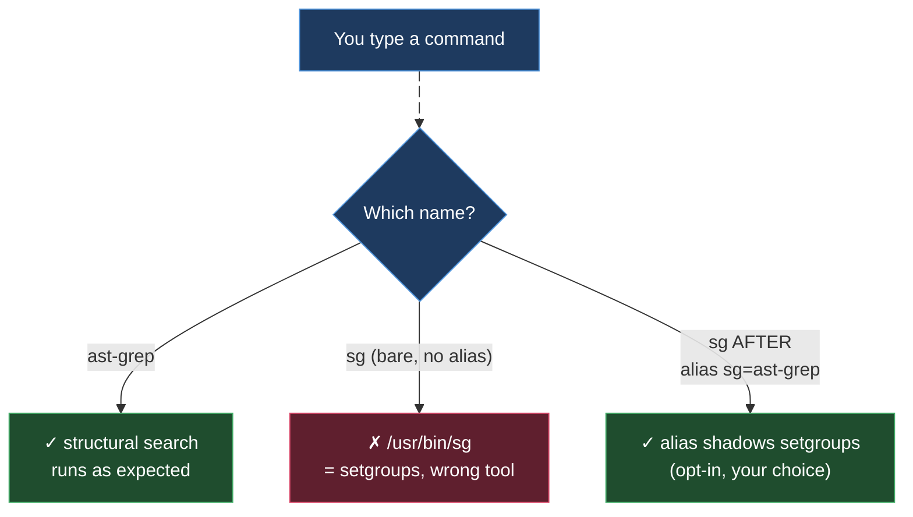

# ast-grep on Linux

> Part of the ast-grep learning book — see [INDEX](../INDEX.md). ↑ Up: [02 · CLI & Rules](../02-cli-and-rules.md)

This is the **canonical OS chapter**. Every `[verified]` fact in the whole book was
exercised on **this machine — WSL2, x86_64, `ast-grep 0.42.3`** — and WSL2 *is* a
real Linux kernel, so what holds here holds on a native Linux box. The three sibling
OS pages — [WSL](wsl.md), [macOS](macos.md), [Windows](windows.md) — are thin
**deltas** that only describe how they differ from this page. Read this one first;
visit the others for the one or two things that change.

What this chapter is **not**: a re-teaching of patterns, meta-variables, or rule YAML.
Those live in [01 · Foundations](../01-foundations.md) and
[02 · CLI & Rules](../02-cli-and-rules.md). Here we cover only the six things that are
genuinely *operating-system* concerns:

1. **Installing** the binary (several routes, pick one)
2. The **`sg` name collision** with `setgroups` — why you always type `ast-grep`
3. The **grammar-library extension** (`.so` on Linux) for custom languages
4. **Pattern quoting** in bash / zsh / fish — single quotes, always
5. **Shell completions** — bash, elvish, fish, powershell, zsh
6. Setting the project config via the **`AST_GREP_CONFIG`** environment variable



---

## 1. Installing on Linux

ast-grep ships as a single self-contained Rust binary. The Tree-sitter grammars for
all 32 built-in languages are **compiled into that binary** [verified], so there is
**no toolchain to install** to analyze Java, Python, or Go — no JDK, no Python
interpreter, no Go SDK is ever invoked. You install one executable and you are done.

Pick whichever route matches how you already manage tools. They all land the same
binary; the difference is only in who keeps it updated.

| Route | Command | Best when… |
| --- | --- | --- |
| **Nix** | `nix-shell -p ast-grep` | you use Nix; gives an ephemeral shell with the binary on `PATH` |
| **mise** | `mise use -g ast-grep` | you manage tool versions with [mise](https://mise.jdx.dev) |
| **Cargo** | `cargo install ast-grep --locked` | you have a Rust toolchain and want to build from source |
| **npm** | `npm i @ast-grep/cli -g` | you live in a Node project / want it in `devDependencies` |
| **pip** | `pip install ast-grep-cli` | you live in a Python project / venv |

All five commands are taken from the official quick-start and registry docs
[sourced — https://ast-grep.github.io/guide/quick-start.html ; mise via
https://mise.jdx.dev/registry.html]. They are **not** marked `[verified]`: I did not
capture the installer output on this machine, only the resulting `ast-grep 0.42.3`
binary that every other `[verified]` fact was run against.

> **A note on the package names.** The pip package is `ast-grep-cli` (not `ast-grep`,
> which is a different, unrelated PyPI project) and the npm package is the scoped
> `@ast-grep/cli`. Getting the name wrong is the single most common install snag
> [sourced — https://ast-grep.github.io/guide/quick-start.html].

### Confirm the install

Whatever route you chose, prove the binary is real and is the version this book
targets before you trust any result:

```bash
ast-grep --version
# expect: ast-grep 0.42.3   (or newer)
```

If that prints a version, you are ready. If it says *command not found*, the install
directory (e.g. `~/.cargo/bin`, the npm global prefix, or the mise shims dir) is not
on your `PATH` — fix the `PATH`, don't reinstall.

---

## 2. The `sg` trap: why you always type `ast-grep`

Across its own documentation ast-grep is sometimes invoked as `sg` — a short, two-key
alias. **On Linux (and therefore WSL) you must not rely on `sg`.** The name is already
taken by a core system utility.

`sg` on Linux is **`setgroups`** — it runs a command under a different group
identity. It almost certainly already exists on your machine:

```bash
which sg
# /usr/bin/sg        ← this is setgroups, NOT ast-grep
```

So if you type `sg 'System.out.println($$$A)' -l java` expecting a structural search,
you instead invoke the `setgroups` tool with nonsense arguments — best case an error,
worst case a confusing partial action. The official quick-start calls this out
directly: *"Linux has a default command `sg` for `setgroups`,"* and recommends using
the full `ast-grep` command, or creating your own alias if you really want the short
form [verified — collision; sourced —
https://ast-grep.github.io/guide/quick-start.html].



**The rule for this book — and for any agent harness:** always invoke `ast-grep` by
its full name. Every `[verified]` command in every chapter does exactly that. If you
*want* the short form for interactive use, opt in explicitly and the alias will shadow
`setgroups` inside your shell:

```bash
# optional, opt-in only — your alias wins over /usr/bin/sg in interactive shells
alias sg=ast-grep
```

But **never put `sg` in a script, a CI job, or an agent prompt** — those don't load
your interactive aliases, so `sg` there resolves to `setgroups` and silently does the
wrong thing.

> **Cross-OS note.** This collision is a *Linux/WSL* problem. On macOS and Windows
> there is normally no `sg` on `PATH`, so `sg` is free to alias to ast-grep — see
> [macos.md](macos.md) and [windows.md](windows.md) [sourced — not reproduced on
> those platforms]. Even so, this book uses `ast-grep` everywhere for portability.

---

## 3. Grammar libraries use the `.so` extension

You rarely need this — the 32 built-in languages (Java, Python, Go included) are
already compiled into the binary [verified]. But if you teach ast-grep a **custom
language**, you register a pre-compiled Tree-sitter grammar as a dynamic library, and
**the file extension is platform-specific**:

| Platform | Grammar library extension |
| --- | --- |
| **Linux / WSL** | `.so` [verified] |
| macOS | `.dylib` [verified] |
| Windows | `.dll` [verified] |

On Linux you wire it up under `customLanguages` in your `sgconfig.yml`, pointing
`libraryPath` at the `.so`:

```yaml
# sgconfig.yml — custom language registration (Linux)
customLanguages:
  mylang:
    libraryPath: ./grammars/mylang.so   # .so on Linux/WSL, .dylib macOS, .dll Windows
    extensions: [ml]
    expandoChar: _
```

The `.so` / `.dylib` / `.dll` split is the one custom-language detail that actually
differs per OS; everything else (`extensions`, `expandoChar`, the registration shape)
is identical across platforms. The macOS and Windows chapters note only their own
extension and otherwise point back here.

---

## 4. Pattern quoting: single quotes, always

This is not an ast-grep rule — it is a **shell** rule, and it is the most common way a
copy-pasted command breaks on Linux. ast-grep patterns are full of meta-variables that
start with `$`: `$VAR`, `$$$ARGS`, `$_`. In bash, zsh, and fish, **`$` inside
double quotes is variable expansion** — the shell rewrites your pattern *before*
ast-grep ever sees it.

Watch what the shell does to a double-quoted pattern:

```bash
# WRONG — double quotes: the shell expands $$$A before ast-grep sees it
ast-grep run -p "print($$$A)" -l python
#                      ▲▲▲ shell turns $$ into the PID, $A into "", etc.
```

`$$` expands to the shell's process ID and `$A` to the (probably empty) variable `A`,
so ast-grep receives a mangled, meaningless pattern. Use **single quotes**, which all
three shells treat as fully literal — no expansion of any kind:

```bash
# RIGHT — single quotes: the pattern reaches ast-grep byte-for-byte
ast-grep run -p 'print($$$A)' -l python
```

| Shell | Single quotes `'...'` | Double quotes `"..."` |
| --- | --- | --- |
| **bash** | literal — safe | `$` expands — breaks patterns |
| **zsh** | literal — safe | `$` expands — breaks patterns |
| **fish** | literal — safe | `$` expands — breaks patterns |

[sourced — POSIX/bash, zsh, and fish quoting semantics; this is standard shell
behavior, not ast-grep output.]

Every `-p '...'` example in this book is single-quoted for exactly this reason. The
rule is mechanical: **wrap every pattern in single quotes** and your meta-variables
arrive intact. (If your pattern itself must contain a literal single quote, that is a
rare case — escape it the way your shell documents; you almost never hit this with
ast-grep patterns.)

---

## 5. Shell completions

ast-grep can emit a completion script for your shell. The subcommand is the same on
every OS; only *where you install the output* is shell-specific.

```bash
ast-grep completions <SHELL>
```

`<SHELL>` is **optional** and may be one of `bash`, `elvish`, `fish`, `powershell`,
or `zsh`. If you omit it, ast-grep **infers** the shell from your environment (e.g.
`$SHELL`) [sourced — https://ast-grep.github.io/guide/tooling-overview.html].

The command writes the completion script to **stdout** — it does not install anything
itself. You pipe that output into the location your shell loads completions from. The
exact destination varies per shell (the official docs defer here to the same
conventions ripgrep/Poetry document), so the recipes below are the *standard* install
locations, marked unverified because the precise path is shell convention, not
ast-grep output:

```bash
# bash — source it from your shell rc, or drop into a completions dir
ast-grep completions bash > ~/.local/share/bash-completion/completions/ast-grep

# zsh — into a directory that's on your $fpath
ast-grep completions zsh  > ~/.zsh/completions/_ast-grep

# fish — fish auto-loads from this dir
ast-grep completions fish > ~/.config/fish/completions/ast-grep.fish
```

[sourced — unverified: the `completions <shell>` subcommand and shell list are from
https://ast-grep.github.io/guide/tooling-overview.html ; the specific destination
paths are standard per-shell convention and were not run on this machine — confirm the
path your distro/shell uses.]

After installing, restart the shell (or re-source its rc) and Tab-completion for
`ast-grep` subcommands and flags lights up. This is a pure quality-of-life step — it
changes nothing about how ast-grep matches or rewrites.

---

## 6. Pointing ast-grep at your config: `AST_GREP_CONFIG`

`ast-grep scan` needs a project config (`sgconfig.yml`) to know where your rules and
tests live. By default it **auto-discovers** that file by walking *up* the directory
tree from your current working directory until it finds one — exactly how the POC in
this repo works (the `sgconfig.yml` at the repo root wires in `ruleDirs:` and
`testConfigs:`).

Sometimes you can't or don't want to run from inside the project tree — a CI job, an
agent invoking ast-grep from an arbitrary directory, a global rule set in your home
directory. For that, set the path explicitly. There are two ways, and the
command-line flag wins over the environment variable:

```bash
# environment variable — applies to every ast-grep call in this shell/session
export AST_GREP_CONFIG=/home/rodrigo/Workspace/ast-grep-poc/sgconfig.yml
ast-grep scan        # now finds the rules no matter what directory you're in

# OR per-invocation flag — takes precedence over the env var
ast-grep scan --config /home/rodrigo/Workspace/ast-grep-poc/sgconfig.yml
```

[sourced — https://ast-grep.github.io/guide/project/project-config.html : the config
is located by walking up from the CWD; `--config` and `AST_GREP_CONFIG` both override
that, with `--config` taking precedence.]

For an agent harness, `export AST_GREP_CONFIG=...` once at session start is the clean
move: every subsequent `ast-grep scan` resolves the same rule set deterministically,
regardless of which directory a tool call happens to run from. See
[03 · Agentic](../03-agentic.md) for the broader agent-integration story.

---

## Linux cheat-sheet

| Goal | Do this | Label |
| --- | --- | --- |
| Install (any one route) | `nix-shell -p ast-grep` · `mise use -g ast-grep` · `cargo install ast-grep --locked` · `npm i @ast-grep/cli -g` · `pip install ast-grep-cli` | [sourced] |
| Confirm install | `ast-grep --version` → `ast-grep 0.42.3` | [verified env] |
| Run a search | always `ast-grep …`, **never** bare `sg` (= setgroups) | [verified] |
| Custom grammar | `libraryPath: ….so` in `sgconfig.yml` | [verified — `.so`] |
| Write a pattern | wrap in **single quotes**: `-p '…$VAR…'` | [sourced — shell] |
| Completions | `ast-grep completions <bash\|elvish\|fish\|powershell\|zsh>` | [sourced] |
| Point at rules | `export AST_GREP_CONFIG=/path/sgconfig.yml` (or `--config`) | [sourced] |

**Rules of thumb for Linux/WSL**

- Type `ast-grep`, never `sg` — `/usr/bin/sg` is `setgroups`.
- Patterns go in **single quotes** so `$`-meta-variables survive the shell.
- No JDK / Python / Go needed — grammars are baked into the binary.
- Custom-grammar files end in `.so` here (`.dylib` macOS, `.dll` Windows).
- `AST_GREP_CONFIG` makes `scan` location-independent — ideal for CI and agents.

---

## See also

- **[WSL](wsl.md)** — this machine's actual platform; the delta is Windows↔Linux
  interop and path handling. Everything `[verified]` in the book ran *here*.
- **[macOS](macos.md)** — delta: grammar libs are `.dylib`; `sg` is usually absent so
  the alias is free.
- **[Windows](windows.md)** — delta: grammar libs are `.dll`; PowerShell quoting and
  completions differ.
- **[02 · CLI & Rules](../02-cli-and-rules.md)** — the flags, subcommands, and rule
  YAML this chapter assumes.
- **Official install + tooling docs** —
  [quick-start](https://ast-grep.github.io/guide/quick-start.html) ·
  [tooling overview](https://ast-grep.github.io/guide/tooling-overview.html) ·
  [project config](https://ast-grep.github.io/guide/project/project-config.html).

---
[← Previous: Go](../languages/go.md) · [Next: WSL](wsl.md)
