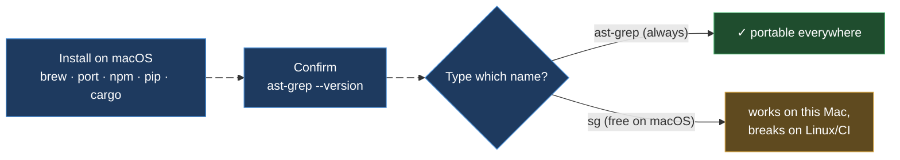
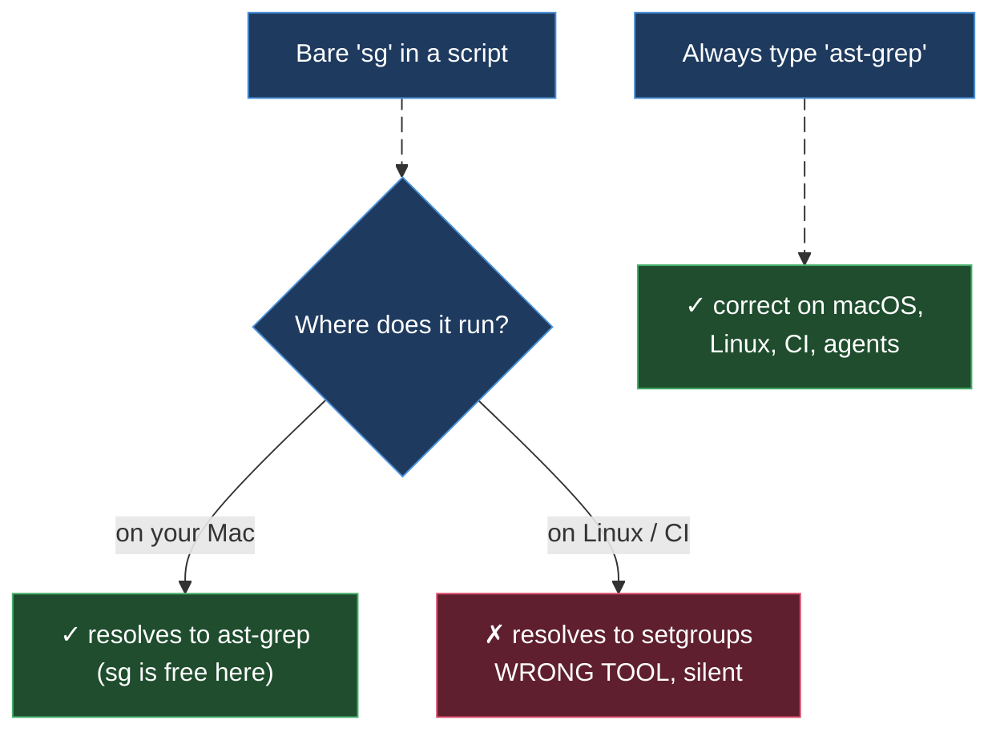

# ast-grep on macOS

> Part of the ast-grep learning book — see [INDEX](../INDEX.md). ↑ Up: [02 · CLI & Rules](../02-cli-and-rules.md)

This is a **delta** chapter. The canonical OS page is [linux.md](linux.md), and every
`[verified]` fact in this book was exercised on **WSL2, x86_64, `ast-grep 0.42.3`** —
a real Linux kernel. ast-grep is the **same single self-contained Rust binary** on
macOS, with the **same 32 Tree-sitter grammars compiled in** [verified], so every
matching, rewriting, JSON, and rule behavior described in [linux.md](linux.md) holds
**identically** on a Mac. Only three things actually differ, and this page covers just
those:

1. **How you install** — `brew` and MacPorts join npm / pip / cargo.
2. **The grammar-library extension** — `.dylib` instead of `.so`.
3. **The `sg` situation is inverted** — macOS usually has *no* `setgroups` `sg`, so the
   short alias is free… but you still type `ast-grep` for portability.

Everything else — pattern quoting, shell completions, `AST_GREP_CONFIG` — is the same
as Linux, so this page just points you back to the relevant section there.

> **Honesty note.** I run on WSL2/Linux and cannot execute anything on a Mac. The
> macOS-specific claims below are therefore marked **[sourced — not reproduced on
> macOS]** (or `[sourced]` with a URL where an official doc confirms them), **never**
> `[verified]`. `[verified]` is reserved for output captured on this machine.



---

## 1. Installing on macOS

macOS gives you two native package managers on top of the cross-platform routes. They
all land the same `ast-grep` binary; pick whichever matches how you already manage
tools.

| Route | Command | Best when… |
| --- | --- | --- |
| **Homebrew** | `brew install ast-grep` | you use Homebrew (the default on most Macs) |
| **MacPorts** | `sudo port install ast-grep` | you use MacPorts instead of Homebrew |
| **Cargo** | `cargo install ast-grep --locked` | you have a Rust toolchain and want to build from source |
| **npm** | `npm i @ast-grep/cli -g` | you live in a Node project / want it in `devDependencies` |
| **pip** | `pip install ast-grep-cli` | you live in a Python project / venv |

The `brew` and `port` commands, and the npm / pip / cargo trio, are all taken
verbatim from the official quick-start [sourced —
https://ast-grep.github.io/guide/quick-start.html]. They are **not** `[verified]`: no
installer was run on a Mac in this book.

> **Package-name reminder (same as Linux).** The pip package is `ast-grep-cli` (not the
> unrelated `ast-grep` PyPI project) and the npm package is the scoped `@ast-grep/cli`.
> Homebrew and MacPorts both use the plain formula/port name `ast-grep` [sourced —
> https://ast-grep.github.io/guide/quick-start.html].

### Confirm the install

Whatever route you chose, prove the binary is the version this book targets before you
trust any result:

```bash
ast-grep --version
# expect: ast-grep 0.42.3   (or newer)
```

If it says *command not found*, the install directory (Homebrew's `bin`, `~/.cargo/bin`,
the npm global prefix, or MacPorts' `/opt/local/bin`) is not on your `PATH` — fix the
`PATH`, don't reinstall.

---

## 2. Grammar libraries use the `.dylib` extension

You rarely need this — Java, Python, and Go (plus 29 other languages) are already
compiled into the binary [verified]. But if you register a **custom language**, the
pre-compiled Tree-sitter grammar is a dynamic library, and on macOS its file extension
is **`.dylib`** (where Linux uses `.so` and Windows uses `.dll`):

| Platform | Grammar library extension |
| --- | --- |
| Linux / WSL | `.so` [sourced] |
| **macOS** | **`.dylib`** [sourced — not reproduced on macOS] |
| Windows | `.dll` [sourced — not reproduced on macOS / Windows] |

The registration shape is identical to Linux — only the `libraryPath` filename changes:

```yaml
# sgconfig.yml — custom language registration (macOS)
customLanguages:
  mylang:
    libraryPath: ./grammars/mylang.dylib   # .dylib on macOS (.so Linux, .dll Windows)
    extensions: [ml]
    expandoChar: _
```

Everything else about custom languages (`extensions`, `expandoChar`, the
`customLanguages` block, how `sgconfig.yml` is discovered) is exactly as documented in
[linux.md § 3](linux.md#3-grammar-libraries-use-the-so-extension) — the **only** macOS
delta is the `.dylib` suffix.

---

## 3. The `sg` situation is inverted — but still type `ast-grep`

On Linux/WSL, `sg` is `/usr/bin/sg` = **`setgroups`**, a real system tool, so bare `sg`
silently runs the wrong program. **macOS normally ships no `setgroups` `sg` on `PATH`**,
so the short `sg` name is free and the alias to ast-grep works without shadowing
anything [sourced — not reproduced on macOS]. The official quick-start frames the
collision as a *Linux* caveat, which implies the macOS `PATH` is clear [sourced —
https://ast-grep.github.io/guide/quick-start.html].

So on a Mac you *can* do this:

```zsh
# macOS only — sg is (usually) free, so this alias shadows nothing
alias sg=ast-grep
```

But this book — and every `[verified]` command in it — invokes the **full `ast-grep`
name everywhere**, for one reason: **portability**. A command, script, CI job, or
agent prompt that uses bare `sg` works on your Mac and then **silently invokes
`setgroups` the moment it runs on Linux or in a Linux CI container**. Type `ast-grep`
and the same command is correct on every platform.



See [linux.md § 2](linux.md#2-the-sg-trap-why-you-always-type-ast-grep) for the full
collision story and the Linux side of the picture.

---

## 4. Everything else is the same as Linux

These three areas have **no macOS delta** — the default macOS shell is **zsh**, which
shares bash's `$`-expansion and quoting rules, so the Linux guidance applies byte for
byte. Don't re-learn them; jump to the linked section.

| Concern | macOS behavior | Where it's taught |
| --- | --- | --- |
| **Pattern quoting** | zsh is the default shell; `$` expands inside `"…"` and is literal inside `'…'`, exactly like bash. Wrap every pattern in **single quotes**. | [linux.md § 4](linux.md#4-pattern-quoting-single-quotes-always) |
| **Shell completions** | `ast-grep completions <bash\|elvish\|fish\|powershell\|zsh>` — same subcommand; for a default macOS shell you want the `zsh` script on your `$fpath`. | [linux.md § 5](linux.md#5-shell-completions) |
| **Config discovery** | `sgconfig.yml` is auto-discovered by walking up from the CWD; `export AST_GREP_CONFIG=/path/sgconfig.yml` or `--config` override it. Identical on macOS. | [linux.md § 6](linux.md#6-pointing-ast-grep-at-your-config-ast_grep_config) |

A concrete quoting example, identical to the Linux page (zsh treats single quotes as
fully literal):

```zsh
# RIGHT — single quotes: the meta-variables reach ast-grep byte-for-byte
ast-grep run -p 'print($$$A)' -l python
```

[sourced — zsh/bash quoting semantics are standard shell behavior, not ast-grep output.]

---

## macOS cheat-sheet

| Goal | Do this | Label |
| --- | --- | --- |
| Install (Homebrew) | `brew install ast-grep` | [sourced] |
| Install (MacPorts) | `sudo port install ast-grep` | [sourced] |
| Install (cross-platform) | `cargo install ast-grep --locked` · `npm i @ast-grep/cli -g` · `pip install ast-grep-cli` | [sourced] |
| Confirm install | `ast-grep --version` → `ast-grep 0.42.3` | [sourced — not reproduced on macOS] |
| Run a search | always `ast-grep …` (don't rely on `sg`, even though it's free here) | [sourced — not reproduced on macOS] |
| Custom grammar | `libraryPath: ….dylib` in `sgconfig.yml` | [sourced — not reproduced on macOS] |
| Write a pattern | wrap in **single quotes**: `-p '…$VAR…'` (zsh, same as bash) | [sourced — shell] |
| Completions / config | same as Linux → [linux.md](linux.md) | [sourced] |

**Rules of thumb for macOS**

- Install with `brew install ast-grep` (or `sudo port install ast-grep`); npm/pip/cargo also work.
- Custom-grammar files end in **`.dylib`** here (`.so` Linux, `.dll` Windows).
- `sg` is usually free on macOS, but type **`ast-grep`** anyway so your commands stay portable.
- No JDK / Python / Go needed — grammars are baked into the binary (same as everywhere).
- Quoting, completions, and `AST_GREP_CONFIG` behave exactly like Linux — see [linux.md](linux.md).

---

## See also

- **[linux.md](linux.md)** — the canonical OS chapter; macOS only differs in install,
  the `.dylib` extension, and the `sg` situation.
- **[WSL](wsl.md)** — the platform every `[verified]` fact in this book actually ran on.
- **[Windows](windows.md)** — sibling delta: grammar libs are `.dll`, PowerShell quoting differs.
- **[02 · CLI & Rules](../02-cli-and-rules.md)** — the flags, subcommands, and rule YAML this chapter assumes.
- **Official install docs** — [quick-start](https://ast-grep.github.io/guide/quick-start.html).

---
[← Previous: WSL](wsl.md) · [Next: Windows](windows.md)
