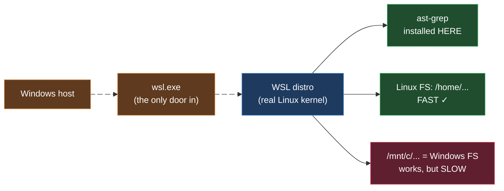
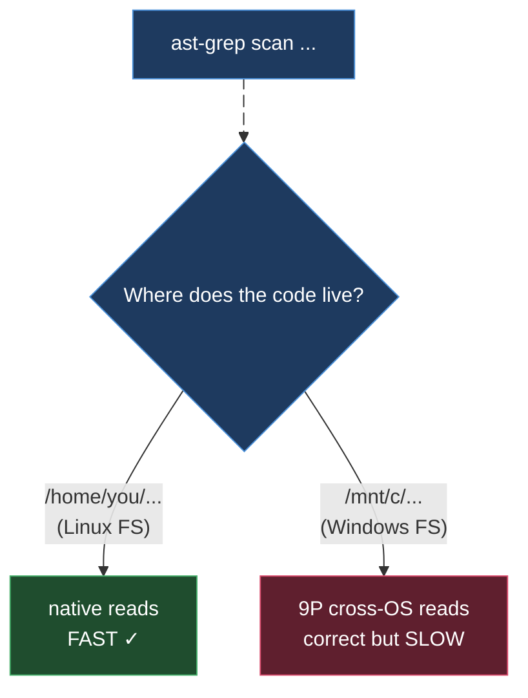

# ast-grep on WSL

> Part of the ast-grep learning book — see [INDEX](../INDEX.md). ↑ Up: [02 · CLI & Rules](../02-cli-and-rules.md)

**This is a delta page. WSL *is* Linux** — the Windows Subsystem for Linux runs a
real Linux kernel (this machine reports `…-microsoft-standard-WSL2` [verified env]),
so every install route, the `sg` collision, the `.so` grammar extension, single-quote
pattern quoting, completions, and `AST_GREP_CONFIG` all work **exactly** as on a
native box. Read the canonical **[Linux chapter](linux.md)** first — it teaches all
of that in full. This page adds only the four things that are genuinely *WSL*
concerns, where a Windows host sits next to your Linux distro.

| # | WSL delta | One-line takeaway |
| --- | --- | --- |
| 1 | **Where you install** | Install ast-grep *inside* the distro — not on the Windows host, not `ast-grep.exe`. |
| 2 | **The `sg` collision** | Still applies (it's Linux). Always type `ast-grep`. → [linux.md §2](linux.md#2-the-sg-trap-why-you-always-type-ast-grep). |
| 3 | **Windows-mounted paths** | `/mnt/c/...` works but is **markedly slower** — keep code in the Linux filesystem. |
| 4 | **MCP across the boundary** | A Windows-host MCP client reaches the WSL server through `wsl.exe`. |



---

## 1. Install ast-grep *inside* the WSL distro

WSL gives you two worlds on one machine: the **Windows host** and one or more **Linux
distros**. ast-grep for your Linux workflow belongs in the **distro**, not on Windows.

Open your distro's shell (Ubuntu, Debian, …) and install with **any of the Linux
routes** from [linux.md §1](linux.md#1-installing-on-linux) — `cargo`, `npm`, `pip`,
`mise`, or Nix. They behave identically here because, again, this *is* Linux.

```bash
# inside the WSL distro shell — pick one, exactly as on native Linux
cargo install ast-grep --locked     # or: npm i @ast-grep/cli -g
                                    # or: pip install ast-grep-cli
ast-grep --version                  # confirm the Linux binary answers
```

[sourced — install routes from https://ast-grep.github.io/guide/quick-start.html ;
see [linux.md §1](linux.md#1-installing-on-linux) for the full table and package-name
gotchas.]

**Two traps that are unique to having Windows next door:**

- **Do not install the *Windows* build and call it from the distro.** There is a
  native Windows `ast-grep.exe`, and WSL's interop lets you launch Windows `.exe`s
  from a Linux shell. It is tempting to type `ast-grep.exe` and think you are done.
  Don't. That binary runs as a Windows process; it sees the Windows filesystem and
  Windows path semantics, not your Linux paths — a recipe for "file not found" on
  perfectly valid Linux paths, plus the cross-boundary slowdown of §3. For a Linux
  workflow, install the Linux binary and call it as plain `ast-grep`.
- **The two installs are independent.** ast-grep on the Windows host (for PowerShell
  work) and ast-grep in the distro are *separate* binaries with separate versions and
  separate `PATH`s. Installing one does nothing for the other. This book's
  `[verified]` facts were all run from the **Linux side**; the Windows-host story is
  in [windows.md](windows.md).

> **Which `ast-grep` am I really running?** If a command behaves strangely, check
> `command -v ast-grep`. A path ending in `.exe` (or under `/mnt/c/...`) means you
> reached the *Windows* binary through interop, not the Linux one you installed in
> step 1.

---

## 2. The `sg` collision still applies — type `ast-grep`

Because WSL is Linux, the **`sg` name collision is present here**, and it is the one
collision fact this book marks `[verified]` *on WSL2*. The short alias `sg` that
ast-grep's own docs sometimes use is already a **system command on Linux** — it
belongs to the `setgroups`/`newgrp` family, not to ast-grep. On this machine the
system entry is a symlink:

```bash
/usr/bin/sg -> newgrp        # the system 'sg' — NOT ast-grep [verified here]
```

So a bare `sg 'System.out.println($$$A)' -l java` does **not** run a structural
search; in the worst case it invokes the unrelated group-identity tool with garbage
arguments. The fix is the same as on any Linux box and is taught in full, with the
decision diagram and the opt-in `alias sg=ast-grep` caveat, in
**[linux.md §2](linux.md#2-the-sg-trap-why-you-always-type-ast-grep)**.

**The rule, unchanged for WSL:** always invoke `ast-grep` by its full name in scripts,
CI, and agent prompts. Never put bare `sg` in anything that doesn't load your
interactive aliases.

---

## 3. `/mnt/c/...` works — but it is markedly slower

WSL auto-mounts your Windows drives under `/mnt/` — your `C:\` becomes `/mnt/c/`. You
*can* point ast-grep at a Windows-side project from the Linux shell:

```bash
# works — scans a Windows-mounted project from inside WSL
ast-grep scan /mnt/c/Users/you/project
```

It runs and produces correct results. But every file read crosses the
Windows↔Linux filesystem boundary (a 9P network protocol, not a native disk), and
Microsoft is explicit that this is the **slow** path:

> *"We recommend against working across operating systems with your files, unless you
> have a specific reason for doing so. For the fastest performance speed, store your
> files in the WSL file system if you are working in a Linux command line."*
> — and: *"It is possible to store your project files on a mounted drive, but your
> performance speed will improve if you store them directly on the `\\wsl$` drive."*
> [sourced — https://learn.microsoft.com/en-us/windows/wsl/filesystems]

ast-grep is **I/O-bound** when it walks a tree: it opens and parses every candidate
file. On a large repo, the per-file cost of `/mnt/c` reads dominates and a scan that
feels instant on Linux-native storage can crawl. The remedy is purely *where the code
lives*, not anything about ast-grep:

| Project location | Path you'd scan | Speed | Verdict |
| --- | --- | --- | --- |
| **Linux filesystem** | `/home/<you>/project` | native ext4 | **use this** [sourced] |
| Windows filesystem (mounted) | `/mnt/c/Users/<you>/project` | crosses 9P boundary | works, **slow** [sourced] |



**Practical rule:** `git clone` into the Linux home directory and run ast-grep there.
Reach for `/mnt/c` only when the files genuinely must live on the Windows side. The
exact slowdown is workload- and hardware-dependent — this page does not put a number
on it; it reports Microsoft's documented guidance, not a benchmark run here.

---

## 4. MCP across the boundary: reach the WSL server via `wsl.exe`

ast-grep ships an **MCP server** (covered in [03 · Agentic](../03-agentic.md)) so an
LLM agent can call structural search/rewrite as a tool. In WSL there's a wrinkle:
**where does the MCP *client* live?**

- **Client inside the same distro** (an agent running in WSL): nothing special. It
  spawns the ast-grep MCP server as a normal Linux child process. Treat it exactly
  like the Linux setup.
- **Client on the Windows host** (e.g. a Windows-native IDE or agent runner): it
  cannot exec a Linux binary directly. The only door from Windows into the distro is
  **`wsl.exe`**. The Windows-side MCP client must therefore launch the server *as a
  Linux command run through `wsl.exe`*, rather than naming the Linux binary directly.

Microsoft documents the mechanism: from a Windows command line you run a Linux binary
with `wsl <command>` (equivalently `wsl.exe <command>`), and you target a specific
distro with `--distribution <Name>` (short form `-d`). Crucially:

> *"The commands passed into `wsl.exe` are forwarded to the WSL process without
> modification. File paths must be specified in the WSL format."*
> [sourced — https://learn.microsoft.com/en-us/windows/wsl/basic-commands and
> https://learn.microsoft.com/en-us/windows/wsl/filesystems]

So the shape of a Windows-host MCP server entry becomes "run `wsl.exe`, and hand it
the Linux ast-grep MCP invocation as its arguments." Conceptually:

```jsonc
// Windows-host MCP client config — the command is wsl.exe, the ast-grep
// MCP server is the *argument*. Shape only; consult your client's docs and
// ast-grep's MCP docs for the exact server subcommand/flags.
{
  "command": "wsl.exe",
  "args": ["-d", "Ubuntu", "ast-grep", "<mcp-server-args>"]
}
```

[sourced — `wsl.exe` invocation, `-d/--distribution`, and "forwarded without
modification / WSL-format paths" from the two Microsoft pages above. The ast-grep MCP
server's own subcommand and flags are **not** reproduced here — see
[03 · Agentic](../03-agentic.md) and the official MCP docs; the JSON above is the
client *wiring* shape, marked unverified for the exact ast-grep arguments.]

Two consequences fall out of that one Microsoft sentence:

1. **Paths must be WSL-format.** Any file path the Windows client passes through to
   the server has to be a Linux path (`/home/you/project`), not `C:\...`. The client
   does not translate them for you.
2. **Keep the project on the Linux side** (§3). A Windows client driving a WSL server
   that scans `/mnt/c` pays the cross-OS penalty *and* the interop hop — slowest of
   all. Clone into the distro; let both server and files live in Linux.

If you can run the agent **inside** WSL, do that — it sidesteps `wsl.exe` entirely and
is the cleaner setup.

---

## WSL cheat-sheet (deltas only)

| Goal | Do this | Label |
| --- | --- | --- |
| Install | inside the distro, any Linux route; **not** `ast-grep.exe` | [sourced] |
| Confirm which binary | `command -v ast-grep` — beware a `.exe` / `/mnt/c` path | [sourced] |
| Avoid `sg` | type `ast-grep`; `/usr/bin/sg -> newgrp` here | [verified — collision] |
| Fast scans | keep code in `/home/...`, not `/mnt/c/...` | [sourced] |
| Windows-host MCP | launch server via `wsl.exe -d <distro> ast-grep …` | [sourced — wiring] |
| Everything else | identical to Linux | → [linux.md](linux.md) |

**Rules of thumb for WSL**

- WSL is Linux — install ast-grep **in the distro**, run it as `ast-grep`.
- Never call `ast-grep.exe` from the Linux shell for a Linux workflow.
- `/mnt/c/...` is correct but slow; `git clone` into `/home/<you>/...` instead.
- A Windows-host MCP client reaches the server only through `wsl.exe`; paths stay
  WSL-format.
- For install depth, quoting, completions, custom grammars, and `AST_GREP_CONFIG`,
  see **[linux.md](linux.md)** — none of it changes under WSL.

---

## See also

- **[Linux](linux.md)** — the canonical chapter; read it for *everything* this page
  doesn't repeat. All `[verified]` facts in the book ran on this WSL2 machine.
- **[Windows](windows.md)** — the *other* half of a WSL box: the native Windows-host
  ast-grep story (PowerShell quoting, `.dll` grammars).
- **[macOS](macos.md)** — delta: `.dylib` grammars; `sg` usually absent.
- **[03 · Agentic](../03-agentic.md)** — the MCP server and the agent-integration
  story this page's §4 plugs into.
- **Microsoft WSL docs** —
  [working across file systems](https://learn.microsoft.com/en-us/windows/wsl/filesystems) ·
  [basic commands (`wsl.exe`)](https://learn.microsoft.com/en-us/windows/wsl/basic-commands).

---
[← Previous: Linux](linux.md) · [Next: macOS](macos.md)
