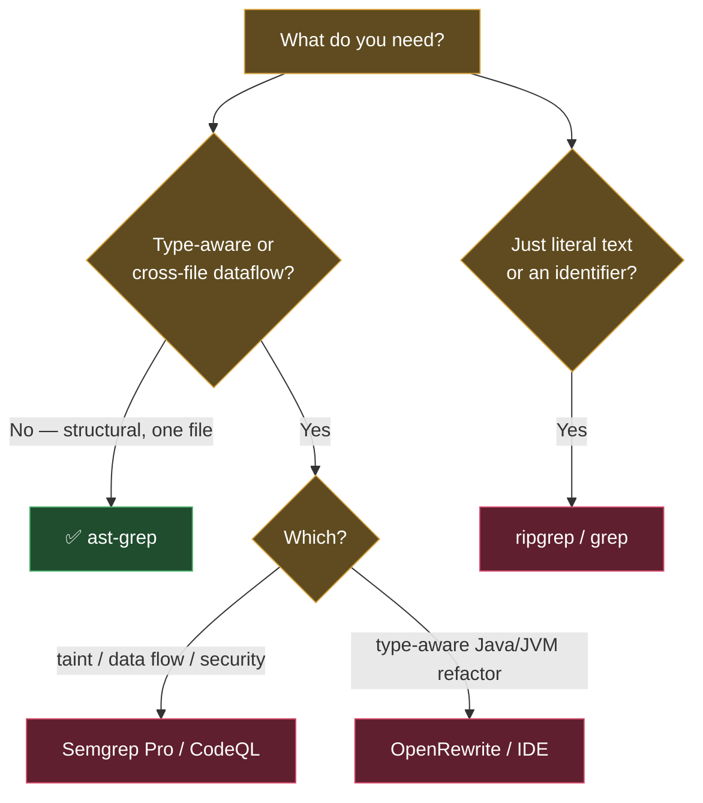

# 04 · When to use ast-grep — and when not to

> Part of the ast-grep learning book — see [INDEX](INDEX.md).

ast-grep's boundary in one line: **intra-file, AST-structural, no type information,
no cross-file dataflow/taint.** Every recommendation here follows from that. The
comparison verdicts below summarize each tool's *documented design* — treat them as
orientation, and verify against each tool's own docs before betting on them.

## The decision in one picture

## The comparison table

| Tool | Model | Reach for it when | ast-grep instead when |
| --- | --- | --- | --- |
| **ripgrep / grep** | text / regex | literal strings, identifiers, log greps; max speed | the match depends on syntax (calls, nesting, kinds) |
| **ast-grep** | single-file Tree-sitter AST | structural search, lint, codemod, agent tooling, many languages | — |
| **Semgrep / Semgrep Pro** | AST + dataflow (Pro: cross-file/interprocedural **taint**) | security rules, taint tracking, big curated rule packs | you want lighter/faster local structural rules, no cloud |
| **Comby** | lightweight structural (lexer-ish) | language-agnostic rewrites across many syntaxes | you want precise node *kinds* and a rule/test system |
| **CodeQL** | code compiled to a queryable DB | deep semantic/dataflow security queries | you can't afford a build step and DB; you want instant local |
| **OpenRewrite** | type-attributed LST (JVM) | **type-aware** Java/Kotlin refactors & migrations (resolve imports/overloads across files) | the change is purely syntactic and single-file |
| **LSP / IDE** | type-aware, interactive | rename-symbol, type-safe extract/refactor for a human | you need scriptable, repeatable, CI-able batch edits |

> **Semgrep is the structural peer worth installing.** Its taint/dataflow is the one
> thing ast-grep cannot do — the dedicated chapter has a `[verified]` source→sink demo:
> [tools/semgrep.md](tools/semgrep.md). Comby and GritQL are alternative structural
> engines; the whole shelf is mapped in [tools/00-overview.md](tools/00-overview.md).

## When NOT to use ast-grep

Reach for something else when you need to:

- **Know a variable's *type*** — ast-grep matches `$X == "admin"` syntactically; it
  cannot confirm `$X` is a `String`. Type-aware tool needed. (See the
  [Java chapter](languages/java.md) and the OpenRewrite tradeoff.)
- **Follow a value across functions/files** (dataflow) — that's Semgrep Pro / CodeQL.
- **Do taint/security analysis** — Semgrep Pro / CodeQL.
- **Refactor type-safely** (overload resolution, import rewriting) — OpenRewrite / IDE.
- **Search for literal text** at max speed — ripgrep is simpler and cheaper.

The thing to internalize: ast-grep is a precise, fast, scriptable **single-file
structural** tool. Inside that box it's excellent and a perfect agent companion;
outside it, it will give confident-looking but incomplete answers. Knowing the box
is the whole skill.

---

[← Previous: 03 · Agentic](03-agentic.md) · [Next: 05 · Best practices →](05-best-practices.md)
