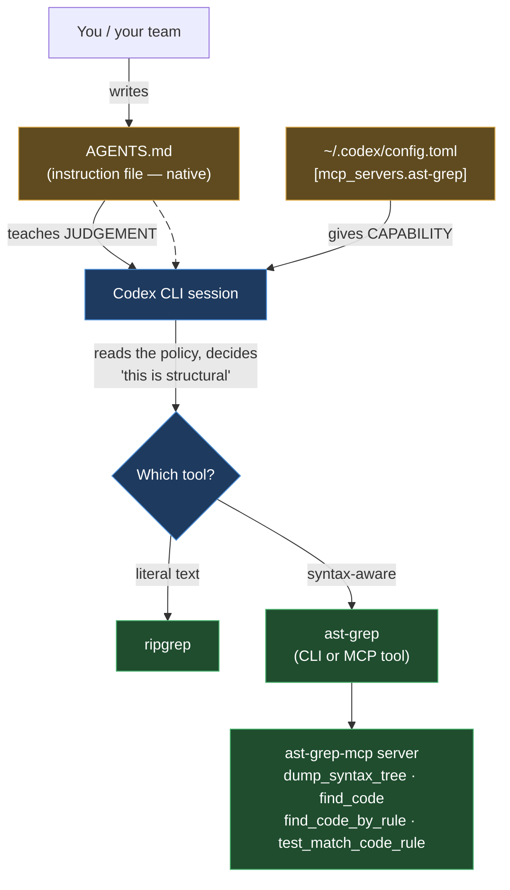
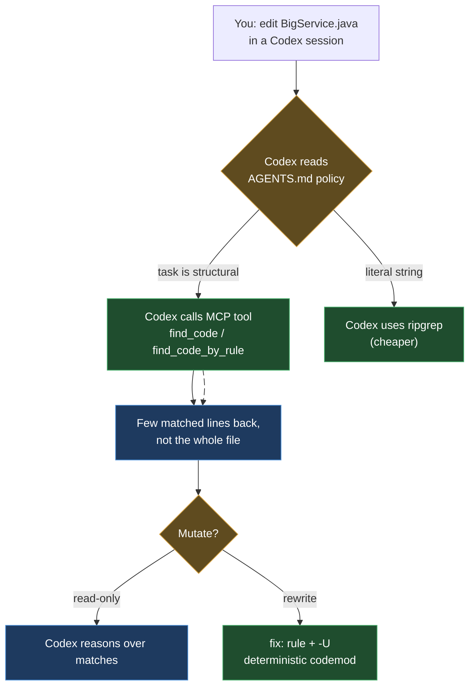

# ast-grep in OpenAI Codex CLI

> Part of the ast-grep learning book — see [INDEX](../INDEX.md). ↑ Up: [Decision Policy](00-decision-policy.md)

This page is a **delta**, not a re-explanation. For
[OpenAI's Codex CLI](https://developers.openai.com/codex) it tells you exactly two
things: *where to put the Agent Decision Policy* so Codex reaches for ast-grep at the
right moment, and *how to mount the ast-grep MCP server* so Codex can call the tools
directly. The policy text itself lives once, in
[00-decision-policy.md](00-decision-policy.md) — don't duplicate it here. The *why*
(token savings, the four MCP tools) is in [Chapter 03 · Agentic](../03-agentic.md).

**The one fact that makes this chapter different from every sibling: Codex reads
`AGENTS.md` natively.** Claude Code does *not* — it needs an `@AGENTS.md` bridge
(see [claude-code.md](claude-code.md)). Cursor needs a `.mdc` wrapper with frontmatter
(see [cursor.md](cursor.md)). Codex needs neither. The portable, cross-tool
`AGENTS.md` *is* Codex's instruction file, so the policy lands there with **zero
glue** — and the same file already works for Codex, partially for others, and (via a
one-line import) for Claude. That is the whole appeal of `AGENTS.md` as the baseline.

All claims below are labelled. `[verified]` is reserved for ast-grep snippets that
were **run on this machine** (they live in the spine chapters, referenced here).
Codex config claims are `[sourced]` with their doc URL and the date checked,
**2026-06-20**. Anything I assembled from two sources but could not run end-to-end is
`[sourced — unverified]`.

## The two surfaces

Codex gives ast-grep two independent ways in. They are complementary — use both.



- **The instruction file (`AGENTS.md`)** carries the
  [Agent Decision Policy](00-decision-policy.md). It shapes *behaviour*: _"Codex reads
  `AGENTS.md` files before doing any work."_ `[sourced — https://developers.openai.com/codex/guides/agents-md, 2026-06-20]`
- **MCP (`~/.codex/config.toml` / `codex mcp add`)** mounts the actual ast-grep tools
  so Codex can call them as functions. This is *capability*. Even without MCP, Codex
  can shell out to the `ast-grep` CLI — MCP just makes the four tools first-class.

## 1. Where the policy lives — `AGENTS.md` (no bridge needed)

Put the [Agent Decision Policy](00-decision-policy.md) in your project-root
`AGENTS.md` and commit it. Codex picks it up automatically — there is no
Codex-specific file to maintain, no import directive, no frontmatter. That is the
payoff of the portable baseline described in
[00-decision-policy.md](00-decision-policy.md).

### Codex's AGENTS.md discovery chain

Codex doesn't read just one `AGENTS.md` — it walks a chain and **merges** them. The
official precedence order, quoted verbatim: `[sourced — https://developers.openai.com/codex/guides/agents-md, 2026-06-20]`

1. **Global scope** — _"In your Codex home directory (defaults to `~/.codex`, unless
   you set `CODEX_HOME`), Codex reads `AGENTS.override.md` if it exists. Otherwise,
   Codex reads `AGENTS.md`."_
2. **Project scope** — _"Starting at the project root (typically the Git root), Codex
   walks down to your current working directory."_ In each directory along the way,
   _"it checks for `AGENTS.override.md`, then `AGENTS.md`, then any fallback names in
   `project_doc_fallback_filenames`."_
3. **Merge order** — _"Codex concatenates files from the root down, joining them with
   blank lines. Files closer to your current directory override earlier guidance
   because they appear later in the combined prompt."_

| Scope | File Codex reads | Shared with |
| --- | --- | --- |
| **Global** | `~/.codex/AGENTS.md` (or `~/.codex/AGENTS.override.md` if present) | Just you, every project |
| **Project root → cwd** | `AGENTS.md` in each directory, root first | Team, via source control |
| **Temporary override** | `~/.codex/AGENTS.override.md` | Just you — _"a temporary global override without deleting the base file."_ |

> **Where to put the ast-grep policy.** Project-root `AGENTS.md`, committed — every
> teammate's Codex then reads the same "ast-grep vs ripgrep vs Semgrep" rule. Because
> files **closer to the cwd win**, you can also drop a narrower `AGENTS.md` inside,
> say, `src/legacy/` to tighten the rule for that subtree without touching the root
> file. `[sourced — https://developers.openai.com/codex/guides/agents-md, 2026-06-20]`

### Keep it short — there's a hard byte cap

Codex doesn't read your `AGENTS.md` files unbounded. _"Codex skips empty files and
stops adding files once the combined size reaches the limit defined by
`project_doc_max_bytes` (32 KiB by default)."_ `[sourced — https://developers.openai.com/codex/guides/agents-md, 2026-06-20]`
The same key is in the config reference — _"`project_doc_max_bytes`: Maximum bytes
read from `AGENTS.md` when building project instructions."_ `[sourced — https://developers.openai.com/codex/config-reference, 2026-06-20]`

That cap is a feature for us, not a limit: a 2000-token policy pasted into every
`AGENTS.md` defeats its own token-saving purpose (and eats into the 32 KiB before
your *actual* project instructions get read). Paste the **short** block from
[00-decision-policy.md](00-decision-policy.md) under a clear header:

```markdown
# AGENTS.md  (project root)

## Code search & refactor tool policy
<!-- paste the canonical block from docs/harnesses/00-decision-policy.md here.
     Do NOT edit the policy in this file — edit it in 00-decision-policy.md so
     every harness page stays in sync. -->
1. Literal string / identifier → ripgrep (rg). Cheapest.
2. Syntax-aware search in ONE language → ast-grep run -p '<pattern>' -l <lang>.
3. Needs TYPE info / cross-file dataflow / taint → ast-grep CANNOT; use Semgrep/CodeQL/OpenRewrite.

# Guardrails: invoke `ast-grep`, never `sg`. A no-match exits 1 with no error —
# confirm a pattern parsed with `--debug-query=ast` before trusting "no matches".
```

The body is a verbatim copy of the fenced `## Code search & refactor tool policy`
block from [00-decision-policy.md](00-decision-policy.md). This is the *only* file
you need for judgement — no Codex-specific wrapper exists or is required.

> **Portability payoff.** This same `AGENTS.md` is read natively by Codex, can be
> imported into Claude Code with a one-line `@AGENTS.md`
> (see [claude-code.md](claude-code.md)), and is the cross-tool baseline the
> [Decision Policy harness matrix](00-decision-policy.md) is built around. One file,
> many agents. `[sourced]`

## 2. Mounting the ast-grep MCP server

The server is the official-org repo
[`ast-grep/ast-grep-mcp`](https://github.com/ast-grep/ast-grep-mcp). It exposes four
tools — described in depth in
[Chapter 03](../03-agentic.md#the-official-integration-surface-sourced), so here is
just the one-line reminder: `[sourced — https://github.com/ast-grep/ast-grep-mcp]`

| Tool | What it does |
| --- | --- |
| `dump_syntax_tree` | Visualise a snippet's AST — Codex's in-MCP `--debug-query` |
| `test_match_code_rule` | Test a YAML rule against code *before* applying it |
| `find_code` | Search with a simple pattern (`max_results`, `output_format` opts) |
| `find_code_by_rule` | Search with a full YAML rule (relational/composite constraints) |

Codex offers **two ways** to register the server — a CLI command or a hand-edited
TOML table. Both write to the same place. _"For more fine-grained control over MCP
server options, edit `~/.codex/config.toml` (or a project-scoped `.codex/config.toml`)."_
`[sourced — https://developers.openai.com/codex/mcp, 2026-06-20]`

### Path A — the `codex mcp add` command

The published command shape is: `[sourced — https://developers.openai.com/codex/mcp, 2026-06-20]`

```bash
codex mcp add <server-name> --env VAR1=VALUE1 --env VAR2=VALUE2 -- <stdio server-command>
```

Everything after `--` is the command Codex runs to spawn the stdio server. The
repo's own clone-and-run invocation is `uv --directory <path> run main.py`
`[sourced — https://github.com/ast-grep/ast-grep-mcp]`. Combining the two gives the
following — the merge of Codex's command shape with the repo's invocation was not run
end-to-end, so treat it as `[sourced — unverified]`:

```bash
# Register ast-grep-mcp, pointing it at your project rules — [sourced — unverified]
codex mcp add ast-grep \
  --env AST_GREP_CONFIG=/absolute/path/to/sgconfig.yml \
  -- uv --directory /absolute/path/to/ast-grep-mcp run main.py
```

### Path B — the `[mcp_servers.ast-grep]` TOML table

_"Configure each MCP server with a `[mcp_servers.<server-name>]` table in the
configuration file."_ `[sourced — https://developers.openai.com/codex/mcp, 2026-06-20]`
The config reference lists the STDIO-server keys verbatim
`[sourced — https://developers.openai.com/codex/config-reference, 2026-06-20]`:

| Key | Meaning (verbatim from the config reference) |
| --- | --- |
| `command` | _"Launcher command for an MCP stdio server."_ |
| `args` | _"Arguments passed to the MCP stdio server command."_ |
| `env` | _"Environment variables forwarded to the MCP stdio server."_ |
| `env_vars` | _"Additional environment variables to whitelist for an MCP stdio server."_ |
| `cwd` | _"Working directory for the MCP stdio server process."_ |
| `startup_timeout_sec` | _"Override the default 10s startup timeout for an MCP server."_ |
| `tool_timeout_sec` | _"Override the default 60s per-tool timeout for an MCP server."_ |

The canonical MCP block elsewhere in this book is **JSON** (`mcpServers`, from
[03-agentic.md](../03-agentic.md)). Codex's config is **TOML**, so it must be
translated. The `command`/`args` come from the repo's published invocation
`[sourced — https://github.com/ast-grep/ast-grep-mcp]`; the table name and `env` key
come from the config reference `[sourced — https://developers.openai.com/codex/config-reference, 2026-06-20]`.
The assembled block was not run end-to-end, so it is `[sourced — unverified]`:

```toml
# ~/.codex/config.toml  — [sourced — unverified] (TOML translation of the repo's JSON block)
[mcp_servers.ast-grep]
command = "uv"
args = ["--directory", "/absolute/path/to/ast-grep-mcp", "run", "main.py"]
env = { AST_GREP_CONFIG = "/absolute/path/to/sgconfig.yml" }
```

Replace `/absolute/path/to/ast-grep-mcp` with your real checkout path and
`/absolute/path/to/sgconfig.yml` with your project config.

### Point the server at your project rules

ast-grep-mcp resolves rules from a config file so `find_code_by_rule` can see your
custom rules. Aim it at your `sgconfig.yml` either with the `--config` CLI argument
(higher precedence) or the `AST_GREP_CONFIG` environment variable.
`[sourced — https://github.com/ast-grep/ast-grep-mcp]` In Codex you pass the env var
through the `env` table (TOML) or `--env` flag (CLI), as shown above.



### Verify it took

_"In the `codex` TUI, use `/mcp` to see your active MCP servers."_
`[sourced — https://developers.openai.com/codex/mcp, 2026-06-20]` You can also manage
servers from the shell — `codex mcp --help` lists the subcommands (`add`, and the
usual list/get/remove family). `[sourced — https://developers.openai.com/codex/mcp, 2026-06-20]`

> **Gotcha — prefer `~/.codex/config.toml` over a project-scoped `.codex/config.toml`
> for MCP.** The docs allow a project-scoped `.codex/config.toml`, but open issues
> report that on some surfaces project-scoped MCP servers are **ignored** and only
> `~/.codex/config.toml` is honored. `[sourced — https://github.com/openai/codex/issues/13025;
> https://github.com/openai/codex/issues/3441, 2026-06-20]` If your `ast-grep` server
> doesn't show up under `/mcp`, move the `[mcp_servers.ast-grep]` table to the
> user-level `~/.codex/config.toml`.

### Don't have the MCP server? The CLI alone is enough

MCP is convenience, not a requirement. Codex runs shell commands, so even with
**zero** MCP setup it can call the CLI directly once the `AGENTS.md` policy tells it
to:

```bash
ast-grep run -p 'System.out.println($$$)' -l java
```

Recall from the [foundations](../01-foundations.md): the Tree-sitter grammars for all
32 languages are **bundled in the `ast-grep` binary**, so analysing Java, Python, or
Go needs **no JDK, no Python, no Go toolchain** — only the single binary on `PATH`.
_[verified]_ That makes the CLI path trivial to set up inside Codex.

> **Guardrail (carry it into the policy):** invoke `ast-grep`, never the `sg` alias —
> on Linux/WSL `sg` collides with the `setgroups` command. _[verified]_ A no-match
> exits 1 with no error message, so an empty result is **not** proof the code is
> clean; have Codex confirm a pattern parsed with `--debug-query=ast` before it trusts
> "no matches." _[verified]_ Both guardrails are already in the
> [policy](00-decision-policy.md) — they apply identically inside Codex.

## Why this matters in Codex specifically

Codex is a terminal agent that edits real repos, and the cheap reflex is to read a
whole file into context before acting on it. That is exactly the expensive habit
ast-grep fixes. From the book's [benchmark](../03-agentic.md) _[verified]_: on a
4191-byte Java file with 5 `System.out.println` calls, reading the whole file costs
≈ 1047 tokens; the same information via `ast-grep` plain output is ≈ 127 tokens —
**12%** of the full read. Grow the file ~4× (15433 bytes, same 5 matches) and
ast-grep's output stays roughly flat, dropping to **2%** of a full read. _[verified]_
The bigger the file, the bigger the saving.

There's a second, Codex-specific lever: the 32 KiB `project_doc_max_bytes` cap on
`AGENTS.md` means a *lean* policy leaves more room for the rest of your project
instructions. A short "prefer ast-grep, here's when" rule earns its keep twice — once
per task (smaller search output) and once per session (smaller instruction budget).

## Setup checklist

| Step | File / command | Done when |
| --- | --- | --- |
| 1. Install ast-grep | — | `ast-grep --version` prints `0.42.3` (or your version) |
| 2. Add the policy | `AGENTS.md` (project root, committed) | Short policy block pasted from [00-decision-policy.md](00-decision-policy.md); under the 32 KiB cap |
| 3. (Optional) mount MCP | `codex mcp add ast-grep -- uv ...` **or** `[mcp_servers.ast-grep]` in `~/.codex/config.toml` | server registered |
| 4. Point MCP at config | `--env AST_GREP_CONFIG=...` / `env = { ... }` | `find_code_by_rule` resolves your `sgconfig.yml` |
| 5. Verify | `/mcp` in the TUI | `ast-grep` appears in the active-servers list |
| 6. Sanity-test | — | Ask Codex to find `System.out.println` in a Java file; it uses ast-grep, not a full read |

## TL;DR

1. Put the [Agent Decision Policy](00-decision-policy.md) in the **project-root `AGENTS.md`** (commit it). Codex reads it **natively — no bridge, no frontmatter.**
2. Keep it short — Codex stops reading `AGENTS.md` at **`project_doc_max_bytes` (32 KiB default)**, and files closer to the cwd win.
3. Mount the tools: `codex mcp add ast-grep -- uv --directory /path/to/ast-grep-mcp run main.py`, **or** add a `[mcp_servers.ast-grep]` table in `~/.codex/config.toml`.
4. Point it at your rules via `AST_GREP_CONFIG` (`env`/`--env`); verify with `/mcp` in the TUI.
5. No MCP? Codex can still shell out to the bare `ast-grep` CLI — the bundled binary needs no language toolchain.

## Cross-links

- The policy text you paste into `AGENTS.md`: [00-decision-policy.md](00-decision-policy.md)
- The four MCP tools and the token benchmark: [03-agentic.md](../03-agentic.md)
- Same setup for other harnesses: [Claude Code](claude-code.md) · [Cursor](cursor.md)
- Where ast-grep stops (type info, dataflow, taint): [04-when-to-use.md](../04-when-to-use.md)
- The wider agent tool shelf (rg/Semgrep/Repomix/DuckDB/…): [tools/00-overview.md](../tools/00-overview.md)

---

[← Previous: Cursor](cursor.md) · [Next: Pi →](pi.md)
