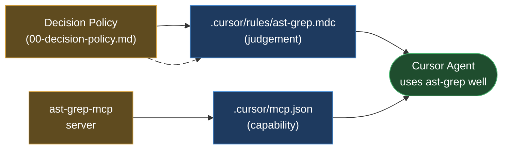
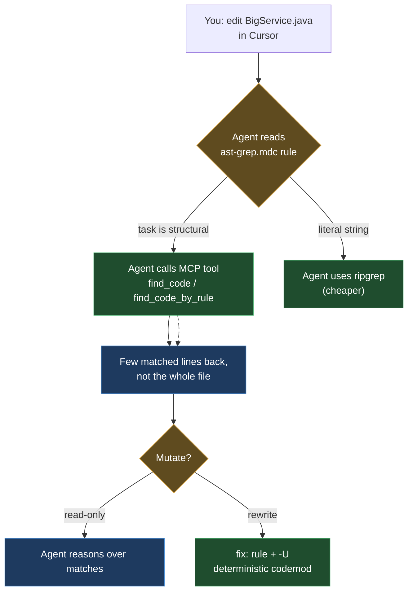

# ast-grep in Cursor

> Part of the ast-grep learning book — see [INDEX](../INDEX.md). ↑ Up: [Decision Policy](00-decision-policy.md)

[Cursor](https://cursor.com) is an AI-first code editor. To make its agent reach
for `ast-grep` at the right moment, you wire up **two** things — the same two the
[Decision Policy](00-decision-policy.md) describes for every harness:

1. A **rule file** that teaches the agent *judgement* (when to pick ast-grep over
   `rg`, when neither will do). In Cursor this is a `.mdc` file under
   `.cursor/rules/`.
2. The **MCP server** that gives the agent *capability* (the actual ast-grep
   tools). In Cursor this is mounted from `.cursor/mcp.json`.

This page is **only** about *where those files go in Cursor* and *how to fill
them in*. The decision policy itself — the copy-pasteable text — lives once in
[00-decision-policy.md](00-decision-policy.md); you paste it into the rule below
rather than re-typing it here.



## The two paths, confirmed (and one to avoid)

Community write-ups disagree on the exact file locations — you will see
`.cursor-mcp/settings.json` cited in older posts. **That path is stale.** The
current, official paths, confirmed from the Cursor docs on **2026-06-20**, are:

| What | Project-level path | Global path |
| --- | --- | --- |
| Rules | `.cursor/rules/*.mdc` _[sourced]_ | User Rules (Cursor Settings, not a file) _[sourced]_ |
| MCP config | `.cursor/mcp.json` _[sourced]_ | `~/.cursor/mcp.json` _[sourced]_ |

> _[sourced]_ Rules: *"Project rules are stored in `.cursor/rules`"* as `.mdc`
> files — [cursor.com/docs/context/rules](https://cursor.com/docs/context/rules)
> (accessed 2026-06-20).
>
> _[sourced]_ MCP: *"Project-level: `.cursor/mcp.json` … Global:
> `~/.cursor/mcp.json`"* —
> [cursor.com/docs/mcp](https://cursor.com/docs/mcp) (accessed 2026-06-20).

The old `.cursor-mcp/settings.json` was never the current scheme; do **not** put
your MCP config there. Cursor reads `.cursor/mcp.json` (project) and
`~/.cursor/mcp.json` (global). _[sourced]_

> **Why two locations?** Put the MCP server in `~/.cursor/mcp.json` if you want
> ast-grep available in *every* project you open; put it in the project's
> `.cursor/mcp.json` (committed to the repo) if you want every teammate who clones
> the repo to get it automatically. Most teams do the latter so the config is
> versioned alongside `sgconfig.yml`.

## Step 1 — the rule file (`.cursor/rules/ast-grep.mdc`)

A Cursor **project rule** is a `.mdc` file (Markdown + YAML frontmatter). A plain
`.md` file dropped in `.cursor/rules/` is **ignored** — without frontmatter Cursor
has nothing to decide *when* to apply it. _[sourced —
[cursor.com/docs/context/rules](https://cursor.com/docs/context/rules), accessed
2026-06-20]_

The frontmatter supports exactly three fields _[sourced, same source]_:

| Field | Type | Meaning |
| --- | --- | --- |
| `description` | string | What the rule is for. The agent reads this to decide relevance. |
| `globs` | comma-separated globs | File patterns that auto-attach the rule. |
| `alwaysApply` | boolean | `true` → injected into *every* chat session. |

Those three fields select between Cursor's **four rule types**. The docs name them
_[sourced, same source]_:

| Rule type (doc name) | How it triggers | Frontmatter to set |
| --- | --- | --- |
| **Always Apply** | Injected into every session | `alwaysApply: true` |
| **Apply Intelligently** | Agent decides from `description` | a `description`, `alwaysApply: false` |
| **Apply to Specific Files** | Auto-attached when a file matches `globs` | `globs: ...` |
| **Apply Manually** | Only when you `@`-mention the rule | none of the above |

> In older Cursor material these same four are called **Always**, **Agent
> Requested**, **Auto Attached**, and **Manual** respectively. That naming maps
> 1-to-1 to the doc names above but is _[sourced — unverified]_ against the current
> page (the current docs use the "Apply …" wording).

For the ast-grep decision policy, you want the agent to know the tool-choice rule
on **every** code task — that's a textbook **Always Apply** rule. Create
`.cursor/rules/ast-grep.mdc`:

```md
---
description: When to use ast-grep vs ripgrep vs type-aware tools for code search/refactor
alwaysApply: true
---

<!--
  Paste the "Code search & refactor tool policy" block verbatim from
  docs/harnesses/00-decision-policy.md here. The policy is maintained in ONE
  place; this file is just the Cursor wrapper that frontmatter-tags it so the
  agent loads it. Do not edit the policy here — edit it in 00-decision-policy.md.
-->
```

The body between the closing `---` and the comment is where the policy text goes —
copy the fenced `## Code search & refactor tool policy` block from
[00-decision-policy.md](00-decision-policy.md). Keep it short; that page explains
why a bloated rules file is self-defeating (every always-on rule spends context
tokens on *every* turn).

### Token-scoped alternative: `globs` instead of `alwaysApply`

If you only want the policy loaded when the agent actually touches Java/Python/Go
code — saving the context tokens on, say, a Markdown-editing turn — swap the
always-on rule for an **Apply to Specific Files** rule:

```md
---
description: When to use ast-grep for structural code search/refactor
globs: **/*.java, **/*.py, **/*.go
---

<!-- Paste the policy block from 00-decision-policy.md here. -->
```

Now Cursor auto-attaches the rule only when the chat involves a matching file.
This ties straight into the book's [token-efficiency](../03-agentic.md) theme: the
cheapest token is the one you never load. Multiple glob patterns are
comma-separated. _[sourced —
[cursor.com/docs/context/rules](https://cursor.com/docs/context/rules), accessed
2026-06-20]_

> **A note on nesting.** Cursor lets you organise rules in nested subdirectories
> (`.cursor/rules/` can contain folders), and supports global **User Rules** set
> in Cursor Settings (not a file). _[sourced — same source]_ For one ast-grep
> policy, a single top-level `.mdc` is plenty.

## Step 2 — mount `ast-grep-mcp` (`.cursor/mcp.json`)

The capability side. The official, experimental MCP server lives at
[`ast-grep/ast-grep-mcp`](https://github.com/ast-grep/ast-grep-mcp) and exposes four
tools to the agent — `dump_syntax_tree`, `test_match_code_rule`, `find_code`,
`find_code_by_rule` (see [03-agentic.md](../03-agentic.md) for what each does).
_[sourced]_

Cursor's MCP config uses the standard `mcpServers` object with `command`, `args`,
and `env` keys _[sourced —
[cursor.com/docs/mcp](https://cursor.com/docs/mcp), accessed 2026-06-20]_. The same
JSON block used everywhere else in the book (from
[03-agentic.md](../03-agentic.md)) drops straight into `.cursor/mcp.json`:

```json
{
  "mcpServers": {
    "ast-grep": {
      "command": "uv",
      "args": ["--directory", "/absolute/path/to/ast-grep-mcp", "run", "main.py"],
      "env": {}
    }
  }
}
```

_[sourced — invocation from `ast-grep/ast-grep-mcp`; JSON shape per
[cursor.com/docs/mcp](https://cursor.com/docs/mcp), accessed 2026-06-20]_

Replace `/absolute/path/to/ast-grep-mcp` with the real checkout path (Cursor also
resolves `${workspaceFolder}` and `${userHome}` inside these fields, if you prefer
a portable path). _[sourced — same MCP source]_

Point the server at *your project's rules* so `find_code_by_rule` resolves your
`sgconfig.yml`:

- pass `--config /path/to/sgconfig.yml` (CLI arg, higher precedence), **or**
- set `AST_GREP_CONFIG=/path/to/sgconfig.yml` in the `env` block above.

_[sourced]_



### Don't have the MCP server? The CLI alone is enough

MCP is convenience, not a requirement. Cursor's agent runs shell commands, so even
with **zero** MCP setup it can call the CLI directly once the rule tells it to:

```bash
ast-grep run -p 'System.out.println($$$)' -l java
```

Recall from the [foundations](../01-foundations.md): the Tree-sitter grammars for
all 32 languages are **bundled in the `ast-grep` binary**, so analysing Java,
Python, or Go needs **no JDK, no Python, no Go toolchain** — only the single binary
on `PATH`. _[verified]_ That makes the CLI path trivial to set up inside Cursor.

> **Guardrail (carry it into the rule):** invoke `ast-grep`, never the `sg` alias —
> on Linux/WSL `sg` collides with the `setgroups` command. _[verified]_ A no-match
> exits 1 with no error message, so an empty result is **not** proof the code is
> clean; have the agent confirm a pattern parsed with `--debug-query=ast` before it
> trusts "no matches." _[verified]_ Both guardrails are already in the
> [policy](00-decision-policy.md) — they apply identically inside Cursor.

## Why this matters in Cursor specifically

Cursor's agent is generous with reading whole files into context, and that is
exactly the expensive habit ast-grep fixes. From the book's
[benchmark](../03-agentic.md) _[verified]_: on a 4191-byte Java file with 5
`System.out.println` calls, reading the whole file costs ≈ 1047 tokens; the same
information via `ast-grep` plain output is ≈ 127 tokens — **12%** of the full read.
Grow the file ~4× (15433 bytes, same 5 matches) and ast-grep's output stays roughly
flat, dropping to **2%** of a full read. _[verified]_ The bigger the file, the
bigger the saving — which is precisely the situation a Cursor agent hits on a real
module.

So the rule's job is to nudge the agent away from "open the file and scroll" toward
"pattern-match the construct." The `.mdc` above does that; the MCP server (or the
bare CLI) gives it the muscle.

## Setup checklist

| Step | File | Done when |
| --- | --- | --- |
| 1. Install ast-grep | — | `ast-grep --version` prints `0.42.3` (or your version) |
| 2. Add the rule | `.cursor/rules/ast-grep.mdc` | Policy pasted, frontmatter set (`alwaysApply: true` *or* `globs`) |
| 3. (Optional) mount MCP | `.cursor/mcp.json` | `ast-grep` server appears in Cursor's MCP settings panel |
| 4. Point MCP at config | `env` / `--config` | `find_code_by_rule` resolves your `sgconfig.yml` |
| 5. Sanity-test | — | Ask the agent to find `System.out.println` in a Java file; it uses ast-grep, not a full read |

## Cross-links

- The policy text you paste into the `.mdc`: [00-decision-policy.md](00-decision-policy.md)
- The four MCP tools and the token benchmark: [03-agentic.md](../03-agentic.md)
- Same setup for other harnesses: [Claude Code](claude-code.md) · [Codex](codex.md)
- Where ast-grep stops (type info, dataflow, taint): [04-when-to-use.md](../04-when-to-use.md)
- The wider agent tool shelf (rg/Semgrep/Repomix/DuckDB/…): [tools/00-overview.md](../tools/00-overview.md)

---

[← Previous: Claude Code](claude-code.md) · [Next: Codex](codex.md)
