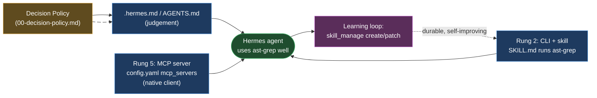
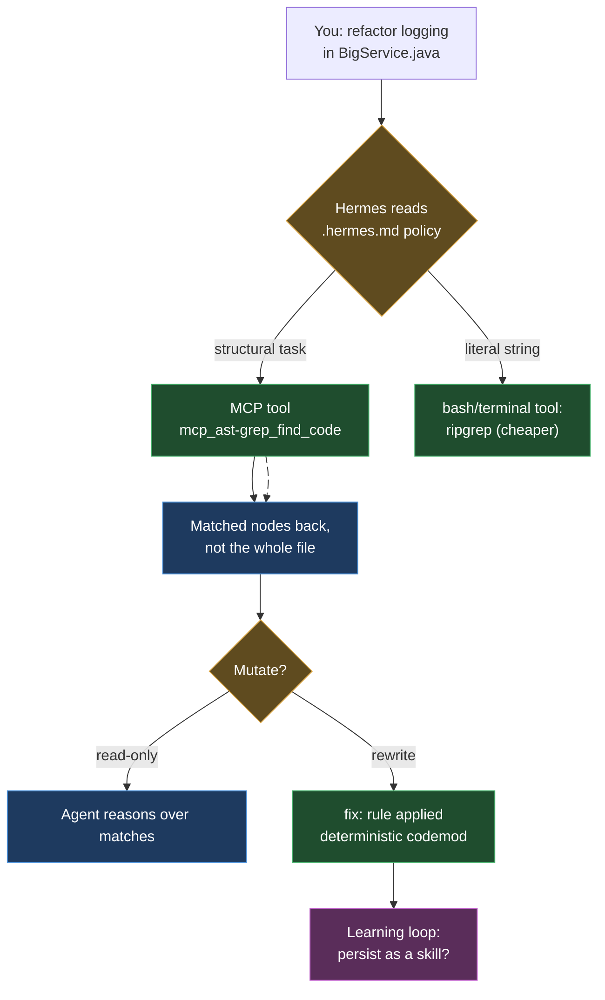

# ast-grep in Hermes Agent

> Part of the ast-grep learning book — see [INDEX](../INDEX.md). ↑ Up: [Decision Policy](00-decision-policy.md)

[Hermes Agent](https://github.com/NousResearch/hermes-agent) is **Nous Research's
self-improving personal AI agent**. It runs "the same agent core across a CLI, a
messaging gateway (Telegram, Discord, Slack, and ~20 other platforms), a TUI, and
an Electron desktop app," and its headline feature is a **built-in learning loop**:
"it creates skills from experience, improves them during use, nudges itself to
persist knowledge, searches its own past conversations, and builds a deepening model
of who you are across sessions." _[sourced — [github.com/NousResearch/hermes-agent](https://github.com/NousResearch/hermes-agent),
accessed 2026-06-20]_

Two Hermes traits set the **delta** for this chapter — and they are exactly the
opposite of the previous chapter's harness, [Pi](pi.md):

1. **Hermes has a native MCP client.** Where Pi had *no* built-in MCP (you had to
   write an extension), Hermes "discovers MCP servers at startup and registers their
   tools into the normal tool registry." Mounting [`ast-grep/ast-grep-mcp`](https://github.com/ast-grep/ast-grep-mcp)
   is therefore *clean and first-class* — a few lines of YAML, no glue code.
   _[sourced — [hermes-agent.nousresearch.com/docs/user-guide/features/mcp](https://hermes-agent.nousresearch.com/docs/user-guide/features/mcp),
   accessed 2026-06-20]_
2. **Hermes has a learning loop that writes durable skills.** It "autonomously
   creates skills" after complex tasks via a `skill_manage` tool, storing them in
   `~/.hermes/skills/`. That turns an ast-grep codemod into a *reusable, self-improving
   capability* — the angle that makes this chapter worth reading. _[sourced — [hermes-agent.nousresearch.com/docs/user-guide/features/skills](https://hermes-agent.nousresearch.com/docs/user-guide/features/skills),
   accessed 2026-06-20]_

So the [two mechanisms](00-decision-policy.md) — *judgement* (a rules/instruction
file) and *capability* (the tool itself) — both have a clean home in Hermes, and a
**third dimension** unique to this harness: *durability* (the learning loop bakes the
capability into a skill you keep).

> **A labeling note you should trust.** Everything below that quotes Hermes config
> was retrieved this session via a fetch-and-summarize tool, i.e. it is the model's
> *rendering* of the page, not a byte-for-byte copy. Prose claims are marked
> `[sourced — <source link>, accessed <date>]`; copy-paste config blocks reproduced from those docs carry an
> explicit "reproduced from docs, not byte-verified" caveat; and any block this book
> *assembled for ast-grep* (an ast-grep MCP entry, an ast-grep skill) is marked
> `[sourced — unverified]`, exactly as the [Pi](pi.md) chapter did. Treat the YAML
> *shape* as accurate and double-check exact key spellings against the live docs
> before pasting into production.

## The organizing idea: Hermes's own "footprint ladder"

Hermes's contributor guide (the repository's own `AGENTS.md` — a *dev guide for the
codebase*, **not** a user instruction file; see the caution in the next section)
defines a "footprint ladder" for adding any capability. You pick the **highest
(least-footprint) rung that works** _[sourced — [github.com/NousResearch/hermes-agent/blob/main/AGENTS.md](https://github.com/NousResearch/hermes-agent/blob/main/AGENTS.md),
accessed 2026-06-20]_:

| Rung | Hermes mechanism | ast-grep fits here? |
| ---: | --- | --- |
| 1 | Extend existing code | — |
| 2 | **CLI command + skill** — "the agent runs `hermes <subcommand>` guided by a skill" | **Yes** — a skill that calls `ast-grep …` (the learning-loop home) |
| 3 | Service-gated tool (`check_fn`) | — |
| 4 | Plugin | possible, overkill |
| 5 | **MCP server (in the catalog)** — "prefer building it as an MCP server … over growing the core toolset" | **Yes** — mount `ast-grep-mcp` natively |
| 6 | New core tool (last resort) | no — "every tool ships on every API call" |

ast-grep lands on **two** rungs at once: rung 2 (a *skill* that invokes the CLI —
which is also where the learning loop lives) and rung 5 (the *MCP server*, mounted
natively). This chapter walks both, because together they tell one story: the policy
teaches judgement, MCP (or the CLI) gives capability, and the skill makes it durable.



## Step 0 — install Hermes and pick a model

Hermes installs with one command and is provider-agnostic at runtime (Nous Portal,
OpenRouter, OpenAI, NVIDIA NIM, custom endpoints, etc.). _[sourced — [github.com/NousResearch/hermes-agent](https://github.com/NousResearch/hermes-agent),
accessed 2026-06-20]_

```bash
curl -fsSL https://hermes-agent.nousresearch.com/install.sh | bash
source ~/.bashrc
hermes setup            # full setup wizard
hermes                  # start the interactive CLI
```

_[sourced — install/setup commands reproduced from the README, accessed 2026-06-20;
not byte-verified]_

Choose a model at startup or switch mid-chat:

```bash
hermes model                       # choose provider + model
/model anthropic:claude-opus-4     # in-chat switch
```

The model lives in `~/.hermes/config.yaml`: _[sourced — [hermes-agent.nousresearch.com/docs/user-guide/configuration](https://hermes-agent.nousresearch.com/docs/user-guide/configuration),
accessed 2026-06-20]_

```yaml
model:
  default: anthropic/claude-opus-4
  provider: anthropic
```

_[sourced — `model` block reproduced from the configuration docs, accessed
2026-06-20; not byte-verified]_

Secrets go to `~/.hermes/.env`; `hermes config set` routes them automatically:

```bash
hermes config set OPENROUTER_API_KEY sk-or-...
```

_[sourced — [same configuration docs](https://hermes-agent.nousresearch.com/docs/user-guide/configuration),
accessed 2026-06-20]_

## Step 1 — the judgement layer: where the policy actually goes

Here is the **one place you must get right in Hermes**, and it is genuinely
ambiguous because two different files share the name `AGENTS.md`:

- The **repository's `/AGENTS.md`** (which this book quoted for the footprint ladder)
  is Nous's **contributor dev guide for the hermes-agent codebase** — `run_agent.py`,
  `cli.py`, contribution standards. It is **not** an instruction file you edit to
  steer your own agent. _[sourced — [github.com/NousResearch/hermes-agent/blob/main/AGENTS.md](https://github.com/NousResearch/hermes-agent/blob/main/AGENTS.md),
  accessed 2026-06-20]_
- The files **Hermes-the-agent loads into its system prompt** are a *different* set.
  Per the configuration docs, Hermes "reads agent identity and instructions from"
  these, then truncates each to `context_file_max_chars` (default **20,000**) before
  injection: _[sourced — [hermes-agent.nousresearch.com/docs/user-guide/configuration](https://hermes-agent.nousresearch.com/docs/user-guide/configuration),
  accessed 2026-06-20]_

| File | Role (per docs) | Right place for the tool-choice policy? |
| --- | --- | --- |
| `SOUL.md` | "Primary agent persona (system-prompt slot #1)" | **No** — persona, not policy |
| `AGENTS.md` | "Multi-agent configuration" | Possible (it is the [portable baseline](00-decision-policy.md)) |
| `CLAUDE.md` | "Claude-specific instructions" | Possible (Claude models) |
| `.hermes.md` | "Project-specific context" | **Yes — primary recommendation** |

**Recommendation:** put the [Decision Policy](00-decision-policy.md) in **`.hermes.md`**
at the project root (Hermes's documented slot for project-specific context). Keep
`AGENTS.md` as the portable cross-tool copy if you also use Codex/Pi on the same
repo — that is the whole point of the [`AGENTS.md` baseline](00-decision-policy.md).
**Do not** put the policy in `SOUL.md`: that is the agent's persona, not a tool
manual.

`./.hermes.md` _[sourced — unverified; ast-grep policy assembled for Hermes]_:

```markdown
<!--
  Paste the "Code search & refactor tool policy" block VERBATIM from
  docs/harnesses/00-decision-policy.md here. The policy is maintained in ONE
  place; this file is just where Hermes reads it as project-specific context.
  Do NOT edit the policy text here — edit it in 00-decision-policy.md.
-->
```

> **Token discipline matters more here than usual.** Hermes truncates every identity
> file to 20,000 chars and injects them on the system prompt — and "per-conversation
> prompt caching is sacred," so this content rides *every* API call in the
> conversation. _[sourced — [github.com/NousResearch/hermes-agent/blob/main/AGENTS.md](https://github.com/NousResearch/hermes-agent/blob/main/AGENTS.md),
> accessed 2026-06-20]_ A bloated policy is a bloated cached prefix you pay for on
> every turn. Keep it as short as the [Decision Policy](00-decision-policy.md)
> prescribes — the [token rationale](../03-agentic.md) is the entire reason the
> policy exists.

## Step 2 — capability via native MCP (the headline)

Unlike [Pi](pi.md), Hermes ships a **native MCP client**. MCP servers go under the
`mcp_servers` key in `~/.hermes/config.yaml`; Hermes "discovers MCP servers at
startup and registers their tools into the normal tool registry," prefixing each as
`mcp_<server_name>_<tool_name>` to avoid collisions. _[sourced — [hermes-agent.nousresearch.com/docs/user-guide/features/mcp](https://hermes-agent.nousresearch.com/docs/user-guide/features/mcp),
accessed 2026-06-20]_

The documented `mcp_servers` shape for a **stdio (local subprocess)** server:
_[sourced — [same MCP docs](https://hermes-agent.nousresearch.com/docs/user-guide/features/mcp),
accessed 2026-06-20; reproduced from docs, not byte-verified]_

```yaml
mcp_servers:
  filesystem:
    command: "npx"
    args: ["-y", "@modelcontextprotocol/server-filesystem", "/home/user/projects"]
    env:
      GITHUB_PERSONAL_ACCESS_TOKEN: "***"
```

ast-grep's MCP server runs as exactly such a stdio subprocess. The
[`ast-grep/ast-grep-mcp`](https://github.com/ast-grep/ast-grep-mcp) canonical
invocation — documented once in [03-agentic.md](../03-agentic.md) — is
`uv --directory /absolute/path/to/ast-grep-mcp run main.py`. Translated into Hermes's
`mcp_servers` shape:

```yaml
# ~/.hermes/config.yaml
mcp_servers:
  ast-grep:
    command: "uv"
    args: ["--directory", "/absolute/path/to/ast-grep-mcp", "run", "main.py"]
    env:
      AST_GREP_CONFIG: "/absolute/path/to/sgconfig.yml"   # optional: point at your rules
```

_[sourced — unverified; ast-grep entry assembled by translating the canonical
`uv`/`main.py` invocation from [ast-grep/ast-grep-mcp](https://github.com/ast-grep/ast-grep-mcp)
into Hermes's documented `mcp_servers` stdio shape]_

That single block exposes the four ast-grep MCP tools into Hermes's registry, where
they appear (per the prefixing rule) as `mcp_ast-grep_dump_syntax_tree`,
`mcp_ast-grep_test_match_code_rule`, `mcp_ast-grep_find_code`, and
`mcp_ast-grep_find_code_by_rule`. _[sourced — tool names from
[03-agentic.md](../03-agentic.md); prefix scheme from Hermes MCP docs, accessed
2026-06-20]_

> **Pointing ast-grep at your rules.** Use the CLI flag by adding
> `"--config", "/path/to/sgconfig.yml"` to the `args` array (highest precedence), or
> set `AST_GREP_CONFIG` in `env` as shown. Both are honored by `ast-grep-mcp`.
> _[sourced — [ast-grep/ast-grep-mcp](https://github.com/ast-grep/ast-grep-mcp),
> accessed 2026-06-20]_

Manage MCP servers from the CLI and reload without restarting: _[sourced — [Hermes MCP docs](https://hermes-agent.nousresearch.com/docs/user-guide/features/mcp),
accessed 2026-06-20]_

```bash
hermes mcp                 # interactive catalog picker
hermes mcp catalog         # plain-text list
hermes mcp install <name>  # install by name
hermes tools               # configure which tools (40+/70+) are enabled
/reload-mcp                # refresh tools after editing config.yaml mid-session
```



> **DELTA discipline.** The four tools, the canonical `uv`/`main.py` MCP block, and
> the token benchmark are documented **once** in [03-agentic.md](../03-agentic.md);
> the policy text lives **once** in [00-decision-policy.md](00-decision-policy.md).
> This page only shows *where they go in Hermes* — it does not re-document them.

## Step 3 — capability the lighter way: the CLI inside a skill (rung 2)

You do not *have* to run MCP. Hermes's footprint ladder explicitly prefers a
**"CLI command + skill"** when a capability is "expressible as shell commands": the
agent runs the command "guided by a skill." _[sourced — [github.com/NousResearch/hermes-agent/blob/main/AGENTS.md](https://github.com/NousResearch/hermes-agent/blob/main/AGENTS.md),
accessed 2026-06-20]_ ast-grep is *the* textbook case — it is a single,
self-contained binary.

Recall from [foundations](../01-foundations.md): the Tree-sitter grammars for all 32
languages are **bundled in the `ast-grep` binary**, so analysing Java, Python, or Go
needs **no JDK, no Python, no Go toolchain** — only the one binary on `PATH`.
_[verified]_ That is exactly what makes the rung-2 path cheap: a skill that shells
out to `ast-grep` has nothing else to install.

```bash
ast-grep run -p 'System.out.println($$$)' -l java
```

> **Guardrails (already in the [policy](00-decision-policy.md), repeated so you don't
> forget them in Hermes):** invoke `ast-grep`, never the `sg` alias — on Linux/WSL
> `sg` collides with the `setgroups` command. _[verified]_ A no-match exits 1 with no
> error message, so an empty result is **not** proof the code is clean; confirm a
> pattern parsed with `--debug-query=ast` before trusting "no matches." _[verified]_

## Step 4 — durability: crystallize an ast-grep codemod into a Hermes skill (the centerpiece)

This is the reason Hermes earns its own chapter. Hermes is "the only agent with a
built-in learning loop": it "autonomously creates skills" as *procedural memory* when
it "completes complex tasks (5+ tool calls) successfully, discovers non-trivial
workflows, or finds workarounds after errors" — using a `skill_manage` tool with
`create` / `patch` / `edit` / `delete` actions. Skills are stored in
`~/.hermes/skills/`, each as a directory with a required `SKILL.md`. _[sourced — [hermes-agent.nousresearch.com/docs/user-guide/features/skills](https://hermes-agent.nousresearch.com/docs/user-guide/features/skills),
accessed 2026-06-20]_

The implication for ast-grep is powerful: a tricky `fix:` codemod you worked out once
— say, migrating every `System.out.println` to a logger, or rewriting a deprecated
API call — does **not** evaporate at end of session. The learning loop captures it as
a durable, **self-improving** skill ("skills self-improve during use"), available
forever after as a `/slash-command`.

The documented skill directory layout: _[sourced — [same skills docs](https://hermes-agent.nousresearch.com/docs/user-guide/features/skills),
accessed 2026-06-20]_

```
~/.hermes/skills/
└── software-development/
    └── ast-grep-codemod/
        ├── SKILL.md         # required: frontmatter + instructions
        ├── references/      # detailed docs loaded on-demand
        ├── scripts/         # helper scripts
        └── assets/
```

The documented `SKILL.md` frontmatter shape (Hermes uses YAML frontmatter with a
`metadata.hermes` block): _[sourced — [same skills docs](https://hermes-agent.nousresearch.com/docs/user-guide/features/skills),
accessed 2026-06-20; reproduced from docs, not byte-verified]_

```yaml
---
name: my-skill
description: Brief description of what this skill does
version: 1.0.0
platforms: [macos, linux]
metadata:
  hermes:
    tags: [python, automation]
    category: devops
    requires_toolsets: [terminal]
---
```

Filled in for ast-grep, the skill bundles the policy guidance with concrete
invocations. The frontmatter follows Hermes's documented format; the ast-grep body is
**this book's assembly**, not a tested artifact:

````markdown
---
name: ast-grep-codemod
description: >
  Syntax-aware structural code search and deterministic codemods for ONE language.
  Use when the task is "find/replace code that looks like X" rather than a literal
  string, or when applying a repeatable fix: rule across a repo.
version: 1.0.0
metadata:
  hermes:
    tags: [refactor, codemod, static-analysis, ast-grep]
    category: software-development
    requires_toolsets: [terminal]
---
# ast-grep codemod

## When to use (and not)
- Literal string / identifier / log line → ripgrep (`rg`). Cheaper.
- Syntax-aware, single language → ast-grep (below).
- Type info / cross-file dataflow / taint → ast-grep CANNOT. Use Semgrep Pro /
  CodeQL / the IDE. (Full policy: docs/harnesses/00-decision-policy.md.)

## Procedure — search
```bash
ast-grep run -p 'System.out.println($$$)' -l java
# add --json ONLY to act on exact ranges/captures (it is ~5x larger)
```

## Procedure — rewrite (deterministic)
```bash
ast-grep scan -r rule.yml        # preview first (no -U)
ast-grep scan -r rule.yml -U     # then apply
```

## Pitfalls
- Invoke `ast-grep`, never `sg` (collides with setgroups on Linux/WSL).
- A no-match exits 1 with NO message — confirm the pattern parsed with
  `ast-grep run -p '<pattern>' -l <lang> --debug-query=ast` before trusting
  "no matches".

## Verification
- Re-run the search pattern; expect 0 matches after a successful rewrite.
- `git diff` shows only the intended structural change.
````

_[sourced — unverified; ast-grep `SKILL.md` assembled against Hermes's documented
skill frontmatter and directory format, not executed]_

You can also create the skill by hand instead of waiting for the loop — the agent's
`skill_manage` actions mirror what you'd do manually (`create` from scratch, `patch`
for targeted fixes, `edit` for rewrites). And there is a **safety gate**: set
`skills.write_approval: true` in `config.yaml` to stage agent-written skills under
`~/.hermes/pending/skills/` for review before they land. _[sourced — [same skills docs](https://hermes-agent.nousresearch.com/docs/user-guide/features/skills),
accessed 2026-06-20]_

```yaml
# ~/.hermes/config.yaml
skills:
  write_approval: false   # false = agent writes skills freely (default); true = require approval
```

```bash
/skills                 # browse installed skills
/ast-grep-codemod migrate System.out.println to slf4j in BigService.java
/skills pending         # list staged writes (when write_approval: true)
/skills diff <id>       # review a unified diff before approving
/skills approve <id>    # apply
```

_[sourced — [same skills docs](https://hermes-agent.nousresearch.com/docs/user-guide/features/skills),
accessed 2026-06-20]_

> **Why this is the climax.** In [Pi](pi.md) a Skill was a portable bundle you
> authored. In Hermes the **agent authors it for you** — the first time it solves a
> gnarly ast-grep refactor across 5+ tool calls, the learning loop can persist that
> workflow as procedural memory, and "skills self-improve during use." The token
> argument from [03-agentic.md](../03-agentic.md) compounds: the agent learned *once*
> to reach for ast-grep instead of reading whole files, and now that judgement is
> baked into a reusable skill instead of being re-derived every session.

## Setup checklist

| Step | Where | Done when |
| --- | --- | --- |
| 0. Install ast-grep | — | `ast-grep --version` prints `0.42.3` (or your version) |
| 1. Install + model | `hermes setup`, `~/.hermes/config.yaml` | `hermes` starts against your provider |
| 2. Add the policy | `.hermes.md` (project root; mirror to `AGENTS.md` for portability) | Hermes injects it (under 20k chars) at startup |
| 3a. Capability via MCP | `mcp_servers:` in `config.yaml` + `/reload-mcp` | `mcp_ast-grep_find_code` appears in the tool registry |
| 3b. Capability via skill | `~/.hermes/skills/.../SKILL.md` | `/ast-grep-codemod …` runs and shells out to `ast-grep` |
| 4. (Optional) point at config | `args: --config …` or `env: AST_GREP_CONFIG` | rule-based search resolves your `sgconfig.yml` |
| 5. Let the loop persist it | complete a real codemod task | a new ast-grep skill shows under `/skills` |
| 6. Sanity-test | — | Ask Hermes to find `System.out.println` in a Java file; it uses ast-grep, not a full read |

## Why this matters in Hermes specifically

Hermes makes three otherwise-separate ideas converge. **Judgement** (the policy in
`.hermes.md`) tells it *when* ast-grep beats a full read. **Capability** (native MCP
*or* the rung-2 CLI-in-a-skill path) gives it *how*. And the **learning loop** adds
*durability* — the capability is not re-explained every session; it crystallizes into
a skill that "self-improves during use." From the book's [benchmark](../03-agentic.md)
_[verified]_: on a 4191-byte Java file with 5 `System.out.println` calls, reading the
whole file costs ≈ 1047 tokens; the same information via `ast-grep` plain output is
≈ 127 tokens — **12%** of the full read. Grow the file ~4× (15433 bytes, same 5
matches) and ast-grep's output stays roughly flat, dropping to **2%** of a full read.
_[verified]_ In a harness whose own design rule is "per-conversation prompt caching is
sacred," every token the agent *doesn't* spend re-reading files is a token saved on
every cached turn — and a learned skill means it makes that saving by habit, not by
luck.

## Cross-links

- The policy text you paste into `.hermes.md`: [00-decision-policy.md](00-decision-policy.md)
- The four MCP tools, the canonical config block, and the token benchmark: [03-agentic.md](../03-agentic.md)
- Same setup for other harnesses: [Claude Code](claude-code.md) · [Cursor](cursor.md) · [Codex](codex.md) · [Pi](pi.md)
- Where ast-grep stops (type info, dataflow, taint): [04-when-to-use.md](../04-when-to-use.md)
- The wider agent tool shelf (rg/Semgrep/Repomix/DuckDB/…): [tools/00-overview.md](../tools/00-overview.md)
- The whole map: [INDEX](../INDEX.md)

---

[← Previous: Pi](pi.md) · [Next: Tools overview →](../tools/00-overview.md)
