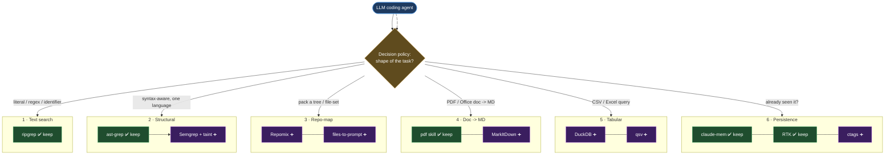

# The agent tool shelf — overview

> Part of the ast-grep learning book — see [INDEX](../INDEX.md). ↑ Up: [03 · Agentic](../03-agentic.md)

ast-grep is one tool on a bench. This shelf is the rest of it: the small, permissive
CLIs an LLM coding agent should reach for so it spends fewer tokens and gets better
structure. The organising idea is blunt — **the cheapest token is the one you never
spend.** An agent burns its context budget three ways, and a good local stack attacks
all three:

| Waste | Fix | Tools on this shelf |
|---|---|---|
| **Reading whole files** when it needed five lines | *structured search* — emit fields, not prose | [ripgrep](ripgrep.md), [ast-grep](../03-agentic.md), [Semgrep](semgrep.md) |
| **Pulling structure-poor blobs** (raw PDFs, whole CSVs, untrimmed trees) into the window | *query / pack, don't load* | [Repomix](repomix.md), [files-to-prompt](files-to-prompt.md), [MarkItDown](markitdown.md), [DuckDB](duckdb.md), [qsv](qsv.md) |
| **Re-reading** content it already saw | *persistence* — remember / index instead of re-scan | [universal-ctags](ctags.md), claude-mem, RTK |

The verdict after researching all six capability categories is deliberately **modest**:
the incumbent stack is already strong. Three categories: **keep the standard tool.**
Three: **add one tool.** Two complements. **Zero deny-lists** — the standard tools
(`Read`/`Grep`/`rg`) are never blocked; the agent is *guided* by a one-paragraph policy
instead.

## The capability taxonomy



Legend: ✅ keep (already installed, still wins) · ➕ add (fills a real gap or complements).

## Decision matrix — the verdict per category

Each category's winner and the closest alternative considered. Full per-tool sourcing,
licenses, and benchmarks live in the linked chapters. _[sourced]_

### 1 · Fast text/file search — _incumbent wins_

| Tool | Verdict | Note |
|---|---|---|
| **[ripgrep](ripgrep.md)** | **KEEP — baseline** | `--json` NDJSON, gitignore-aware, flat-per-match output |
| ugrep / ag | skip | no JSON (ag) or only human-TUI extras (ugrep); dominated |
| ripgrep-all (rga) | _worth-the-weight_ | searches inside PDFs/archives, but pulls pandoc/poppler/ffmpeg (AGPL-3.0) |

### 2 · Structural code search & rewrite — _incumbent wins; add one complement_

| Tool | Verdict | Note |
|---|---|---|
| **ast-grep** | **KEEP — spine** | the book's subject; syntax-aware match **and rewrite** |
| **[Semgrep OSS](semgrep.md)** | **ADD** | the one thing ast-grep can't: taint/dataflow + a CWE rule registry |
| GritQL / Comby | optional / _worth-the-weight_ | alt structural engines; see the peers table in [04 · When to use](../04-when-to-use.md) |

### 3 · Repo-map / context-packing — _gap; clear winner_

| Tool | Verdict | Note |
|---|---|---|
| **[Repomix](repomix.md)** | **ADD — primary** | whole-tree pack: map + summary + contents; `--compress`, token counts |
| **[files-to-prompt](files-to-prompt.md)** | **ADD — light** | an explicit file **subset**, thin wrapper, `--cxml` for Claude |

### 4 · Document → Markdown extraction — _keep PDF; add one for Office_

| Tool | Verdict | Note |
|---|---|---|
| **pdf skill** | **KEEP — PDF** | structure-aware, OCR-capable; stays the PDF path |
| **[MarkItDown](markitdown.md)** | **ADD — Office/web** | docx/pptx/xlsx/html/epub → Markdown (with pipe tables) |
| Docling / Marker | _worth-the-weight_ | layout-aware ML extractors for table-heavy PDFs (model download) |

### 5 · Tabular query (CSV/Excel) — _gap; clear winner_

| Tool | Verdict | Note |
|---|---|---|
| **[DuckDB](duckdb.md)** | **ADD — winner** | SQL over csv/parquet/xlsx without loading; the SUM/JOIN/window engine |
| **[qsv](qsv.md)** | **ADD — light CSV** | sub-second stats/count/slice/frequency/excel-convert |

### 6 · Persistence / avoid re-reads — _incumbents win; add one light index_

| Tool | Verdict | Note |
|---|---|---|
| **claude-mem** | **KEEP — memory** | cross-session memory layer |
| **RTK** | **KEEP — output proxy** | per-command output compression |
| **[universal-ctags](ctags.md)** | **ADD — symbol index** | "where is X defined?" becomes a lookup, not a re-scan (GPL-2.0) |

## Recommended stack (install order, by ROI)

**Keep** what's installed; **add** seven small, permissive CLIs in ROI order. Every "add"
is a single binary or one `pip`/`npm`/`brew` away. _[sourced]_

| # | Add | One-line install | Why it earns its place |
|---|---|---|---|
| 1 | **[Repomix](repomix.md)** | `npx repomix@latest` | fills the biggest gap: compact, structured whole-repo context |
| 2 | **[DuckDB](duckdb.md)** | `brew install duckdb` · `winget install DuckDB.cli` | query CSV/Excel/Parquet by SQL without loading the file |
| 3 | **[MarkItDown](markitdown.md)** | `pip install 'markitdown[all]'` | the Office/web formats the `pdf` skill doesn't cover |
| 4 | **[files-to-prompt](files-to-prompt.md)** | `pip install files-to-prompt` | light path-aware packing of an explicit file subset |
| 5 | **[Semgrep OSS](semgrep.md)** | `brew install semgrep` | taint/dataflow + a large community rule registry |
| 6 | **[qsv](qsv.md)** | `brew install qsv` | sub-second CSV stats/slicing/frequency |
| 7 | **[universal-ctags](ctags.md)** | `brew install universal-ctags` · `apt install universal-ctags` | persistent symbol index |

> **Installed & exercised on this machine** (WSL2 x86_64), versions captured while
> running the benchmarks in [03 · Agentic](../03-agentic.md) and the `scripts/bench-*.sh`
> suite: repomix 1.15.0, duckdb 1.5.4, markitdown (`[all]`), files-to-prompt 0.6,
> semgrep 1.167.0, qsv 21.1.0, universal-ctags 6.2.1. _[verified]_
>
> Note: the DuckDB `curl https://install.duckdb.org | sh` one-liner is the official
> path _[sourced]_ but executes a remote installer; on this machine DuckDB was installed
> with `brew install duckdb` instead _[verified]_. qsv was installed with
> `brew install qsv` _[verified]_ — the from-source path is `cargo build --release
> --locked --bin qsv --features all_features`, **not** `cargo install qsv`. _[sourced — unverified]_

## Where the standard tools still win

The honest counter-section. Reach for the **standard tool**, not a novel one, when:

| Situation | Winning tool | Why the novel tool loses here |
|---|---|---|
| Literal string / identifier / log line across a tree | **ripgrep** | structural tools parse every file — pure overhead for a literal hunt |
| General syntax-aware search/rewrite in one language | **ast-grep** | Semgrep/Comby add install weight + a second rule dialect for no gain unless you need taint |
| Read ONE known file you'll consume in full | **native Read** | packing it through Repomix/files-to-prompt adds a step and tokens |
| Find files by path/glob | **native Glob** | nothing beats it for pure path matching |
| A small CSV (≲ a few KB) you'll fully use | **native Read** | DuckDB's value is *avoiding* a full load; if you need every row, just read it |
| Extract a PDF | **the `pdf` skill** | Docling/Marker download ML models for layouts the skill already handles |
| Remember a decision across sessions | **claude-mem** | a vector DB is a maintenance burden for what memory already does |
| Type-aware / dataflow Java refactor | **IDE / OpenRewrite** | no CLI here does type-resolved cross-file refactor — don't fake it |

The rule the agent should internalise: **a novel tool must justify its install and its
tokens against the standard tool for *this specific task* — novelty is never the
justification.**

## The local tool policy (paste once into the agent's rules file)

This is the canonical snippet. It extends the ast-grep policy in
[harnesses/00-decision-policy.md](../harnesses/00-decision-policy.md); per-harness
placement deltas are in each harness chapter. _[sourced]_

```markdown
## Local tool policy (token-first) — extends the code-search policy

Before reading or searching, pick by the SHAPE of the task:
- Literal / regex / identifier across a tree -> ripgrep (`rg`, add `--json` to parse fields).
- Syntax-aware search/rewrite in one language -> ast-grep. Need taint/dataflow or a CWE rule
  registry -> semgrep. (Type-aware cross-file refactor -> IDE/OpenRewrite, not these.)
- Pack a tree/file-set into context -> repomix (whole repo, structured XML/MD) or
  files-to-prompt (an explicit file subset, `--cxml`). Do NOT cat whole files in.
- A PDF -> the pdf skill. A docx/pptx/xlsx/html/epub -> markitdown. Never paste a binary doc raw.
- A CSV/Excel you won't fully consume -> query it: `duckdb -c "SELECT ... FROM 'f.csv'"`
  (or qsv for quick stats). Reading the whole file is the thing to avoid.
- "Where is X defined / used?" on a large repo -> consult the ctags index before re-scanning.
- "Did I/we already see this?" -> claude-mem (cross-session). Verbose command output -> RTK.

Guardrail: a non-standard tool must beat the standard tool (Read/Grep/rg) for THIS task on
tokens or capability — novelty is never the reason. No standard tool is deny-listed.
```

## When it's worth the weight

These were researched and **benched out of the default stack** — they need a model
download, heavy deps, or a daemon. Reach for them only when the trigger fires: _[sourced]_

- **rga (ripgrep-all)** — searching *inside* PDFs/archives/ebooks. Pulls pandoc/poppler/ffmpeg; AGPL-3.0.
- **Comby / GritQL** — structural rewrite when ast-grep's pattern model doesn't fit; see [04 · When to use](../04-when-to-use.md).
- **Docling / Marker / Unstructured** — layout-aware extraction of *table-heavy* or scanned PDFs (the de-interleaving the [MarkItDown](markitdown.md) bench shows). ML model download.
- **sqlite-vec / Chroma / txtai** — semantic/vector search over a large corpus. An embeddings pipeline to maintain.
- **SCIP / multilspy / Sourcegraph** — type-resolved, cross-file code intelligence. A daemon or per-language servers.

## Cross-links

- The token-efficiency benchmarks behind every chapter's numbers — [03 · Agentic](../03-agentic.md)
- Where ast-grep stops, and its structural peers — [04 · When to use](../04-when-to-use.md)
- The canonical agent decision policy — [harnesses/00-decision-policy.md](../harnesses/00-decision-policy.md)
- Back to the book index — [INDEX](../INDEX.md)

---
[← Previous: Hermes](../harnesses/hermes.md) · [Next: ripgrep →](ripgrep.md)
