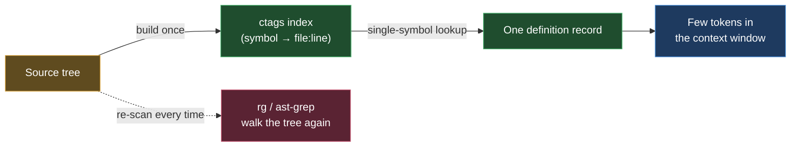

# universal-ctags — a persistent symbol index
> Part of the ast-grep learning book — see [INDEX](../INDEX.md). ↑ Up: [03 · Agentic](../03-agentic.md)

universal-ctags turns "where is `foo` *defined*?" from a re-scan of the whole tree
into a lookup in a precomputed index. You build the index once; you query it many
times. Verdict: **ADD** — it belongs to the *persistence* family of agent tools
(spend effort once, avoid re-doing work later), alongside claude-mem and RTK.

## What it does

ctags parses your source and emits one record per symbol — a function, a class, a
variable — each mapped to its **name, file, line, kind, and scope**. That record set
is the *index*: a small map from "symbol name" to "where it is defined."

- Built with **libjansson**, ctags can emit JSON. `ctags --output-format=json -f - file`
  prints one JSON record per symbol. _[sourced — https://docs.ctags.io/en/latest/man/ctags.1.html]_
- Looking up a single symbol is then just a `grep` into that index — you get the
  *definition site* back as `file:line` without reading the file at all.

The win over plain text search: a grep for a name finds *every textual mention* (in
comments, in strings, at every call site). ctags returns the one place the symbol is
**defined**, already classified by kind. _[sourced — https://github.com/universal-ctags/ctags]_

| You want… | Command |
|---|---|
| Build a JSON index of one file | `ctags --output-format=json -f - file` |
| Find where `compute` is defined | `ctags --output-format=json -f - file \| grep compute` |

## Where it comes from

Editors like vim and emacs needed fast "go to definition" without re-parsing the
whole tree on every jump, so ctags was created to generate a reusable symbol index.
**universal-ctags** is the actively-maintained fork of the older Exuberant Ctags,
with broader language support and JSON output. _[sourced — https://github.com/universal-ctags/ctags]_

It is a single native binary — no daemon, no model download, nothing to keep
running. _[sourced — https://github.com/universal-ctags/ctags]_

## Where it comes from — the license caveat

ctags is licensed **GPL-2.0**, which is **copyleft, not permissive** — state this
plainly, because the rest of this shelf (ripgrep, qsv) is permissively licensed and
this one is the exception. _[sourced — https://github.com/universal-ctags/ctags]_

Agents here invoke ctags as a **separate binary** — they run it as a subprocess and
read its output; nothing links ctags into your own code. The common reasoning is that
GPL obligations therefore do not reach your code or your repo. Treat that conclusion
as editorial, not law: _[sourced — unverified]_. The bare GPL-2.0 fact is sourced; the
"so it doesn't reach your code" step is interpretation.

## Install (per-OS)

ctags packages on every major OS. JSON output (`--output-format=json`) is only
available when the binary was **built with libjansson** — the Homebrew and Debian
builds typically are; if a lookup falls back to the plain tags format, your build
lacks it. _[sourced — https://docs.ctags.io/en/latest/man/ctags.1.html]_

| OS | Command |
|---|---|
| Linux (Debian/Ubuntu) | `apt install universal-ctags` _[sourced — https://github.com/universal-ctags/ctags]_ |
| WSL | same as Linux (`apt install universal-ctags`) _[sourced — https://github.com/universal-ctags/ctags]_ |
| macOS | `brew install universal-ctags` _[sourced — https://formulae.brew.sh/formula/universal-ctags]_ |
| Windows | daily prebuilt binaries from the ctags-win32 project _[sourced — https://github.com/universal-ctags/ctags-win32]_ |

## What it replaces — and what it complements

ctags does **not** replace ripgrep or ast-grep, and they do not replace it. Search
tools *scan*: they walk the tree and read files to answer "where does this appear /
match?" ctags gives you a precomputed **map** you build once and query many times.

| Question | Reach for |
|---|---|
| "Where does the text `compute` appear?" | **ripgrep** (literal / regex scan) |
| "Find every `if`-without-`else`" | **ast-grep** (syntax-aware scan) |
| "Where is `compute` *defined*?" | **ctags** (index lookup) |

So ctags is the persistence-layer complement to the search tools: claude-mem
remembers prior sessions, RTK compresses command output, and ctags resolves a symbol
to `file:line` without re-reading the file. _[sourced — https://github.com/universal-ctags/ctags]_

## Token economics

The book's benchmark compares three things on the *same* Java fixtures the ast-grep
bench uses: building the full JSON symbol index, performing one single-symbol lookup,
and reading the whole file.

| approach | `BigService.java` (4 KB) | `HugeService.java` (15 KB) |
|---|---|---|
| read whole file (no tool) | 4191 B · 100% | 15433 B · 100% |
| `ctags` json — full symbol index | 8354 B · 199% | 33038 B · 214% |
| `ctags` json — single-symbol lookup | 200 B · 4% | 202 B · 1% |

_[verified]_ — `scripts/bench-tokens.sh`, universal-ctags 6.2.1 (json via libjansson).
The **full** JSON index is *larger than the source* (199–214%) — verbose one-record-per-
symbol metadata — so building it to read one small file is a loss. But a **single-symbol
lookup is ~200 B regardless of file size** (4% → 1% as the file grows): build the index
once, and every "where is X defined?" after that is nearly free.

Qualitatively: building the *whole* index can cost more than just reading a small
file — so for a one-off read it does not pay. But a *single-symbol lookup* is tiny,
and the index is built once and queried again and again. The economics flip in your
favor across **repeated** lookups, not a single read.

## When to reach for it (and when not)

- **Reach for it** when you will resolve definitions repeatedly across a session —
  build the index once, then answer "where is `X` defined?" with a cheap lookup
  instead of reading files.
- **Don't** build a full index just to find one symbol in one small file you were
  going to read anyway — the one-off cost outweighs the saving.

## Cross-links

- The search tools ctags complements — [ripgrep](ripgrep.md) and [04 · When to use](../04-when-to-use.md)
- The persistence theme (avoid re-doing work) — [03 · Agentic](../03-agentic.md)
- The tools shelf overview — [00 · Tools overview](00-overview.md)
- Back to the book index — [INDEX](../INDEX.md)

---
[← Previous: qsv](qsv.md) · [Next: Back to INDEX →](../INDEX.md)
