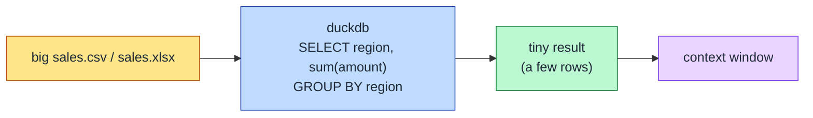

# DuckDB — query CSV/Excel without loading the file
> Part of the ast-grep learning book — see [INDEX](../INDEX.md). ↑ Up: [03 · Agentic](../03-agentic.md)

## What it does

DuckDB is an in-process SQL engine with a CLI that runs full SQL **directly against a file** — CSV, Parquet, or (via an extension) Excel — without importing it first. The core idea is **"query, don't load":** instead of reading a whole spreadsheet into your context window and reasoning over it row by row, you ask a question in SQL and get back only the answer.

A one-liner against a CSV looks like this:

```bash
duckdb -c "SELECT region, sum(amount) FROM 'sales.csv' GROUP BY region"
```

The file path goes straight into the `FROM` clause — no load step, no daemon, no schema declaration. DuckDB infers the columns and types for you.

Two more moves you'll use constantly:

- **Schema first, data never.** `DESCRIBE SELECT * FROM 'sales.csv'` returns just the column names and types — perfect when you need to know the shape of a file before writing a query, and it costs almost nothing.
- **Structured output for parsing.** Add `-json` (`duckdb -json -c "..."`) to get JSON rows instead of the pretty terminal table, so a downstream step can parse the result. _[sourced — https://duckdb.org/docs/lts/clients/cli/overview]_

For Excel files, you load a small extension once, then read the workbook like any other table:

```bash
duckdb -c "INSTALL excel; LOAD excel; SELECT count(*) FROM read_xlsx('sales.xlsx')"
```

This works **offline** — but only **after** the one-time extension fetch (the first `INSTALL excel` downloads from DuckDB's extension repository). CSV and Parquet need no network at all. _[sourced — https://duckdb.org/docs/current/guides/file_formats/excel_import]_

## Where it comes from

DuckDB is the "SQLite for analytics" — a single, dependency-free executable you drop on disk and run. It is **MIT-licensed**. _[sourced — https://github.com/duckdb/duckdb]_

## Install (per-OS)

```bash
# macOS
brew install duckdb

# Windows
winget install DuckDB.cli

# Linux / WSL (official one-liner)
curl https://install.duckdb.org | sh
```

_[sourced — https://duckdb.org/install/]_

## What it replaces — and what it complements

**Replaces:** reading an entire CSV or Excel file into the context window when all you actually need is an **aggregate** — a `SUM`, a `COUNT`, a grouped total, a join across two files. If the question is "what's the total amount per region across 100k rows?", you do not need the 100k rows; you need a handful of result rows. DuckDB makes the token cost proportional to the *answer*, not the *file*.

**Complements [qsv](qsv.md):** the two are not rivals. DuckDB is the **SQL engine** — reach for it when you need `SUM`/`JOIN`/window functions or multi-file queries. qsv is the **light CSV companion** for quick slicing, sampling, and trivial column ops. Use qsv for "show me a sample"; escalate to DuckDB for "compute this aggregate."

**Honest nudge:** DuckDB is an *opt-in upgrade*, not a reason to forbid native `Read`. A tiny CSV you are going to consume in full anyway is still perfectly fine to just read. DuckDB earns its place precisely when reading the whole file would be wasteful — its value is in **avoiding a full load**, so do not deny-list `Read` on its account.

## Token economics

The benchmark aggregates a roughly 100k-row `sales.csv` and compares the size of the `GROUP BY` answer against reading the whole file, plus a row for reading an `.xlsx` without Excel installed. Qualitatively, the aggregate answer is **orders of magnitude smaller** than the full file — a few grouped rows versus the entire table.

| approach | bytes | ~tokens | vs full file |
|---|---|---|---|
| read whole `sales.csv` (no tool) | 3,828,297 | 957,074 | 100% |
| `duckdb` GROUP BY (`-json`) | 195 | 48 | ~0.005% |
| `duckdb` GROUP BY (pretty table) | 537 | 134 | ~0.014% |
| `duckdb DESCRIBE` (schema only) | 707 | 176 | ~0.018% |
| `duckdb read_xlsx` GROUP BY (~129 KB `.xlsx`) | 507 | 126 | — |

_[verified]_ — `scripts/bench-tabular.sh`, duckdb 1.5.4 over a deterministic 100k-row
CSV. Reading the file costs ~957k tokens; the grouped answer costs ~134 — the token
cost tracks the *answer*, not the *file*. `read_xlsx` runs offline after the one-time
`INSTALL excel` fetch.

## When to reach for it (and when not)



**Reach for it when:**

- A tabular file is large and you only need an aggregate, a grouped total, or a join.
- You need just the schema — `DESCRIBE SELECT ...` before committing to a full query.
- You need structured rows another step will parse — use `-json`.
- The data is Parquet (read natively) or Excel (after the one-time `INSTALL excel; LOAD excel;`).

**Skip it when:**

- The file is tiny and you will consume all of it anyway — native `Read` is simpler.
- You only need a quick slice or sample — reach for [qsv](qsv.md) instead.

## Cross-links

- Light CSV companion → [qsv.md](qsv.md)
- Token-efficiency chapter → [03-agentic.md](../03-agentic.md)
- Tools overview → [00-overview.md](00-overview.md)
- Book contents → [INDEX](../INDEX.md)

---
[← Previous: MarkItDown](markitdown.md) · [Next: qsv →](qsv.md)
