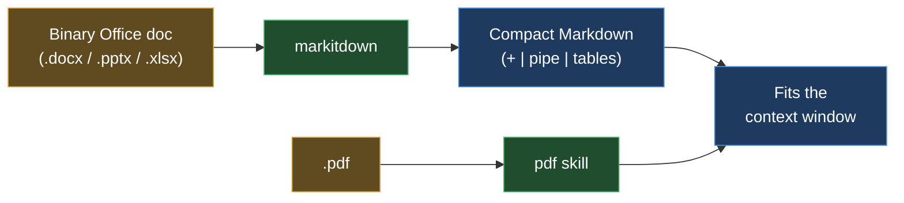

# MarkItDown — Office & web docs into LLM-readable Markdown
> Part of the ast-grep learning book — see [INDEX](../INDEX.md). ↑ Up: [03 · Agentic](../03-agentic.md)

MarkItDown is a small Microsoft tool that turns Office and web documents — `.docx`,
`.pptx`, `.xlsx`, `.html`, `.epub` — into Markdown a language model can actually
read. It closes the exact gap the `pdf` skill leaves open: the `pdf` skill handles
PDFs, MarkItDown handles everything else. Verdict: **ADD**.

## What it does

Here is the beginner-level "why" that makes this tool click: **an agent literally
cannot read a `.docx`, `.pptx`, or `.xlsx` file.** Those are not text files — each
one is a ZIP archive full of packed binary parts (XML, media, relationships). Open
one in a text editor and you get garbage, not words. So you cannot just paste a Word
document into a prompt.

MarkItDown unpacks that binary and re-emits the content as compact Markdown — the
minimal-markup shape LLMs natively "speak" — preserving structure such as headings,
lists, links, and tables. _[sourced — https://github.com/microsoft/markitdown]_

It runs as a CLI that writes Markdown to stdout, or as a Python library:

```bash
markitdown report.docx > report.md     # CLI → stdout
cat report.docx | markitdown           # or pipe in
```
_[sourced — https://github.com/microsoft/markitdown]_

Beyond Office it also converts images, audio, HTML, CSV/JSON/XML, ZIP archives,
YouTube URLs, and EPub. _[sourced — https://github.com/microsoft/markitdown]_

## Where it comes from

LLMs natively read Markdown well, but real documents arrive in a messy zoo of
formats. Microsoft built MarkItDown as one tool to turn that zoo into the minimal,
structure-preserving Markdown representation that fits an LLM's context window. Under
the hood it is a Python wrapper that delegates to per-format reader libraries chosen
via optional extras — no bundled ML models in the default path. _[sourced — https://github.com/microsoft/markitdown]_

License: **MIT** (Microsoft). _[sourced — https://github.com/microsoft/markitdown]_

## Install (per-OS)

One `pip install`; the `[all]` extra pulls in the per-format readers so every
supported document type works out of the box. _[sourced — https://github.com/microsoft/markitdown]_

| OS | Command |
|---|---|
| Linux (Debian/Ubuntu) | `pip install 'markitdown[all]'` |
| WSL | same as Linux (`pip install 'markitdown[all]'`) |
| macOS | `pip install 'markitdown[all]'` |
| Windows | `pip install "markitdown[all]"` |

(Scoped extras exist too, e.g. `pip install 'markitdown[docx,pptx,xlsx]'`.) _[sourced — https://github.com/microsoft/markitdown]_

## What it replaces — and what it complements

MarkItDown **does not replace the `pdf` skill.** The `pdf` skill stays the PDF
extractor; MarkItDown is **additive** — it covers the Office and web formats the
`pdf` skill does not touch. For PDFs specifically, MarkItDown's text path has no OCR
by default, so scanned PDFs yield empty or minimal output — that is a backend
limitation, which is why the `pdf` skill remains the PDF path. _[sourced — https://github.com/microsoft/markitdown/discussions/1361]_

| Document | Reach for |
|---|---|
| `.pdf` | the **`pdf` skill** (structure-aware, OCR-capable) |
| `.docx` / `.pptx` / `.xlsx` / `.html` / `.epub` | **MarkItDown** |

What it does replace: ad-hoc readers and the temptation to dump raw Office bytes into
context (which an agent cannot parse anyway).

## Token economics & table fidelity

The book's benchmark converts small `.docx` / `.pptx` / `.xlsx` / `.pdf` fixtures and
reports the resulting Markdown size plus whether each table survived as Markdown
`| pipes |`.

| format | raw bytes | md bytes | ~md tokens | md vs raw | table → pipes? |
|---|---|---|---|---|---|
| `.docx` | ~36,846 | 183 | 45 | ~0% | ✅ preserved |
| `.pptx` | ~28,533 | 164 | 41 | ~0% | ✅ preserved |
| `.xlsx` | ~4,931 | 126 | 31 | ~2% | ✅ preserved |
| `.pdf` | ~1,294 | 109 | 27 | ~8% | ❌ de-interleaved |

_[verified]_ — `scripts/bench-docs.sh`, markitdown[all]; fixtures via
python-docx/pptx/openpyxl/fpdf2. Binary-container sizes wobble ±tens of bytes
(embedded timestamps); the Markdown output is stable. The born-digital `.pdf`'s table
came out **de-interleaved** — MarkItDown read the columns top-to-bottom
(`Region/North/South/East`, then `Revenue/$4,800/…`), so the row associations were
lost. For table-heavy PDFs reach for a layout-aware extractor (Docling/Marker).

Qualitatively: a binary Office document — which an agent cannot read at all — becomes
a tiny block of Markdown that drops cleanly into the context window. And because
Office formats carry **real table objects** (rows and cells, not just visual
positioning), those tables survive the round-trip as Markdown `| pipes |`. Formats
with semantic tables preserve pipes better than PDF, where layout has to be inferred.

## When to reach for it (and when not)



- **Reach for it** when the agent must read a `.docx`, `.pptx`, `.xlsx`, `.html`, or
  `.epub` — anything that is not plain text and not a PDF.
- **Don't** use it as your PDF extractor: route PDFs to the `pdf` skill, which keeps
  layout and tables and can OCR scanned pages. MarkItDown's PDF path is a fallback,
  not the primary route.

## Cross-links

- The PDF path (the `pdf` skill) and how the agentic stack routes documents — [03 · Agentic](../03-agentic.md)
- PDF extraction best practices — [05 · Best practices](../05-best-practices.md)
- The tools shelf overview — [00 · Tools overview](00-overview.md)
- Back to the book index — [INDEX](../INDEX.md)

---
[← Previous: files-to-prompt](files-to-prompt.md) · [Next: DuckDB →](duckdb.md)
