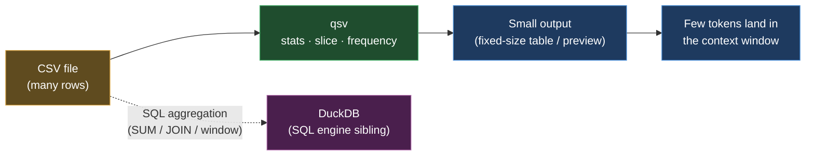

# qsv — fast, light CSV operations
> Part of the ast-grep learning book — see [INDEX](../INDEX.md). ↑ Up: [03 · Agentic](../03-agentic.md)

qsv is a single Rust binary that wrangles CSV files fast. For an agent it is the
sub-second way to *look at* a table — get column stats, count rows, slice a preview,
tally value frequencies, or turn an Excel sheet into CSV — without reading the whole
file into the context window. Verdict: **ADD**.

## What it does

qsv ships dozens of subcommands; a handful matter for everyday agent work:

- **`stats`** — per-column summary statistics (min, max, mean, type inference, and
  more) as a small fixed-size table, no matter how many rows the input has.
- **`count`** — how many data rows the file has.
- **`slice`** — pull a window of rows (e.g. the first 20) for a quick preview.
- **`frequency`** — tally how often each value appears in a column.
- **`select`** / **`search`** — keep specific columns, or filter rows by a pattern.
- **`excel`** — export a single Excel/ODS sheet to CSV. It is a *converter*, not an
  aggregator: `qsv excel file.xlsx` reads one sheet and emits CSV.
  _[sourced — https://github.com/dathere/qsv/blob/master/README.md]_

With an on-disk index, `count`, `sample`, and `slice` run instantaneously.
_[sourced — https://github.com/dathere/qsv]_

| You want… | Command |
|---|---|
| Column stats for a big CSV | `qsv stats sales.csv` |
| Row count | `qsv count sales.csv` |
| First 20 rows | `qsv slice -l 20 sales.csv` |
| Value tallies for a column | `qsv frequency -s region sales.csv` |
| An Excel sheet as CSV | `qsv excel sales.xlsx` |

## Where it comes from

qsv is a data-wrangling toolkit for tabular data — CSV, Excel, and more — built in
the lineage of `xsv`, extended with the many commands `xsv` lacked.
_[sourced — https://github.com/dathere/qsv]_

License: **MIT OR The Unlicense** — dual-licensed, both fully permissive.
_[sourced — https://github.com/dathere/qsv]_

## Install (per-OS)

| OS | Command |
|---|---|
| Linux (Arch) | `pacman -S qsv` |
| WSL | same as Linux (`pacman -S qsv` on Arch, or build from source) |
| macOS | `brew install qsv` |
| Windows | `scoop install qsv` |
| Any (from source) | `cargo build --release --locked --bin qsv --features all_features` |

_[sourced — https://github.com/dathere/qsv]_

> **Heads-up on `cargo install qsv`.** The README documents the **from-source build**
> above, *not* `cargo install qsv`. The crates.io release lags behind the distro
> packages, so `cargo install qsv` gives you a stale binary — prefer a package
> manager or the documented build. _[sourced — unverified]_

## What it replaces — and what it complements

qsv replaces a harness `Read` of an entire CSV for "give me the stats" or "show me
the first rows", and replaces a one-off pandas snippet for the same — in one binary,
no Python.

It **complements DuckDB rather than competing with it**:

| Job | Reach for |
|---|---|
| Stats, count, slice, frequency, Excel→CSV | **qsv** |
| `SUM` / `GROUP BY` / `JOIN` / window SQL | **DuckDB** |

Do not assume qsv does arbitrary SQL out of the box. Its `sqlp` command is
**Polars SQL** and needs a Polars-enabled build — prebuilt binaries may not include
it. For relational aggregation, reach for the SQL engine: [duckdb.md](duckdb.md).

## Token economics

The book's benchmark runs `qsv stats`, `count`, `slice`, `frequency`, and `excel`
against the same ~100k-row `sales` fixture and compares each tiny output against the
cost of reading the whole file into the context window.

| approach | bytes | ~tokens | vs full file |
|---|---|---|---|
| read whole `sales.csv` (no tool) | 3,828,297 | 957,074 | 100% |
| `qsv count` | 7 | 1 | ~0.0002% |
| `qsv frequency -s region` | 128 | 32 | ~0.003% |
| `qsv stats` | 705 | 176 | ~0.018% |
| `qsv slice -l 20` | 716 | 179 | ~0.019% |
| `qsv excel` (`.xlsx`→CSV, 5k rows) | 175,166 | 43,791 | converter, not aggregator |

_[verified]_ — `scripts/bench-tabular.sh`, qsv 21.1.0. `stats`/`count`/`slice`/`frequency`
all return tiny, fixed-size output regardless of row count. `qsv excel` is the outlier:
it *converts* the whole sheet to CSV (every row), so it is bigger than the binary —
reach for it to reshape, not to summarize. The brew "all_features" build ships **no
`sqlp`**, so for SUM/JOIN/window SQL use [DuckDB](duckdb.md).

## When to reach for it (and when not)

- **Reach for it** when you want fast stats, a row count, a row-window preview,
  value frequencies, or an Excel sheet converted to CSV — all sub-second, all small.
- **Don't** reach for it when you need `SUM` / `GROUP BY` / `JOIN` / window SQL —
  that is DuckDB's job. qsv covers the quick-look; DuckDB covers the query.

## Cross-links

- The SQL engine companion for aggregation — [duckdb.md](duckdb.md)
- The token-efficiency chapter these numbers come from — [03 · Agentic](../03-agentic.md)
- The tools shelf overview — [00 · Tools overview](00-overview.md)
- Back to the book index — [INDEX](../INDEX.md)

---
[← Previous: DuckDB](duckdb.md) · [Next: universal-ctags →](ctags.md)
