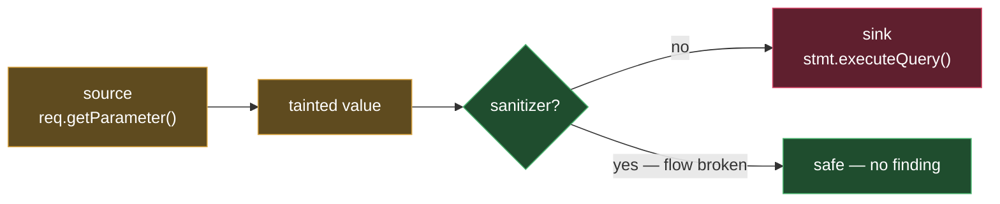

# Semgrep OSS — the taint/dataflow complement to ast-grep
> Part of the ast-grep learning book — see [INDEX](../INDEX.md). ↑ Up: [04 · When to use](../04-when-to-use.md)

ast-grep finds *shapes* in one file. Semgrep finds *flows* across statements. They
are not competitors — Semgrep adds the one capability ast-grep has no concept of:
**taint / dataflow analysis** (tracking attacker-controlled data from a *source* to a
dangerous *sink*), plus a large community registry of CWE/OWASP security rules. This
chapter is a delta — it assumes you already know ast-grep from the
[spine](../02-cli-and-rules.md).

## What it does

Semgrep scans code with rules whose patterns *look like the source itself* and match
semantically, not just textually. On top of that structural matching it can do
**intra-file taint analysis**: declare a `source` (e.g. an HTTP parameter), a `sink`
(e.g. a SQL query call), and Semgrep reports only the paths where tainted data reaches
the sink *unsanitized*. It ships thousands of community security rules and emits
findings with a rule id, file, line/col, severity, and CWE/OWASP metadata.
_[sourced — https://github.com/semgrep/semgrep]_

> The OSS / Community Edition does single-file, single-function taint. Cross-file /
> cross-function dataflow is a feature of the commercial Pro engine.
> _[sourced — https://github.com/semgrep/semgrep]_

## Where it comes from

Writing static-analysis rules in traditional AST frameworks (or CodeQL) is steep.
Semgrep was built so a rule "looks like the code you already write" — no manual AST
construction, no regex wrestling — making security pattern authoring accessible while
still matching semantically. The core engine is written largely in OCaml and shipped
as a Python package, a Homebrew formula, and a Docker image; rules are YAML.
_[sourced — https://github.com/semgrep/semgrep]_

**License — read the split carefully.** The Semgrep CE *engine* is **LGPL-2.1** (a
permissive open-source binary). But the bundled **registry rules carry a separate,
more restrictive license** (the "Semgrep Rules License v.1.0", internal-use-only) and
some third-party rule packs inherit yet other licenses (e.g. AGPL-3.0). The binary is
free to use; not all bundled rules are freely redistributable.
_[sourced — https://docs.semgrep.dev/licensing]_

## Install (per-OS)

```bash
brew install semgrep            # macOS and Linux
python3 -m pip install semgrep  # any platform with Python (incl. native Windows wheels on PyPI)
# or, fully sandboxed:
docker run --rm semgrep/semgrep semgrep --version
```

- **Linux / WSL:** `pip` or `brew` or the Docker image. _[sourced — https://github.com/semgrep/semgrep]_
- **macOS:** `brew install semgrep`. _[sourced — https://github.com/semgrep/semgrep]_
- **Windows:** native Windows support (CLI, no WSL required) was announced for the
  Fall 2025 CE release, with x86-64 wheels on PyPI — announced without explicit "GA"
  terminology, so treat it as new. If you hit friction, WSL remains a reliable
  fallback. _[sourced — unverified]_

An official Semgrep MCP server is also reported to exist for harness integration; this
chapter does not assert its config details. _[sourced — unverified]_

## What it replaces — and what it complements

Semgrep does **not** replace ast-grep. The two solve different problems and happily
coexist (with ripgrep as the third leg):

| Tool | Model | Reach for it to… |
| --- | --- | --- |
| **ripgrep** | text / regex | find literal strings or identifiers at max speed |
| **ast-grep** | single-file Tree-sitter AST | structural search & **rewrite** in one language, agent tooling |
| **Semgrep OSS** | AST + intra-file **taint/dataflow** | security rules, source→sink reasoning, a big rule registry |

What Semgrep *replaces* is ad-hoc grep-based security checks and single-purpose
linters — it folds them into one registry-driven SAST scanner and adds taint
reasoning ast-grep cannot express. _[sourced — https://github.com/semgrep/semgrep]_

For **type-aware, cross-file refactoring** (overload resolution, import rewriting),
neither tool fits — that is the job of an IDE / LSP or OpenRewrite. See
[04 · When to use](../04-when-to-use.md).

## Capability demo: taint tracking

Here is the crux of why this tool earns a place beside ast-grep. Consider a SQL call:

```java
stmt.executeQuery(userInput);   // dangerous?
stmt.executeQuery(sanitize(userInput));   // safe
```

To ast-grep, **both lines have the identical syntactic shape** —
`stmt.executeQuery(...)`. ast-grep matches the AST node; it has *no notion of where the
argument came from* or whether it passed through a sanitizer. It would flag both, or
neither, but it can never tell them apart, because "did this value flow from an
untrusted source?" is a *dataflow* question, not a *shape* question.

Semgrep can. The demo below tracks an HTTP request parameter (the **source**,
`getParameter`) to a SQL query call (the **sink**, `executeQuery`), and reports the
unsanitized path as a finding while the sanitized control case produces nothing.

| run on `examples/bench/TaintDemo.java` | findings | where |
|---|---|---|
| 1 unsanitized path + 1 sanitized control | **1** | line 25 — `stmt.executeQuery(sql)` in `vulnerable()` |

_[verified]_ — `scripts/semgrep-taint-demo.sh`, semgrep 1.167.0. Exactly **1** finding on
the tainted source→sink path; the sanitized `sanitize(user)` path (line 36) produces
**0** findings. The same `executeQuery(...)` shape appears in both methods — only taint
tracking tells them apart, which is precisely what ast-grep cannot do.



## When to reach for it (and when not)

- **Reach for Semgrep** when you need source→sink / taint reasoning, curated security
  rule packs, or CWE/OWASP-tagged findings — things ast-grep structurally cannot do.
- **Stay with ast-grep** when you want fast, single-file structural match *and rewrite*
  in one language, or token-cheap node extraction for an agent.
- **Drop to ripgrep** when the target is just literal text or an identifier.
- **Neither** for type-aware cross-file refactor — that is an IDE/LSP or OpenRewrite job.

## Cross-links

- Where ast-grep stops — type info, dataflow, taint → [04-when-to-use.md](../04-when-to-use.md)
- The structural spine (CLI & rules) → [02-cli-and-rules.md](../02-cli-and-rules.md)
- Tools-shelf overview → [00-overview.md](00-overview.md)
- Book table of contents → [INDEX](../INDEX.md)

---
[← Previous: ripgrep](ripgrep.md) · [Next: Repomix →](repomix.md)
